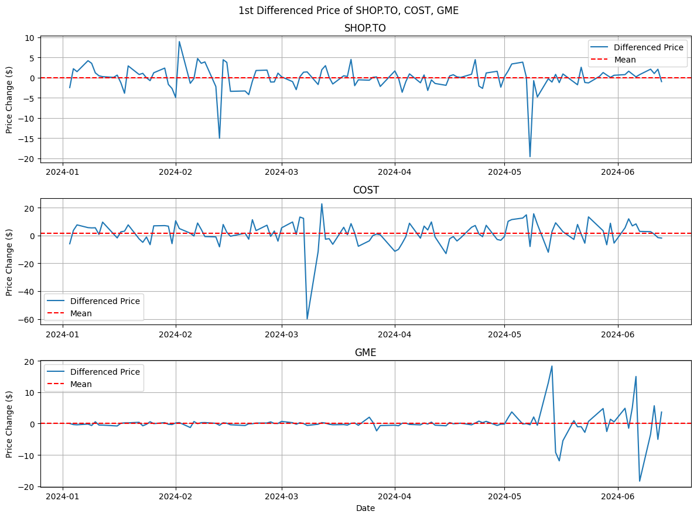
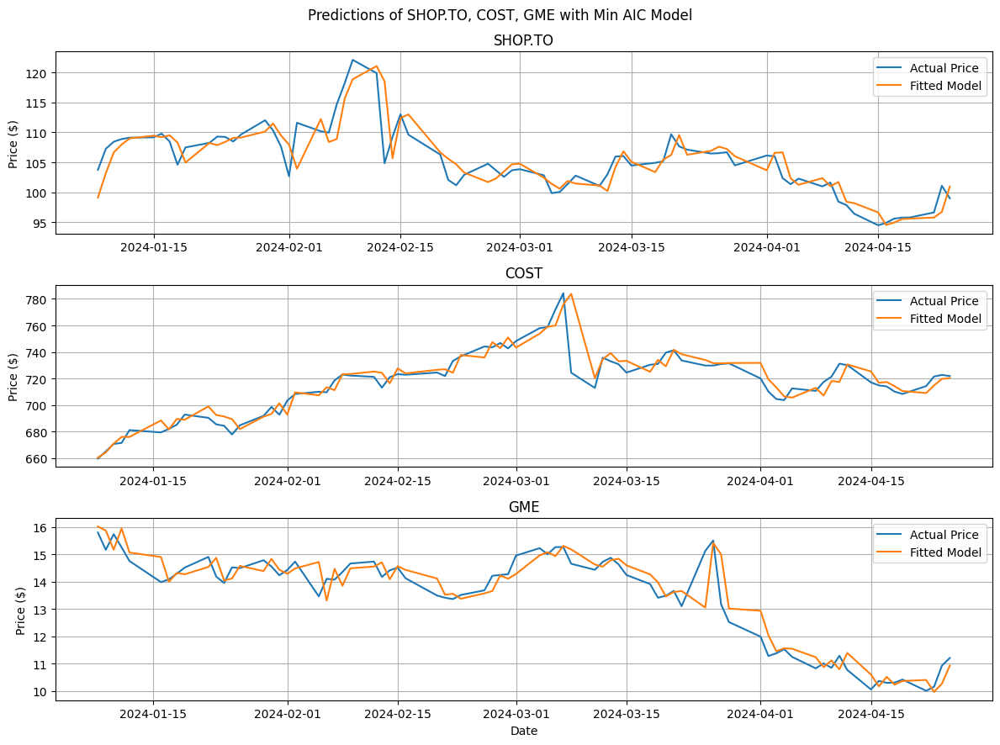

And we're back, after 2 weeks of no blog posts! Sorry my loyal readers, if any of you exist out there 👀... So as a reward, this week's blog won't just feature 1 blog post, but **2 BLOG POSTS**!!!

When I tell people I'm writing a _weekly_ blog on quantitative finance and investing, a response I often get is: _"Thats cool bro, but can you tell me how to beat the market and get rich?"_ Well, dear reader, that's exactly what we will _try_ to do today.

How does one beat the market? Well, if you somehow knew the price of a stock tomorrow, then you would be able to guarantee a profit! Easy. But then how does one predict events that have not occurred yet? Using a statistical model of course! So, all we have to do to beat the market is find some equation that encapsulates the behavior of a stock's price and use it to forecast future prices.

Many statistical models try to do this very thing, but one of the most common ones is... ARIMA models, which is what we will be looking at today.

This blog will have 2 parts: this post, where we will go through the theory, and a followup that will put this theory to use and see how easy (or hard) it is to beat the market.

## 1 Time Series Analysis

Before we can model anything, we need data, specifically: time series data. A `Time Series` is just a fancy way of calling a dataset where observations are made in chronological order such as historical stock prices.

Lets choose some stocks to analyze:

`SHOP.TO`: Shopify Inc.
`COST`: Costco Wholesale Corporation
`GME`: GameStop Corp.

The first thing to do when getting a new dataset is to do a quick exploratory analysis.

_Figure 1. YTD Price History of Stocks_

We see that the price of **SHOP.TO** seems relatively stable until early May 2024, where there is a large dropoff. **COST** shows steady growth over time but theres still some volatility around March 2024. **GME** exhibits clear volatility clustering (periods of high volatility and periods of low volatility). Wouldn't expect anything less from a meme stock.

### 1.1 Stationary Processes

Many statistical models (including ARIMA models) assume that the time series data is stationary. Specifically, we will be referring to weakly stationary data. A time series is `Weakly Stationary` if its mean, variance, and covariance are independent of shifts in time. That just saying its mean and variance are some finite constant, and its covariance only depends on the distance between 2 measurements.

The data also need to be stationary because it allows us to model the time series using fewer independent variables (we don't have to worry about the mean, variance, or covariance as it is just some constant). Fewer variables mean less error and generally a better resulting model.

Looking at the data in _Figure 1_, we clearly see that the datasets are not stationary. If we directly use this data to fit a model, we will run into issues. So, we need to modify the data first. One way is to take the differenced prices (ie, subtracting the previous price from the current price).

_Figure 2. 1st Difference Stock Prices_

That looks better. The mean seems constant now (around \$0). The variance is not constant but we will have to make do for now... As for the covariance, its hard to tell.

We can double check using analytical methods that test for stationarity. A common one is the `Augmented Dickey-Fuller test (ADF)`. I wont explain it here, but in case you are interested, heres an [article](https://www.machinelearningplus.com/time-series/augmented-dickey-fuller-test/).

The result of the ADF test on the differenced data allows us to reject the null hypothesis that the data has any unit roots. Which basically means the data is stationary (even though the variance is not constant).

### 1.2 Autocorrelation

Another important metric is the `Autocorrelation` which tells us the correlation between a data point and values at previous time points (called lags). We can plot this as a function called the `Autocorrelation Function (ACF)`.

_Figure 3. ACF of Differenced Stock Prices_

Here the $x$-axis is lags (differenced prices on previous days) and the $y$-axis is correlation. The shaded blue area is the error bands, so any values in the bands are statistically insignificant.

Ignoring the value at lag 0 (correlation between a value with itself is always 1), we see that for both **COST** and **GME**, there is a negative correlation between the current price and the price 2 days ago. As for **SHOP.TO**, there is a spike at 7, but that might be just random error.

### 1.3 Partial Autocorrelation

Building on top of the ACF, we have the partial autocorrelation (PACF). The ACF shows both the _direct_, and _indirect_ effects lagged terms have on the time series. If we then isolate the direct effects, we have the PACF. `Partial Autocorrelation (PACF)` measures the direct influence a past value has on the current value of a time series.

_Figure 4. PACF Plot of Differenced Stock Prices_

From the figure above, we observe significant lags at [7] for **SHOP.TO**, [2] for **COST**, and [2, 4] for **GME**. Again, I'm ignoring the lags past 5 since it might be due to random fluctuations. If we use this when fitting the model, we may risk overfitting.

## 2 ARIMA(p, d, q)

Alright, now we can get into the juicy stuff. `ARIMA (AutoRegressive Integrated Moving Average)` is a statistical model used to predict and forecast time series data. It consists of 3 parts auto-regression (AR), differencing (I), moving average (MA). Lets look at each one individually.

### 2.1 AR(p)

The AR model is a regression model that uses past values to predict future values. In its simplest form, we have an **AR(1) process** (degree 1).

$$
Y_t = (1 - \phi)\mu + \phi Y_{t-1} + \epsilon_t \quad (1)
$$

Where $Y_t$ is the price at time $t$, $\mu$ is the mean of the time series, $Y_{t-1}$ is the price 1 period ago, $\epsilon_t$ is the error (white noise), and $\phi$ is some constant coefficient that we can find through fitting the data.

**TL;DR**, equation (1) just says that the current price is a function of the previous price (scaled by some constant), plus some constant and some error. Basically just $y = mx + b$

We can of course add more terms for higher degrees by plugging equation (1) into itself to get $Y_t$ as a function of $Y_{t-1}, Y_{t-2}, Y_{t-3}...$

And how do you figure out what degree to use? You look at the PACF. Each lag of the PACF tells us how much _direct_ influence it has on the current value, so we should include any significant lags.

From _Figure 4_, we see the models we should consider are: AR(0) for **SHOP.TO** (ie, no AR model), AR(2) for **COST**, and AR(4) for **GME**.

### 2.2 I(d)

This ones pretty simple, we just need to find what degree of differencing we need to make the time series stationary. As we determined earlier in section 1.1, that would be I(1) for all 3 stocks.

### 2.3 MA(q)

MA models use past errors to try and predict current values. Again, the simplest is an **MA(1)** process, expressed as:

$$
Y_t = \mu + \epsilon_t + \theta \epsilon_{t-1} \quad (2)
$$

Where $Y_t$ is the price at time $t$, $\mu$ is the mean of the time series, $\epsilon_t$ is the error (white noise), $\epsilon{t-1}$ is the error 1 period ago, and $\theta$ is some constant coefficient that we can find through fitting the data.

**TL;DR**, equation (2) tells us the current price is the mean of the entire time series, plus a weighted sum of past prediction errors.

To figure out which degree to use, we can look at the ACF plots. As we just mentioned, MA processes are weighted sums of past prediction errors (moving average). This is exactly what ACFs tell us (direct and indirect correlation of past terms can be thought of as a weighted average). So we just need to look at the significant lags of each ACF in _Figure 3_. That is MA(0) for **SHOP.TO**, MA(2) for **COST**, and MA(2) for **GME**.

## 3 Fitting the Model

Now all we need to do is fit the models and find the constants! Its pretty simple since theres already libraries that do this. In Python, I used the `statsmodels.tsa.arima.model.ARIMA` function (see github for details). just input the dataset and specify the order.

### 3.1 Evaluating Models

We could just use the model orders we found graphically in the previous section, but that is prone to mistakes. Also its a lot of work if you have to manually analyze every stock graphically.

Time for analytical methods. For time series models, we can use `AIC (Akaike Information Criterion)` or `BIC (Bayesian Information Criterion)`. In this blog, we will be using AIC.

AIC measures the effectiveness of a model by balancing it's complexity and fit(More complex models generally have better fits but might also be overfitting).

$$
\text{AIC} = 2k - 2ln(L) \quad (3)
$$

Where $k$ is the number of parameters in the model, and $L$ is the max value of the likelihood function (which tells us how good the fit is...). _We want to minimize AIC_

**TL;DR**, equation (3) tells us how good a time series model is. Models are rewarded for accuracy and penalized for complexity.

Now using this criteria, we can brute force our way of finding the optimal model. By fitting ARIMA models of different orders and selecting the one that minimizes AIC, here is the result:

_Figure 5. Stock Prices and Predictions Based on Fitted ARIMA Models_

Looks pretty good. The model incorporates the behavior of the dataset pretty well. But in order to see how it would actually perform, we need to Forecast some prices.

## 4 Forecasting

Similar to the methods used in machine learning, we are trying to train a model on known data, then use it to make predictions on new data.

In Machine Learning, a common practice is to split the data 70%-30% for training and testing. With time series models, That doesn't really work. This is because the data is in chronological order and each term depends on previous terms. So if we fit our model on the first 70% of data, then use it to forecast the next 30%, the errors will quickly propagate and make all forecasts irrelevant.

A common method, and the one we will be using is called rolling forecasts. Basically, we fit the model on a subset of the data, then use that model to predict the price for the next day. Then after the next day, we add the new data point (the new price of the stock) to the dataset and re-fit the model and make another forecast. We then repeat this to get...

_Figure 6. Rolling Forecasts of Stock Prices_

Visually inspecting the forecasts, we see that its a decent predictor when the stock price is less volatile. However, during periods of high volatility such as mid May 2024 for **GME**, the forecasts lag behind the actual price by around 1 day. This is very concerning when you consider volatile stocks will shoot up one day then plummet the next. So that 1 day difference can mean a lot...

## 5 Limitations of ARIMA

Lets look at the accuracy of the predictions. To do this, we can look at the `Mean Absolute Error` which tells us the average percent error of the forecast and the `Root Mean Squared Error` which tells us the average dollar amount the forecasts deviates by.

| Ticker  | MAE (%) | RMS ($) |
| :-----: | :-----: | :-----: |
| SHOP.TO |  2.97%  | 4.2941  |
|  COST   |  0.77%  | 7.5747  |
|   GME   | 17.68%  | 7.4863  |

_Table 1. Mean Absolute Error and Root Mean Squared Error of Forecasts_

From the table, we see large errors for volatile stocks and small errors for stocks with relatively constant variances. This matches our graphical observation discussed previously, revealing one of the main limitations of ARIMA models: it assumes constant variance. And sadly, stock prices often do not exhibit this behavior.

If we dig deeper and look at the equations defining the models (equations 1, 2), we see another limitation: linearity. ARIMA models assume that the relationship between past and future prices are linear, which is often not the case in the real world.

Lastly, as mentioned at the start of the forecasting section, we cannot forecast prices in the long term due to exponential error propagation...

Damn, thats a lot of limitations. But then again, if it was that easy to predict stock prices, then everyone would be rich (which means no one would be rich). ARIMA models still have their uses though, and are often one of the first time series models people learn (at least for me).

## 6 Conclusion

Well, hopefully now you know more about time series analysis and ARIMA models.

In this blog, we explored how we can analyze time series data and fit an ARIMA model to it. We also looked at how we can determine the ARIMA(p, d, q) orders graphically and evaluate the effectiveness of the models. Lastly, we tried to forecast stock prices and discussed some of the limitations of ARIMA models.

This was intended to be a 2 part blog with this one focusing on the theory. We will next try to apply ARIMA models to real investing strategies and see if we can make any money using it.

Thanks for reading this blog! As always, the code used can be found on [github](https://github.com/yangsu01/funance_blog/blob/main/blogs/03-time-series-intro/time-series-analysis.ipynb).

Chao 😘
