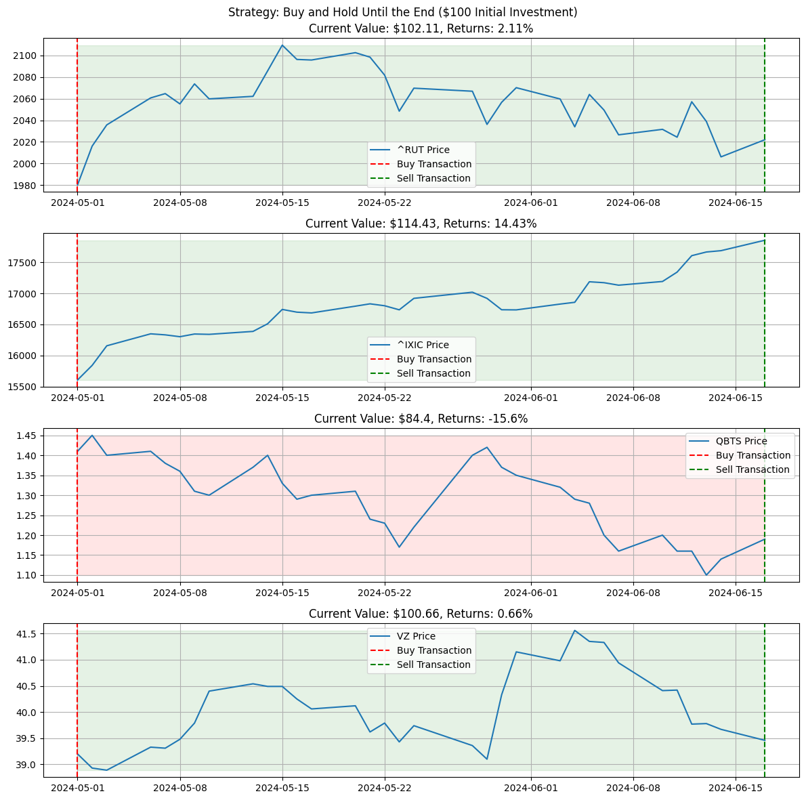

Alright, no more theory, just applications. Lets see if we can make any money using ARIMA models...

This is a continuation of the previous post: [_Time Series Analysis: ARIMA Models_](https://www.funance.lol/blog/2oH7rZlN6SorUF88mjEX9H/time-series-arima). The theory used in this blog regarding ARIMA models can be found there.

Suppose you are going to invest $100 in some stock. What investment strategy would yield the greatest returns? To be consistent, we will also be testing our strategies on the same stocks over the same time period. The tickers I chose are:

`^RUT`: Russell 2000

`^IXIC`: NASDAQ Composite

`QBTS`: D-Wave Quantum Inc

`VZ`: Verizon Communications Inc.

Note: we will assume there are no transaction fees.

## 1 Control Strategies

All scientific experiments need control groups. In our case, it would be baseline investment strategies that we will compare our ARIMA models to. Heres what I've come up with.

### 1.1 Hold 💎🙌

This is the passive approach. All we're gonna do is buy at the start of the period, and sell at the end. Lets see how this performs.

_Figure 1. Buy at the Beginning and Sell at the End_

In the figure, the red dotted line is where we bought the stock, the green dotted line is where we sold the stock, and the green shaded area is the period we held the stock (it will be red if the return over that period is negative). All following plots will follow this format. Sorry if you're red-green colorblind.

Damn, that's pretty good returns though. Considering the time frame is just over a month and a half. 13% returns for NASDAQ? Geez. Tech stocks are flying.

### 1.2 Panic Buy, Panic Sell

Just for fun, lets compare some more strategies. Heres a bad one: buy after you see the price go up, then panic sell after you see the price go down...

_Figure 2. Buy After Price Increase, Sell After Price Decrease_

Yeaaa as expected, not a good strategy.

### 1.3 Delayed Buy, Immediate Sell

This should be a bit better. Similar to the previous strategy, we will buy after seeing the price go up but immediately sell it at the end of the next day.

_Figure 3. Buy After Price Increase, Sell Next Day_

Huh, not as good of a performance as I thought. Might even be slightly worse than the previous strategy. I do think this would work a lot better for stocks with high volatility though.

## 2 ARIMA Forecasting Strategies

Now lets fit the model. Using the prices from the last year as the training data, we implement the same process outlined in the previous post.

1. Generate a list of potential ARIMA model orders
2. Try to fit an ARIMA model on the training data for each order
3. Find the model that has the minimum AIC
4. Use the min AIC model to do a rolling forecast on the test data
5. ???
6. Profit

With our model and forecasts ready, we now need some investment strategies. Heres a few I came up with. For reference, I also plotted the forecasted price on the same axis.

_Figure 4. Buy when Positive Returns are Forecasted, Sell when Negative_

_Figure 5. Buy when Returns above 0.1% are Forecasted, Sell Next Day_

Yikes. At first glance, we're not looking good. Here's all the info summed up in a table...

| Investing Strategy                   | ^RUT  | ^IXIC | QBTS  |  VZ   |
| :----------------------------------- | :---: | :---: | :---: | :---: |
| Hold                                 | 2.11  | 14.43 | -15.6 | 0.66  |
| Panic Buy/Sell                       | 0.67  | 7.21  | -5.01 | -1.44 |
| Delayed Buy, Sell Next Day           | -0.62 | 4.52  | 4.14  | -2.41 |
| Buy: Forecast > 0, Sell: < 0         | 1.34  | 2.76  | -8.45 | -0.21 |
| Buy: Forecast > 0, Sell: Next Day    | -0.87 | 0.38  | -1.21 | -1.33 |
| Buy: Forecast > 0.1%, Sell: < 0      | 1.34  | 2.78  | -0.87 | 0.38  |
| Buy: Forecast > 0.1%, Sell: Next Day | -0.87 | 0.38  | -1.21 | 0.06  |

_Table 1. Returns of Different Investment Strategies. Note: Forecast refers to Forecasted Returns_

Wow, that's pretty bad. The only redeeming aspect of the forecast strategies is they decreased the loss from holding QBTS. But aside from that, buying and holding stocks that have an upward historical trend is definitely the way to go.

Note: this is only a very small sample of tickers and I've only ran each model once. But I think it's pretty reasonable to conclude that you can't just fit an ARIMA model on a stock's price and expect to beat the market (unless I'm doing something wrong??).

## 3 Improved(?) ARIMA Strategies

The question now is: Can we improve the results we just got?

Well, there's nothing we can do about the limitations of ARIMA models, namely assuming the fact that our data has a linear relationship between values, constant variance, and constant covariance. So to improve the results, we need to... get better data!

While models trained on most stocks won't do well, there's got to be at least some that are decent right?? That's the first thing we can improve upon. By looking at the accuracy of the predictions, we can select stocks that historically have been good for ARIMA forecasting.

We can also try and improve upon our existing forecasting methods. Previously, we found the 'optimal' ARIMA orders by fitting a bunch of models on the training data and selecting the model with minimized AIC. Then, the rolling forecasts were all done by fitting a model with the same order. However, this may not always be the case since our dataset updates between each forecast.

Taking these points into account, here is the updated process I will follow _(inspired by this [video](https://youtu.be/8jY675fjUWo?si=waxj-8jqyuBBAokL))_

1. **Create a list of candidate stocks**. The more the merrier but I chose 60 different stocks to begin with.
2. **For each stock, backtest model on historical data**. In my case, I chose to use the last 3 years of historical data. Each model was fitted 50 times on slightly different data (I shifted the time frame forward each iteration)
3. **Find stocks with the best results**. The criteria I used was the percentage of actual prices that fell within the 95% confidence interval of each forecast.
4. **Rolling forecasts**. Only forecast if a model could be fit. For consistency, I also spliced the training dataset to make sure each forecast was fitted on data of the same length.
   1. For each new set of data, find the optimal ARIMA order to use for the model.
5. **Implement Investing Strategy**. Buy or sell stocks depending on forecasted returns. I tested two strategies: buy when forecasted returns are positive and buy when forecasted returns are above 0.01% (sell next day for both).
6. **Profit**. Hopefully...

Using this method, here are the stocks that were selected as good candidates and their corresponding testing results:

`META`: Meta Platforms Inc

`MNST`: Monster Beverage Corp

`NFLX`: Netflix Inc

_Figure 6. ARIMA Forecasting Investing Performance for META_

_Figure 7. ARIMA Forecasting Investing Performance for MNST_

Note for **MNST**, we were only able to fit a model and forecast 23 out of the total 42 days

_Figure 8. ARIMA Forecasting Investing Performance for NFLX_

OK, that looks a lot better. There is still hope...

| Investing Strategy                   | META  | MNST  | NFLX  |
| :----------------------------------- | :---: | :---: | :---: |
| Hold                                 | 0.77  | -9.96 | 7.59  |
| Buy: Forecast > 0, Sell: Next Day    | 9.57  | 1.46  | 5.51  |
| Buy: Forecast > 0.1%, Sell: Next Day | -3.22 | -0.11 | 11.63 |

_Table 1. Returns of Different Strategies (Using Improved Stock Selection Process)_

Still, this is a pretty small sample size, but its good enough for now. We can definitely observe a better performance than our previous methods.

There are things we can still tweak such as the candidate ticker selection process (what criteria to use), the size of the training datasets, and specific buy/sell conditions... But I'll leave that to you, the reader (if ur interested).

## 4 Conclusions

Would I invest my own money using ARIMA forecasting? NO. But hey, at least I had FUN working on this post and hopefully you had fun reading it ❤️.

In this blog, we tried to implement investing strategies using ARIMA models. After getting unsatisfying results, we then tried to refine the methodology to see if better results were possible.

As always, all the code used in this post can be found on [Github](https://github.com/yangsu01/funance_blog/tree/main/blogs/04-trading-with-arima).
