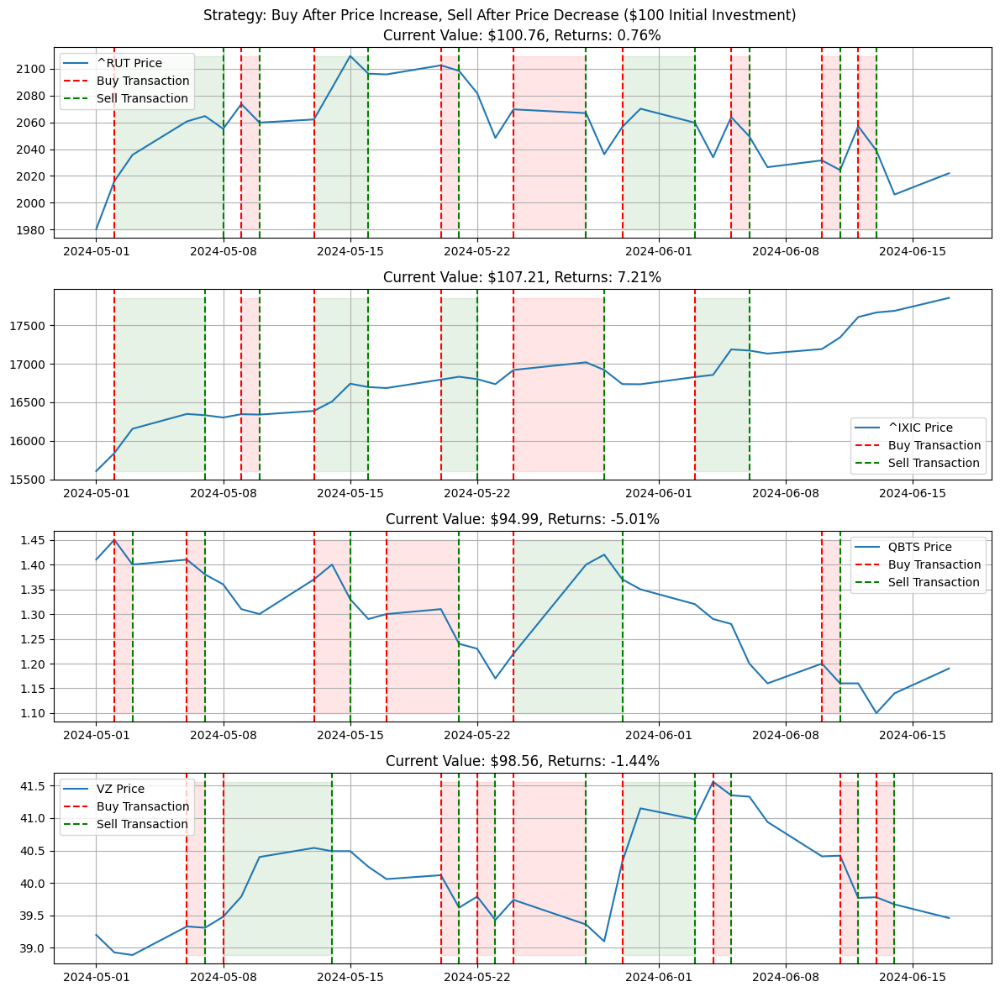
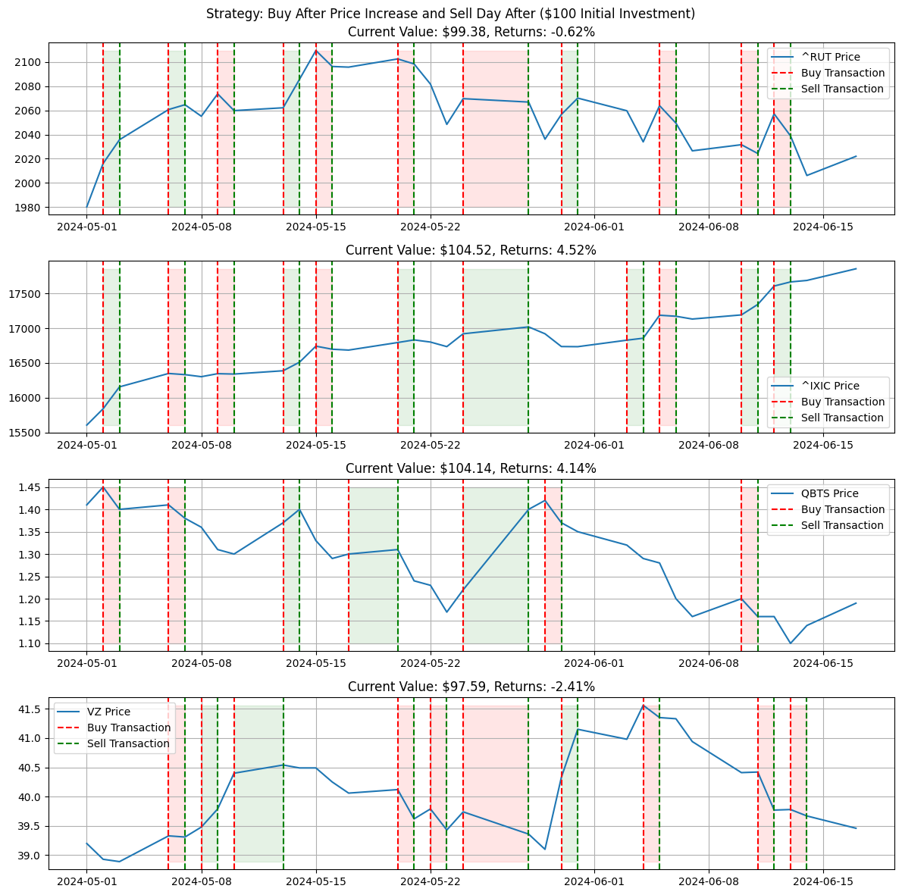

Alright, here we are. No more theory, just applications.

This is a continuation of the previous post: [_Time Series Analysis: ARIMA Models_](https://www.funance.lol/blog/2oH7rZlN6SorUF88mjEX9H/time-series-arima). All the theory used in this blog regarding ARIMA models can be found there.

Suppose you are going to invest $100 in some stock. What investment strategy would yield the greatest returns? To be consistent, we will also be testing our strategies on the same stocks over the same time period. The tickers I chose are:

`^RUT`: Russell 2000

`^GSPC`: S&P 500

`^IXIC`: NASDAQ Composite

`^DJI`: Dow Jones Industrial Average

Note: all 4 of these are stock indexes. The reason I chose these is due to the relatively low volatility of indexes. So theoretically, our ARIMA models would perform better. Guess we'll have to wait and see.

Note2: we will assume there are no transaction fees.

## 1 Control Methods

All scientific experiments need control groups. In our case, it would be baseline investment strategies that we will compare our ARIMA models to. Heres what I've come up with.

### 1.1 Hold 💎🙌

This is the passive approach. All we're gonna do is buy at the start of the period, and sell at the end. Lets see how this performs.

_Figure 1. Buy at the Beginning and Sell at the End_

In the figure, the red dotted line is where we bought the stock, the green dotted line is where we sold the stock, and the green shaded area is the period we held the stock (it will be red if the return over that period is negative). All following plots will follow this format. Sorry if you're red-green colorblind.

Damn, thats pretty good returns though. Considering the time-frame is just over a month and a half. 13% returns for NASDAQ? Geez. Tech stocks are really flying.

### 1.2 Panic Buy, Panic Sell 😱

Ok, what if you kinda slow 😵 and you decide to buy the stock after you see the price go up, then panic sell after you see the price go down?

_Figure 2. Buy After Price Increase, Sell After Price Decrease_

Yeaaa as expected, not a good strategy.

### 1.3 Delayed Buy, Immediate Sell 😏

This should be a bit better. So similar to the previous strategy, we will buy after seeing the price go up but immediately sell it at the end of the next day.

_Figure 3. Buy After Price Increase, Sell Next Day_

Huh, not as good of a performance as I thought. Might even be slightly worse than the previous strategy. I do think this would work a lot better for stocks with high volatility though.

## 2 ARIMA
