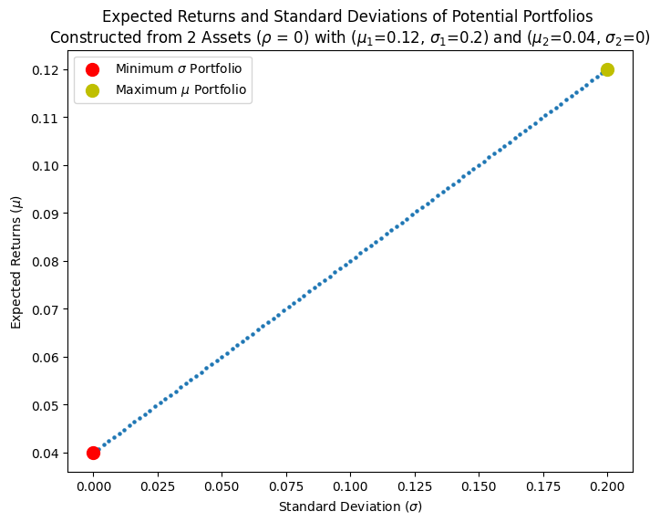
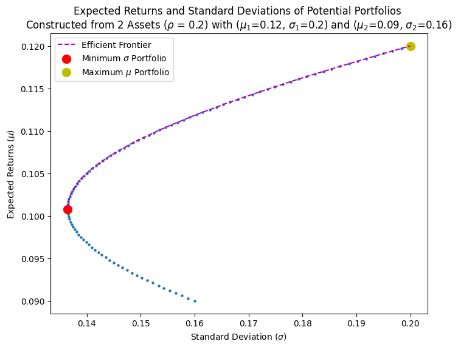
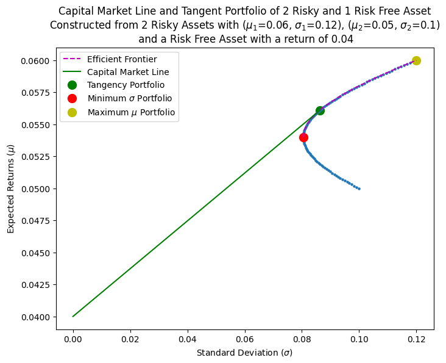

This week, we're looking at Modern Portfolio Theory. Suppose you opened a TFSA (for my fellow Canadians...) cause you have some extra cash lying around. As a rational investor, what assets do you buy? How should you allocate your money to these assets? You heard from someone that you need to diversify, but what does that mean? That's what we will try to answer today.

Note: We're gonna look at individual stocks instead of index funds and ETFs. A lot of them are constructed using the same fundamentals that we will discuss anyways...

## 1 Portfolio Theory

Modern Portfolio Theory (also called Markowitz's Portfolio Theory) was created by Harry Markowitz. It's a portfolio construction method that maximizes returns for a given level of risk. Ok, that's enough history.

As mentioned in my blog post on [returns](https://www.funance.lol/blog/3mYoAwyTNnmDODIlrTj6hx/returns), investing is a game of balancing risk with potential returns. The higher the risk, the higher the potential returns. In the context of portfolio theory, we want to maximize returns while minimizing risk. Sounds simple enough.

Before moving forward, we need to define two things: what is risk, and what is returns. Since theres no way of knowing the exact future performance of assets, we will have to make assumptions. Depending on how accurate these assumptions are, our optimized portfolio's performance will vary. Unfortunately, I'm no hedge fund manager, so we will just use the 'textbook' definitions:

- The `Risk` of a stock is defined as the historical annualized standard deviation, $\sigma$.
- The `Returns` of the stock is defined as the historical annualized returns, $\mu$

In this post, we will look at the underlying theory. For simplicity, I will be using made-up values for hypothetical assets. In the next post (yes, I'm doing a 2 part blog again...), I will then use what we learned in this post and apply it to real-world data.

## 2 Portfolio of Two Assets

We start with the simple case of constructing a portfolio with two assets. This is a good way to develop a fundamental understanding of how modern portfolio theory works. I will also go through the math in more detail for clarity. It should be pretty straightforward.

Suppose we have two assets [1, 2] with expected returns $[\mu_1, \mu_2]$, standard deviation $[\sigma_1, \sigma_2]$, and correlation (between the historical prices) $\rho_{1,2}$. We are trying to construct a portfolio from these two assets. If the weight of asset 1 in the portfolio was $\omega$, then asset 2 would be $(1-\omega)$.

Given the above, the overall expected returns of the portfolio is just a weighted sum of the individual returns...

$$
\mu_p = \omega \mu_1 + (1-\omega) \mu_2 \quad (1)
$$

Similarly, the standard deviation of the portfolio is:

$$
\sigma_p^2 = (\omega \sigma_1 + (1-\omega) \sigma_2)^2 \quad (2)
$$

Note this is written in terms of the variance, which is just standard deviation squared. We can then expand equation (2) to get:

$$
\sigma_p^2 = \omega^2 \sigma_1^2 + (1-\omega)^2 \sigma_2^2 + 2\omega(1-\omega)\sigma_{1,2} \quad (3)
$$

If we substitute in the equation for correlation: $\rho_{1,2}=\sigma_{1,2}/(\sigma_{1} \sigma_{2})$, then we finally have:

$$
\sigma_p^2 = \omega^2 \sigma_1^2 + (1-\omega)^2 \sigma_2^2 + 2\omega(1-\omega)\sigma_{1} \sigma_{2} \rho_{1,2}\quad (4)
$$

So far so good? If we now plug in all our known values into equations (1) and (4), and vary the weights, we can get a plot of portfolio standard deviation $(\sigma_p)$ as a function of expected returns $(\mu_p)$. Lets look at some special cases.

### 2.1 Risky and risk-free Assets

Lets say you chose to invest in a risky asset (such as stocks) and a risk-free asset (which by definition implies $\sigma_p=0$). This risk-free asset could be a fixed-income security with know cashflows such as a bond where the risk is effectively zero (you can read more about bonds in this [blog](https://www.funance.lol/blog/71L1S3TkGdShKyTKbHa4Ou/bonds-intro)).

Heres what we get if we plot the relationship between the overall portfolio's expected returns and standard deviation as we vary the weights in both assets.

_Figure 1. Possible Portfolios Constructed with 1 Risky and 1 Safe Asset_

Make sure you understand this plot. Each blue point represents a possible portfolio with weights $\omega$ in the risky asset, and $(1-\omega)$ in the risky asset. Since one of our assets has $\sigma=0$, the overall standard deviation in equation (4) just becomes linear $\sigma_p = \omega \sigma_1$. So the resulting relationship between $\sigma_p$ and $\mu_p$ is also linear.

Note the maximum returns portfolio is obtained when the weight of the risky asset is 1, and the minimum standard deviation portfolio is obtained when the weight of the risk-free asset is 1. Any other weight would result in a portfolio along the dotted line.

### 2.2 Diversification

Now suppose you invest in two different risky assets. These assets both have the same expected returns and standard deviation. However, since they are fundamentally different assets, they have a correlation of less than 1.

_Figure 2. Possible Portfolios Constructed using 2 Risky Assets with the same Returns and Standard Deviation_

Interesting. Even though $\sigma = 0.2$ for both assets, when combined in a portfolio together, a lower overall risk can be achieved. This is why `Diversification` is important. By buying uncorrelated stocks, we can significantly lower the risk of a portfolio while maintaining similar levels of expected returns.

Note in this case, the maximum returns portfolio is any portfolio.

### 2.3 Efficient Frontier

One more example. What if we buy 2 different stocks with different $\sigma$ and $\mu$? What would that relationship look like?

_Figure 3. Possible Portfolios Constructed using 2 Risky Assets_

Now we have a quadratic relationship. Notice the dotted line between the minimum variance portfolio and maximum returns portfolio. This is known as the `Efficient Frontier` where every point corresponds to a portfolio of maximized expected returns for a given standard deviation. Every portfolio located on the efficient frontier is considered optimal. That means all the blue points below the efficient frontier can be ignored as there are better choices for that same level of risk.

The efficient frontier narrows down the optimal portfolios we can construct. However, theres still an infinite number of points along the efficient frontier. Which one should we choose?

## 3 Adding a risk-free Asset to a Risky Portfolio

While any point along the efficient frontier is optimal, portfolio theory suggests that we can narrow it down further... to a single point. Let's see how.

Consider the portfolio of risky assets we constructed in the previous part as a whole, with an overall expected return of $\mu_p$, and standard deviation $\sigma_p$. If we then introduce a new risk-free asset, the relationship between this risk-free asset and 'risky asset portfolio' would be similar to _Figure 1_ where it would be a linear line connecting the points of $(0, \mu_f)$ corresponding to the risk-free asset, and $(\sigma_p, \mu_p)$ corresponding to the portfolio of the 2 risky assets.

However, we also showed from _Figure 3_, that many efficient portfolios can be constructed from the 2 risky assets alone. So which point (representing a specific portfolio allocation) should we connect with the risk-free asset?

Well, as rational investors, we want to maximize returns while minimizing risk. So lets select the line with the highest returns as a proportion of risk. Aka, the line representing the most 'bang for our buck'. With our particular axis setup, this could be found by maximizing the slope of the line found using:

$$
S_p = \frac{\mu_p - \mu_f}{\sigma_p} \quad (5)
$$

This is just rise over run $(\sigma_f = 0)$, also called the `Sharpe Ratio` which measures the risk-adjusted return compared to the risk needed to be taken. $(\mu_p - \mu_f)$ is the risk-adjusted return.

A higher Sharpe Ratio indicates that the portfolio (or asset) has higher expected returns as a proportion of risk. Knowing this, how can we find the most efficient portfolio?

Going back to _Figure 3_, which portfolio (represented by a point) would produce the highest Sharpe Ratio when connected with a risk-free asset (similar to _Figure 1_)?

### 3.1 The Tangent Portfolio

The answer is the point on the efficient frontier where we can draw a tangent line between the efficient frontier and risk-free asset. It looks something like this.

_Figure 4. Capital Market Line and Tangent Portfolio Constructed with 2 Risk and 1 risk-free Asset_

From the figure above, the line that we were able to draw which maximized the Sharpe Ratio is called the `Capital Market Line (CML)` and the tangent point where the CML meets the Efficient Frontier is the `Tangent Portfolio`. The tangent portfolio can be thought of as the portfolio with asset allocations that offers the highest expected returns as a proportion of risk.

### 3.2 Adjusting for Risk

_Modern Portfolio Theory suggests that as a rational Investor, the optimal portfolio for a given list of risky assets IS the Tangent Portfolio._

Notice how the tangent portfolio only depends on the list of risky assets we were looking to invest in, and the risk-free rate of the market (the returns from a risk-free asset). It does not depend on the amount of risk we are willing to take.

So how do we adjust our portfolio depending on our desired risk? By using the Capital Market Line. We can find the optimal portfolio depending on our desired returns or risk by moving along the CML. This is why if you go on an investment website such as [Canadian Couch Potato](https://canadiancouchpotato.com/model-portfolios/), the model portfolios it suggests are presented as percent stock and bond allocations. This is where the popular 80-20 or 60-40 stock-bond split comes from.

The individual allocations of each stock does not matter, as according to Portfolio Theory, there is a single allocation which is the most 'optimal'.

## 4 Conclusions

In this blog, we looked at the intuition behind Modern Portfolio Theory by investigating portfolio construction using 2 assets. We then showed how combining risky and risk-free assets allowed us to find a tangent portfolio with the highest expected returns as a proportion of risk. Lastly, we briefly discussed how we can customize our portfolios depending on the level of risk or returns we want.

The code used in this post can be found on [GitHub](https://github.com/yangsu01/funance_blog/blob/main/blogs/05-portfolio-theory-intro/portfolio-theory-intro.ipynb). In part 2 of this blog, I will apply this theory to a real basket of assets and see what portfolios we can construct. Stay tuned...

I will leave you with this passage.

_An old view of investing is that investors should select stocks that match their tolerance for risk. Investors with a low tolerance for risk should select stocks with low volatility, while aggressive investors should select risky stocks... The newer view derived from portfolio theory is that **all** investors should invest in the same mixture of low, moderate, and high risk stocks given by the tangency portfolio. An individual investor's risk tolerance should determine only that investor's allocation between the tangency portfolio and the risk-free asset._

-_Ruppert, D (2004). Statistics and Finance: An Introduction_
