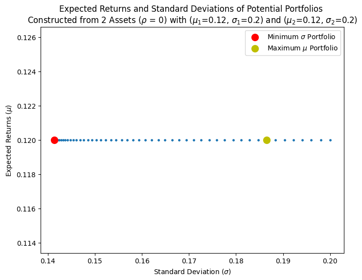

If you were to only read 1 post I've written so far, it would probably be this one. Haven't even started writing but I already know its gonna be a certified banger. The stuff I learned when researching for this blog really blew my mind. Alright, enough glazing, lets get started.

This week, we're look at portfolio construction. Suppose you opened a TFSA (for my fellow Canadians...) cause you have some cash lying around. As a rational investor, what assets do you buy? How much of each asset should you buy? You heard from someone that you need to diversify, but what does that mean? Thats what we will try to answer today. Buckle in, this is gonna be a long one.

Note^1: We're gonna look at individual stocks instead of index funds and ETFs. A lot of them are constructed using the same fundamental theory that we will discuss anyways...

Note^2: Theres gonna be a lot of math involved. I will still include the equations but honestly you can just ignore it. The equations are just there in case you want to implement anything yourself.

## 1 Modern Portfolio Theory

Modern Portfolio Theory (sometimes also called Markowitz's Portfolio Theory) was created by Harry Markowitz, and is a portfolio construction method that maximizes returns for a given level of risk. Ok, thats enough history.

As I mentioned in my blog post on [returns](https://www.funance.lol/blog/3mYoAwyTNnmDODIlrTj6hx/returns), investing is a game of balancing risk with potential returns. The higher the risk, the higher the potential returns.

Before moving forward, we need to define two things: what is risk, and what is returns. Since theres no way of telling the future, we will have to make assumptions. Depending on how accurate these assumptions are, our optimized portfolio's performance will vary. Unfortunately, I'm no hedge fund manager, so we will just use the 'textbook' definitions.

- The `Risk` of a stock is defined as the historical annualized standard deviation, $\sigma$.
- The `Returns` of the stock is defined as the historical annualized returns, $\mu$

For consistency, I will be calculating both standard deviation and returns using historical average over the last 10 years.

## 2 Portfolio of Two Assets

The base case of creating a portfolio with two assets is a good way to develop the intuition, so we will start with this. I will also go through the math in more detail for clarity.

Suppose we have two different assets [1, 2] with expected returns $[\mu_1, \mu_2]$, standard deviation $[\sigma_1, \sigma_2]$, and correlation (between the historical prices) of $\rho_{1,2}$. We are trying to construct a portfolio from these two assets. If the weight of asset 1 in the portfolio was $\omega$, then asset 2 would be $(1-\omega)$.

Given the above, the overall expected returns of the portfolio is:

$$
\mu_p = \omega \mu_1 + (1-\omega) \mu_2 \quad (1)
$$

Just a weighted sum of the individual returns...

The standard deviation of the portfolio is:

$$
\sigma_p^2 = (\omega \sigma_1 + (1-\omega) \sigma_2)^2 \quad (2)
$$

Note this written in terms of the variance, which is just standard deviation squared. Expanding, we get:

$$
\sigma_p^2 = \omega^2 \sigma_1^2 + (1-\omega)^2 \sigma_2^2 + 2\omega(1-\omega)\sigma_{1,2} \quad (3)
$$

If we substitute in the equation for correlation, $\rho_{1,2}=\sigma_{1,2}/(\sigma_{1} \sigma_{2})$ then we finally have:

$$
\sigma_p^2 = \omega^2 \sigma_1^2 + (1-\omega)^2 \sigma_2^2 + 2\omega(1-\omega)\sigma_{1} \sigma_{2} \rho_{1,2}\quad (4)
$$

So far so good? Pretty easy math. If we now plug in all our know values into equations (1) and (4), and vary the weights, we can get a plot of portfolio standard deviation $(\sigma_p^2)$ as a function of expected returns $(\mu_p)$.

### 2.1 Risky and Risk Free Assets

Lets say you chose to invest in a stock as one of your assets, and the other in a risk free one (which by definition implies $\sigma_p=0$). This asset could be a fixed-income security with know cashflows such as a bond where the risk is effectively zero (you can read more about bonds in this [blog](https://www.funance.lol/blog/71L1S3TkGdShKyTKbHa4Ou/bonds-intro)). Heres what we get.

_Figure 1. Possible Portfolios Constructed with 1 Risky and 1 Safe Asset_

Make sure you understand this plot. Since one of our assets has $\sigma=0$, the overall standard deviation in equation (4) just becomes linear $\sigma_p = \omega \sigma_1$. So the resulting relationship between $\sigma_p$ and $\mu_p$ is also linear.

Note the maximum Returns portfolio obtained when the weight of the risky asset is 1, and the minimum standard deviation portfolio obtained when the weight of the risk free asset is 1. Any other weight would result in a portfolio along the dotted line.

### 2.2 Diversification

Now suppose you invest in two different risk assets. These assets both have the same expected returns and standard deviation. However, since they are fundamentally different assets, they have a correlation of less than 1...

_Figure 2. Possible Portfolios Constructed using 2 Risky Assets with the same Returns and Standard Deviation_

Interesting. Even though $\sigma = 0.2$ for both assets, when we put them in a portfolio together, we can obtain lower risk than if we only bought one of the two assets.

And that is why `diversification` is important. By buying uncorrelated stocks, we can significantly lower the risk of a portfolio while maintaining similar levels of expected returns.

Note in this case, the maximum returns portfolio is any portfolio...

### 2.3 Efficient Frontier

One more example. What if we buy 2 different stocks with different $\sigma$ and $\mu$? What would that relationship look like?

_Figure 3. Possible Portfolios Constructed using 2 Risky Assets_

Now we have a quadratic relationship. Notice the dotted line between the minimum variance portfolio and maximum returns portfolio. This is known as the `Efficient Frontier` where every point corresponds to a portfolio of maximized expected returns for a given standard deviation. Every portfolio located on the efficient frontier is 'efficient'. That means all the blue points below the efficient frontier can be ignored as there are better choices for that same level of risk.

### 2.3 Tangent Portfolio

If we consider the portfolio of risky assets we constructed in the previous part as '1 risky asset', with an overall expected return of $\mu_p$, and standard deviation $\sigma_p$, we can then introduce another risk free asset. The relationship between this risk free asset and 'risky asset' would be similar to _Figure 1_ where it would be a linear line connecting the points of $(0, \mu_f)$ corresponding to the risk free asset, and $(\sigma_p, \mu_p)$ corresponding to the portfolio composed of the 2 risky assets.

However, from _Figure 3_, we showed that we can construct many portfolios. So which point (representing a specific portfolio allocation) should we connect with the risk free asset?

Well, as rational investors, we want to maximize returns while minimizing risk. So lets select the line with the highest returns as a proportion of risk. Aka, the line representing the most bang for our buck. With our particular axis setup, this could be found by maximizing the slope of the line found using:

$$
S_p = \frac{\mu_p - \mu_f}{\sigma_p} \quad (5)
$$

This is just rise over run $(\sigma_f = 0)$. This is also called the `Sharpe Ratio` which measures the risk-adjusted return compared to the risk needed to be taken. $(\mu_p - \mu_f)$ is the risk-adjusted return.

A high Sharpe Ratio indicates that the portfolio (or asset) has high expected returns when compared to the risk. So by maximizing the Sharpe Ratio (the slope), how can we select the most efficient portfolio?

Going back to _Figure 3_, which portfolio (represented by a point) would produce the highest Sharpe Ratio when connected with a risk free asset (similar to _Figure 1_)?

The answer is the point on the efficient frontier where we can draw a tangent line between the efficient frontier and risk free asset.

_Figure 4. Capital Market Line and Tangent Portfolio Constructed with 2 Risk and 1 Risk Free Asset_

From the figure above, the line that we were able to draw which maximized the Sharpe Ratio is called the `Capital Market Line (CML)` and the tangent point where the CML meets the Efficient Frontier is the `Tangent Portfolio`. The tangent portfolio can be though of as the portfolio with asset allocations that is the best 'bang for your buck'.

**Quick summary**: As a rational Investor, the optimal portfolio for a given list of risky assets (stocks) **IS** the Tangent Portfolio. You can adjust just how much 'risk' you are willing to take by balancing the ratio between the risky assets and risk free asset (bonds) by moving along the Capital Market Line. More on this later.

This is where all that 80-20 or 60-40 equity-bond allocation comes from. Woah.
