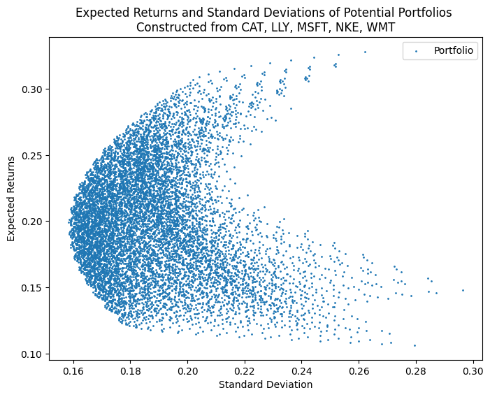
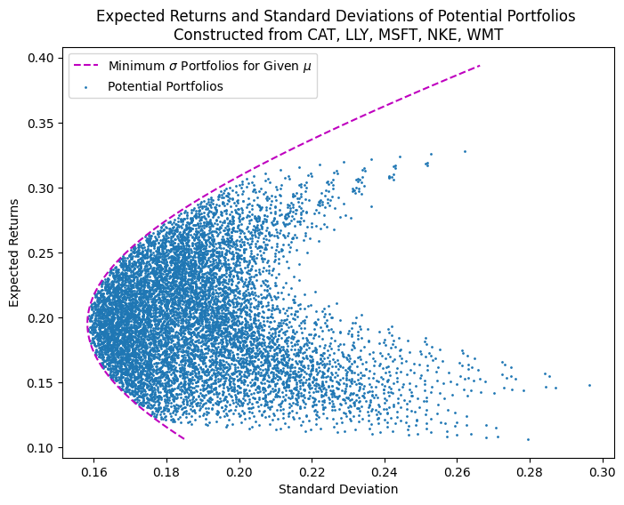
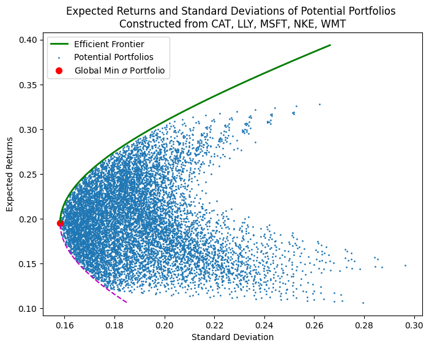
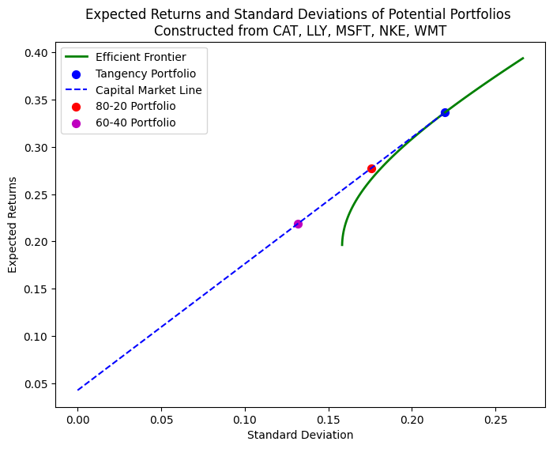

In the last post, we looked at the intuition behind Modern Portfolio Theory by constructing a mock portfolio with 2 assets. In this post, we will go one step further by constructing an optimized portfolio with real assets.

This is a continuation of the previous blog on [portfolio theory](https://www.funance.lol/blog/gKDY75eUP7UCVosEO8mSl/portfolio-theory-intro). The terminology used and overall intuition is discussed there.

Note theres gonna be a lot of math involved. I'll still include the equations with brief explanations in case anyone is interested. But you can just ignore that part and focus on the insights.

## 1 Portfolios with $n$ Risky Assets

For simplicity, we will be using 5 stocks but the math stays the same for any $n$. The stocks I've chosen are:

- `WMT`: Walmart Inc.
- `MSFT`: Microsoft Corp.
- `CAT`: Caterpillar Inc.
- `LLY`: Eli Lilly And Co.
- `NKE`: Nike Inc.

To find the standard deviation and expected returns of each stock, we will use the historical 10 year average annual values. Heres what we got:

| Ticker | Annual $\mu$ | Annual $\sigma$ |
| :----- | :----------: | :-------------: |
| WMT    |    12.72%    |     20.27%      |
| MSFT   |    28.54%    |     23.63%      |
| CAT    |    14.77%    |     29.64%      |
| LLY    |    32.81%    |     26.21%      |
| NKE    |    10.63%    |     27.95%      |

_Table 1. Annual Expected Returns and Standard Deviation of Chosen Stocks_

Damn Eli Lilly has been performing better than Microsoft... Insulin ftw.

We now have the general case for the 2-asset portfolio discussed previously, so the core intuition stays the same: We are looking for the **expected returns** $\mu_p$ and **standard deviation** $\sigma_p$ of the overall portfolio. This can be found using the same method as the 2-asset case. But since there are $n$ assets, we will use matrices to represent these relationships.

Consider a portfolio consisting of a given list of $n$ risky assets with returns $\bm{\mu} = [\mu_1 ... \mu_N]$ and weights $\bm{\omega} = [\omega_1 ... \omega_N]$, we can find the expected returns of the overall portfolio, $\mu_p$ using:

$$
\mu_p = \sum^{N}_{i=1} \omega_i \mu_i = \bm{\omega}^T \bm{\mu} \quad (1)
$$

Where $\bm{\omega}^T$ is the transpose matrix of $\bm{\omega}$. We're just doing a dot product between the individual weights and returns.

The overall standard deviation, $\sigma_p$ can be found using:

$$
\sigma_p^2 = \sum^{N}_{i=1} \sum^{N}_{j=1} \omega_i \omega_j \Omega_{i,j} = \bm{\omega}^T \bm{\Omega} \bm{\omega} \quad (2)
$$

Where $\bm{\Omega}$ is the covariance matrix of the assets. This equation is a bit more confusing, but it does the same thing as multiplying out $(a + b + ...)^2$.

Lets plot a bunch of portfolios of different weights to see the overall relationship between $\sigma_p$ and $\mu_p$.

_Figure 1. Expected Returns and Standard Deviation of Portfolios Constructed with Chosen Stocks_

From the plot, we can already filter out most of the portfolios as they are not optimal. But to get a better understanding, we will need to find the efficient frontier...

## 2 Efficient Frontier

In the last post, we found the efficient frontier graphically. But this does not scale well, so we will now introduce the analytical way of calculating it. Get ready.

The efficient frontier defines the portfolios that have minimum standard deviation for a given expected return. This is an optimization problem (we need to minimize equation (2)). Furthermore, we can impose 2 constraints:

$$
\bm{\omega}^T \bm{\mu} = \mu_p \quad (3)
$$

Aka, the dot product of all the asset returns and weights need to equal the portfolio returns. And...

$$
\bm{\omega}^T \bm{1} = 1 \quad (4)
$$

Where $\bm{1} = [1...1]$ is a 1xn matrix of 1s. This just says all the asset weights need to sum up to 1.

So now we have a constrained optimization problem. How do you solve that? Using a Lagrangian with multipliers for each constraint (flashback to that Lagrangian Mechanics class in uni, iykyk...). I don't remember how to solve this at all so lets just jump to the general solution.

The weights of a portfolio given by solving this optimization problem is:

$$
\bm{\omega}_{\mu_p} = \bm{g} + \mu_P \bm{h} \quad (5)
$$

Where:

$$
\bm{g} = \frac{B}{D}\bm{\Omega}^{-1}\bold{1} - \frac{A}{D}\bm{\Omega}^{-1}\bm{\mu} \quad (6)
$$

$$
\bold{h} = \frac{C}{D}\bm{\Omega}^{-1}\bm{\mu} - \frac{A}{D}\bm{\Omega}^{-1}\bm{1} \quad (7)
$$

And:

$$
A = \bm{\mu}^T \bm{\Omega}^{-1} \bm{1} \quad (8)
$$

$$
B = \bm{\mu}^T \bm{\Omega}^{-1} \bm{\mu} \quad (9)
$$

$$
C = \bm{1}^T \bm{\Omega}^{-1} \bm{1} \quad (10)
$$

$$
D = BC-A^2 \quad (11)
$$

$\bm{\Omega}^{-1}$ is the inverse of the covariance matrix $\bm{\Omega}$.

If we generate a list of portfolio returns, $\mu_p$, we can plug it into equation (5) to find the weights. Then using equation (2), the portfolio standard deviation $\sigma_p$ can be calculated (need to take the square root). Lets plot this on the same axis as _Figure 1._

_Figure 2. Minimum $\sigma$ Portfolios Given by Equation (5)_

We almost have the efficient frontier, just need to filter the data again using the global minimum variance portfolio (variance is standard deviation squared). If the expected returns corresponding to the minimum variance portfolio is $\mu_{min}$, then the efficient frontier is any portfolio given by equation (5) with $\mu_p > \mu_{min}$.

First, we need to find $\mu_{min}$. Plug equation (5) into equation (2):

$$
\sigma_p^2 = (\bm{g} + \mu_P \bm{h})^T \bm{\Omega} (\bm{g} + \mu_P \bm{h}) \quad (12)
$$

Take the 1st derivative. Then by setting $\frac{d}{d\mu_p} \sigma_p^2 = 0$ and solving for $\mu_{min}$, we get:

$$
\mu_{min} = -\frac{\bm{g}^T\bm{\Omega}\bm{h}}{\bm{h}^T\bm{\Omega}\bm{h}} \quad (13)
$$

Plugging equation (13) back into equation (12), we find the global minimum variance

$$
\sigma_{min} = \bm{g}^T\bm{\Omega}\bm{g} - \frac{(\bm{g}^T\bm{\Omega}\bm{h})^2}{\bm{h}^T\bm{\Omega}\bm{h}} \quad (14)
$$

Alright, enough math for now. Lets apply everything and find the efficient frontier.

_Figure 3. Efficient Frontier of Portfolios_

We did it!

### 2.1 Short Selling

In _Figure 3_, notice how the efficient frontier deviates from the 'potential portfolios' at higher expected returns. According to the efficient frontier, we can achieve an over 35% expected return. How is this possible when the highest performing asset we selected only has 32.81% returns (see _Table 1_)?

Lets take a closer look. Plugging $\mu_p = 0.35$ into equation (5), we get the following portfolio weights (I also included the annual returns for reference):

| Ticker | Weight  | Annual $\mu$ |
| :----- | :-----: | :----------: |
| WMT    | -3.35%  |    12.72%    |
| MSFT   | 64.99%  |    28.54%    |
| CAT    |  3.17%  |    14.77%    |
| LLY    | 57.13%  |    32.81%    |
| NKE    | -21.93% |    10.63%    |

_Table 2. Portfolio Weights to Achieve 35% Expected Returns_

Huh, negative weights. Did we do something wrong?

Technically the constraint we set when solving for equation (5) was that the sum of weights needed to be 1 (equation (4)). We never said anything about negative weights. In fact, if we plug the values in _Table 2_ into equation (1), we indeed get $\mu_p = 0.35$. Trust me bro.

So what does negative weights mean? Short Selling. This is beyond the scope of this post (maybe I'll write one about short selling in the future?). But basically, `Short Selling` is when you borrow assets and immediately sell it hoping that the price of the asset goes down so you could buy it back at a lower price in the future when you return that borrowed asset. Heres an [Investopedia article](https://www.investopedia.com/terms/s/shortselling.asp) if you want to read more.

In the context of Modern Portfolio Theory, short selling allows us to achieve higher expected returns because we are able to invest more money than we actually 'own'... Of course, the high expected returns from shorting also comes with high risk.

For most retail investors, short selling is out of the picture. So to find the optimal portfolio allocation in this modified case (no shorting), we need to impose another restriction when optimizing equation (2). Again, this is beyond the scope of this post. I will probably write a blog on adding restrictions to the efficient frontier in the future. Stay Tuned.

## 3 Tangent Portfolio and CML

Going back to portfolio construction... The next step is to find the tangent portfolio and capital market line (CML). Looking at the 10-year US Treasury Bond, we see the current yield is $y=0.0425%$. We will use this as our risk-free rate $(\mu_f = 0.0425)$ moving forward.

To find the tangent portfolio and CML graphically, we draw a tangent line from the expected return of the risk-free asset to the efficient frontier. Analytically, this is once again a bit more complicated.

The capital market line defines the set of portfolios (composed of the risk-free asset and tangent portfolio) with minimized standard deviation for a given expected return. So we got another constrained optimization problem. We are optimizing equation (2) again, but with different constraints.

We can remove the constraint that _the weights of the risky assets in the tangent portfolio need to sum up to 1_ (equation (3)). This is because some of the weight would be allocated to the risk-free asset instead. So, if the weights of the individual assets in the tangent portfolio is $\bm{\omega}$, then the allocation to the risk-free asset is $(1 - \bm{\omega}^T \bm{1})$.

The expected return of this portfolio is:

$$
\mu_P = \bm{\omega}^T \bm{\mu} + (1 - \bm{\omega}^T \bm{1}) \mu_f \quad (15)
$$

This is just equation (3) with an extra term for the risk-free asset.

To solve this constrained optimization problem, set up another Lagrangian for equation (2) with multipliers for equation (15). The general solution is:

$$
\bm{\omega}_{\mu_P} = c_P \bm{\bar{\omega}} \quad (16)
$$

Where $\bm{\omega}_{\mu_p}$ is the weights that minimizes standard deviation subjected to the constraint, $c_P$ is the Sharpe Ratio:

$$
c_P = \frac{\mu_P - \mu_f}{(\bm{\mu} - \mu_f \bm{1})^T \bm{\Omega}^{-1}(\bm{\mu} - \mu_f \bm{1})} \quad (17)
$$

and:

$$
\bm{\bar{\omega}} = \bm{\Omega}^{-1}(\bm{\mu} - \mu_f \bm{1}) \quad (18)
$$

So $\bm{\omega}_{\mu_p}$ is the optimal weights. But this is not quite the weights of the tangent portfolio because it (likely) does not sum up to 1 (we removed the constraint). To get the weights of the tangent portfolio, we need to normalize equation (16):

$$
\bm{\omega}_T = \frac{\bm{\bar{\omega}}}{\bm{1}^T \bm{\bar{\omega}}} \quad (19)
$$

Note the coefficient, $c_P$ cancels out.

With the weights of the tangent portfolio, we can find it corresponding expected return and standard deviation by plugging it into equations (1) and (2).

The CML can be found by plugging equation (16) into equation (2) for different $\mu_P$.

Ok, thats all the math... Lets plot everything we just discussed.

_Figure 4. Tangent Portfolio and Capital Market Line_

The weights of the tangent portfolio constructed from our chosen stocks and a risk-free rate of 0.0425 is:

| Ticker | Weight  | Annual $\mu$ | Annual $\sigma$ |
| :----- | :-----: | :----------: | :-------------: |
| WMT    |  0.58%  |    12.72%    |     20.27%      |
| MSFT   | 60.72%  |    28.54%    |     23.63%      |
| CAT    |  3.76%  |    14.77%    |     29.64%      |
| LLY    | 53.89%  |    32.81%    |     26.21%      |
| NKE    | -18.95% |    10.63%    |     27.95%      |

_Table 3. Weight Allocation for Tangent Portfolio_

Well, you saw it here first, time to short NIKE (this is a joke, don't sue me).

Heres the table with all the expected returns and standard deviation of the resulting portfolios. Observe the noticeable reduction in 'risk'.

| Portfolio         | $\mu$  | $\sigma$ |
| :---------------- | :----: | :------: |
| Tangent Portfolio | 33.63% |  21.96%  |
| 80-20 Split       | 27.75% |  17.57%  |
| 60-40 Split       | 21.88% |  13.18%  |

_Table 4. Expected Returns and Standard Deviation of Optimal Portfolio Allocations_

## 4 Conclusion

In this post, we looked at the general case of constructing a portfolio with $n$ risky assets and a risk-free asset. We also showed how to mathematically find the efficient frontier, tangent portfolio, and capital market line for the assets.

As always, the code used for this blog can be found on [Github](https://github.com/yangsu01/funance_blog/blob/main/blogs/06-portfolio-construction/portfolio-construction.ipynb).
