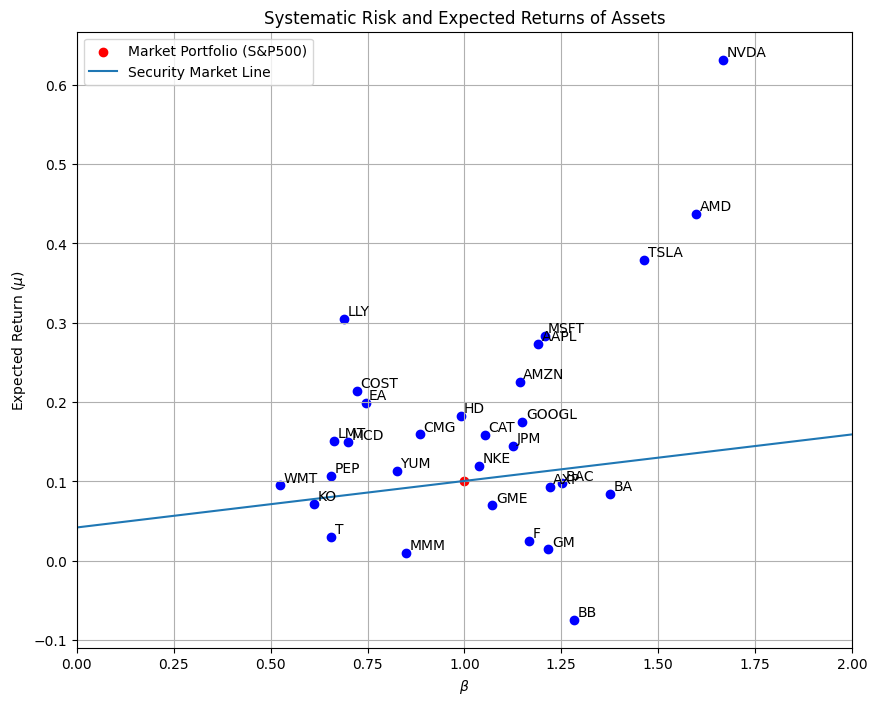
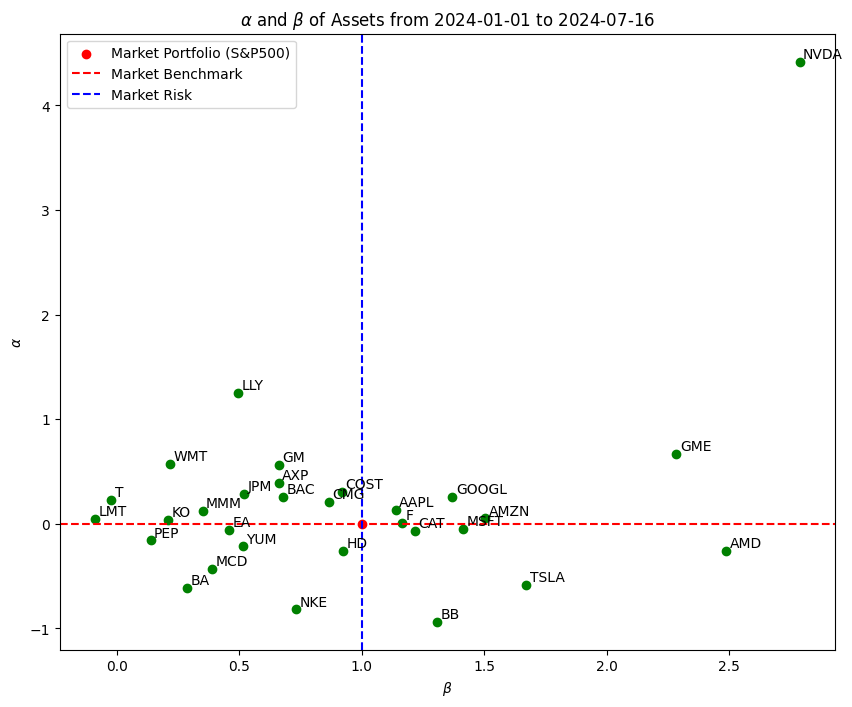
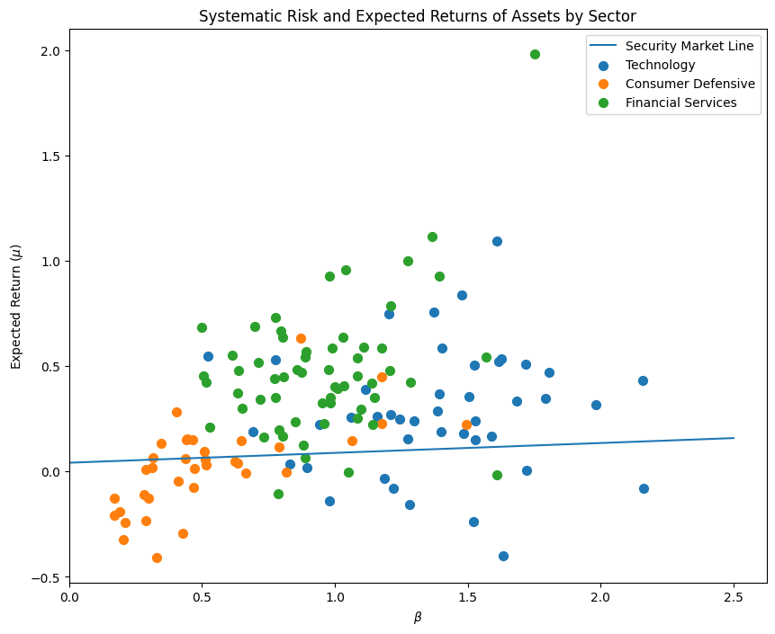

If you were able to accurately predict the expected returns of risky assets, you could consistently beat the market (read more about returns [here](https://www.funance.lol/blog/3mYoAwyTNnmDODIlrTj6hx/returns)). It's just as simple as that, but this is no easy task in practice. Accurate models of expected returns are the claim to fame of many hedge funds.

In past blog posts, we found the expected returns of an asset using its historical average returns. It's not hard to see the flaws in this approach: we are assuming that the future will behave exactly like the past. This is often not the case.

So today, we will go one step further and look at another way of estimating expected returns: using the `Capital Asset Pricing Model (CAPM)`.

This post will utilize some of the terminology introduced in the Modern Portfolio Theory post. Read that [here](https://www.funance.lol/blog/gKDY75eUP7UCVosEO8mSl/portfolio-theory) if you'd like a refresher.

## 1 Capital Asset Pricing Model

The CAPM is a way of estimating the expected returns of an investment, specifically using the systematic risk of the overall market to model the expected returns of an asset.

And like any estimation, we need to make assumptions. And for CAPM, it is as follows:

1. **The market is in equilibrium**. In other words, supply equals demand for each asset.
2. **The market is efficient**. This means everyone has access to the same information. Efficient markets also imply that no one can beat the market since everyone will have the same forecasts.
3. **All investors are rational**. Everyone aims to maximize returns and minimize risk. In the context of Modern Portfolio Theory, this means everyone holds a combination of the tangent portfolio and a risk-free asset.

Immediately, you can see the shortcomings of these assumptions. But let's just roll with it for now and see what we can learn.

### 1.1 Security Market Line

The Security Market Line (SML) is the graphical representation of CAPM. It is defined as:

$$
\mu_i = \beta_i (\mu_M - \mu_f) + \mu_f \quad (1)
$$

Where:

$$
\beta_i = \frac{\sigma_{i,M}}{\sigma_M^2} \quad (2)
$$

$\mu_i$ is the expected return of asset $i$, $\mu_M$ is the expected return of the market portfolio, and $\mu_f$ is the risk-free rate. $\beta_i$ is known as the `beta` of the asset and measures the volatility of the asset relative to the overall market ($\sigma_{i,M}$ is the covariance between asset $i$ and the market, $\sigma_M^2$ is the variance of the market).

TL;DR: Equations (1) and (2) give us the governing equation for CAPM. They show how the expected returns of an asset can be estimated based on its systematic risk (risk relative to the overall market).

Using equation (2), we can see that the beta of the Market $\beta_M = 1$. Setting this as the reference point, we can then classify the riskiness of assets based on their betas:

- $\beta < 1$: Asset is not risky (a 1% change in the market would result in a less than 1% change in the asset price).
- $\beta > 1$: Asset is risky (a 1% change in the market would result in a more than 1% change in the asset price).

### 1.2 Deriving the SML\*

This part is not important to understanding CAPM, so you can just skip to the next section. But in case you are interested like I was, here is how the SML (equation 2) can be derived. The math shouldn't be that bad.

Consider a portfolio consisting of two assets: a risky asset and the market portfolio (technically, the risky asset is also in the market portfolio, but here we consider it by itself). From portfolio theory, we know that the overall expected return of this portfolio is:

$$
\mu_P = w_i \mu_i + (1 - w_i) \mu_M \quad (3)
$$

Where $\mu_P, \mu_i, \mu_M$ are the expected returns of the portfolio, risky asset, and market, respectively. $w_i, (1 - w_i)$ are the portfolio weights of the risky asset and market.

The risk, or standard deviation is:

$$
\sigma_P = \sqrt{w_i^2 \sigma_i^2 + (1-w_i)^2 \sigma_M^2 + 2w_i (1-w_i)^2 \sigma_{i, M}} \quad (4)
$$

Where $\sigma_i^2, \sigma_M^2$ are the variances of the asset and market, and $\sigma_{i,M}$ is the covariance between the asset and market.

We want to find how expected returns change as the risk changes, i.e., $\frac{d\mu_P}{d\sigma_P}$. Using the chain rule, we can further break this down to:

$$
\frac{d\mu_P}{d\sigma_P} = \frac{d\mu_P / dw_i}{d\sigma_P / dw_i} \quad (5)
$$

Taking the first derivative of equations (3) and (4) with respect to $w_i$ gives:

$$
\frac{d\mu_P}{dw_i} = \mu_i - \mu_M \quad (6)
$$

and,

$$
\frac{d\sigma_P}{dw_i} = \frac{w_i \sigma_i^2 - (1-w_i) \sigma_M^2 + (1-2w_i) \sigma_{i, M}}{\sigma_P} \quad (7)
$$

Plugging equations (6) and (7) back into equation (5), we get:

$$
\frac{d\mu_P}{d\sigma_P} = \frac{(\mu_i - \mu_M) \sigma_P}{w_i \sigma_i^2 - (1-w_i) \sigma_M^2 + (1-2w_i) \sigma_{i, M}} \quad (8)
$$

Consider when $w_i = 0$. This means we put 100% of the investments in the market portfolio. Assumption 3 of CAPM, _all investors are rational_, implies that everyone invests in the tangent portfolio. This means the market portfolio IS the tangent portfolio since the investors ARE the market. And at the tangent portfolio, $\frac{d\mu_P}{d\sigma_P}$ is equal to the slope of the CML, or specifically, the Sharpe Ratio. Again, this is all derived in the post on [Modern Portfolio Theory](https://www.funance.lol/blog/gKDY75eUP7UCVosEO8mSl/portfolio-theory).

So now we have our boundary condition:

$$
\frac{d\mu_P}{d\sigma_P} \bigg|_{w_i=0} = \frac{\mu_M - \mu_f}{\sigma_M} \quad (9)
$$

Setting $w_i=0$ in equation (8) and equating to equation (9), we have $\mu_P = \mu_M$ at $w_i=0$:

$$
\frac{(\mu_i - \mu_M) \sigma_M}{\sigma_{i, M} - \sigma_M^2} = \frac{\mu_M - \mu_f}{\sigma_M} \quad (10)
$$

Finally, if we isolate for $\mu_i$:

$$
\mu_i = \frac{\sigma_{i,M}}{\sigma_M^2} (\mu_M - \mu_f) + \mu_f \quad (11)
$$

Boom, that is the SML.

Honestly, I didn't need to include this part at all, but hey, gotta meet the math quota for the post somehow...

### 1.3 Undervalued and Overvalued Assets

Aside from calculating the expected returns of assets, we can also evaluate whether an asset is undervalued or overvalued using the SML.

Let's use the historical returns of the _S&P500 index_ to represent the market returns and _0.042_ as the risk-free rate (current US 10-Year Treasury Bond yield). Using equation (1), we can plot the expected returns as a function of beta. Next, we can calculate the actual returns (using historical returns) and betas (using equation (2)) of different stocks and plot them on the same set of axes. Here is the result:

_Figure 1. Systematic Risk and Expected Returns of Different Stocks. Calculated using historical prices from the start of 2014 to the end of 2023 (10 years)_

In _Figure 1_, the SML serves as a predictor of the expected returns for different betas, and the data points represent the actual return of each stock. We can then use the SML as a benchmark for evaluating investments.

Stocks located above the SML are `undervalued` and can be considered good investments, while stocks under the SML are `overvalued` and are bad investments. This is because, under the assumptions of CAPM, any asset not on the SML is not in equilibrium, and over time its price would change until it is on the SML.

This might be a bit confusing, so here is an example: consider an overvalued stock below the SML. Rational investors would not buy this stock since other options offer higher expected returns for similar risk (beta). This would cause the stock price to decrease due to a supply surplus. As a result, the expected returns would increase, effectively moving the point up until it reaches equilibrium on the SML.

You might think: _"What's the difference between selecting stocks based on CAPM and selecting them based on historical returns? Wouldn't that produce the same results?"_. That's what I wondered too since using both methods, the 'best' stocks are the same: `NVDA`, `AMD`, and `TSLA`.

The difference is simple: when using CAPM, we consider the systematic (market) risk, whereas using purely historical returns doesn't.

Let's look at an example: `BA - Boeing Co` and `WMT - Walmart Inc`. The historical returns are very similar, but when we use CAPM, we see that `WMT` is undervalued while `BA` is overvalued. This is indeed the case when looking at the YTD returns:

| Ticker | Returns (YTD) |
| :----- | :-----------: |
| WMT    |    31.81%     |
| BA     |    -26.10%    |

_Table 1. Year-to-Date Comparison of BA and WMT returns_

Now this is just a very small sample size, not to mention Boeing is probably an outlier due to all the real-world shenanigans going on. But it's not hard to see the advantage of using CAPM.

### 1.4 Alpha

There can't be a beta without an alpha :). That was a joke.

But suppose you own some investments. How can you evaluate them? Well, you could look at whether the returns are positive or negative. Sure, that would work, but I raise you one better: let's directly compare the investment returns to the market.

Simply put, an asset's `Alpha` indicates how much better (or worse) it performed compared to the overall market. In the context of CAPM, this is:

$$
\alpha = (R_i - R_f) - \beta_i (R_M - R_f) \quad (12)
$$

Where $R_i$ is the actual returns of the asset over a given period of time.

It's important to make the distinction that we are not directly comparing the asset returns with the market returns, but rather comparing to the risk-adjusted market returns (this can be achieved using the Capital Market Line).

Similar to beta, we can classify alpha as follows:

- $\alpha < 0$: The investment has underperformed the market, indicating a bad investment.
- $\alpha > 0$: The investment has outperformed the market, indicating a good investment.

Let's use year-to-date data to re-calculate the alphas and betas of the stocks in _Figure 1_ and plot it...

_Figure 2. Alpha and Beta of Assets. Calculated using 2024 year-to-date prices_

We can split the plot into 4 quadrants.

- $\beta > 1, \alpha > 0$: Here we have risky assets that outperformed the market. But it might not be good in the long term since you are taking on more risk.
- $\beta < 1, \alpha > 0$: These are less risky assets that still outperformed the market. This could be an indication that it's a good investment.
- $\beta > 1, \alpha < 0$: Here are assets that are riskier and underperformed. Probably not a good investment.
- $\beta < 1, \alpha < 0$: Less risky assets that underperformed. Still not a good investment.

Comparing Figures 1 and 2, notice how:

1. Betas are not necessarily constant. It's dependent on the data you use. Probably not the best idea to Google 'xxx stock beta' and use whatever value you find in your calculations.
2. Beta could be negative. This means that the returns of the asset are inversely related to the market returns. CAPM indicates that these assets have returns less than the risk-free rate.

This is a bit of a tangent, but why would anyone want to invest in a stock with a negative beta? Shouldn't you just invest in the risk-free asset instead? The answer is hedging. `Hedging` is a way of managing risk by investing in an asset of an opposite position. It's widely used in Options Trading (which will be the topic of next week's blog).

In the context of CAPM, an investor might invest in an asset with negative beta to hedge against the systematic risk in the market.

## 2 Limitations of CAPM

CAPM ain't perfect. What a surprise. Aside from the idealistic at best assumptions, there are also other limitations:

- **Markets are not efficient**. Investors do not have the same access to information. This also means different investors likely have different forecasts of expected returns.
- **People are not rational**. Pretty self-explanatory.
- **Beta is calculated using past data**. As discussed previously, beta isn't constant. So historical beta may not be a good indicator of future beta.
- **Linear relationship between risk and returns**. Unfortunately, the real world is a lot more complex than that.
- **Only considers market risk**. CAPM assumes that the expected returns of an asset only depend on the market risk. This is also known as a `Single Factor Model`, meaning we are estimating expected returns using one factor. There are more advanced `Factor Models` that take into account more factors that may affect returns.

An example of another factor that may impact the returns of a stock is industry/sector. If we plot the betas and expected returns of some stocks in the S&P500 index, we get the following:

_Figure 3. Systematic Risk and Expected Returns of Different Stocks by Sector_

We can observe clustering between the three sectors shown. This suggests that other factors also impact expected returns, not just the market risk that CAPM accounts for. But that is another topic for another day...

## 3 Conclusions

Yup, I am once again ending it here. I wanted to add more about testing the CAPM using empirical data but that will have to be moved to the next blog. I try to keep the reading time of every post around 12 minutes and it looks like we are hitting that now so I'm going to stop yapping.

In this post, we looked at another way of estimating the expected returns of an asset using the Capital Asset Pricing Model. We then showed how to find the beta of an asset and use it with the Security Market Line to evaluate whether the asset is overpriced or underpriced. Also, we looked at how alpha can be used to evaluate whether the asset was a good investment or not. Lastly, we discussed some of the shortcomings of CAPM.

The code used can be found on [GitHub](https://github.com/yangsu01/funance_blog/blob/main/blogs/07-CAPM/CAPM.ipynb).

bye bye
