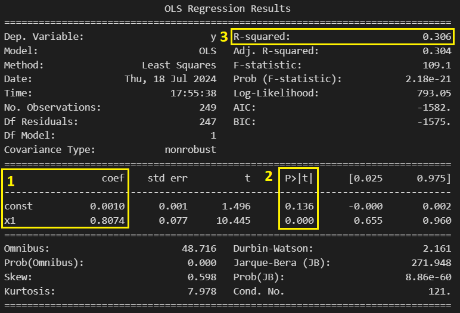
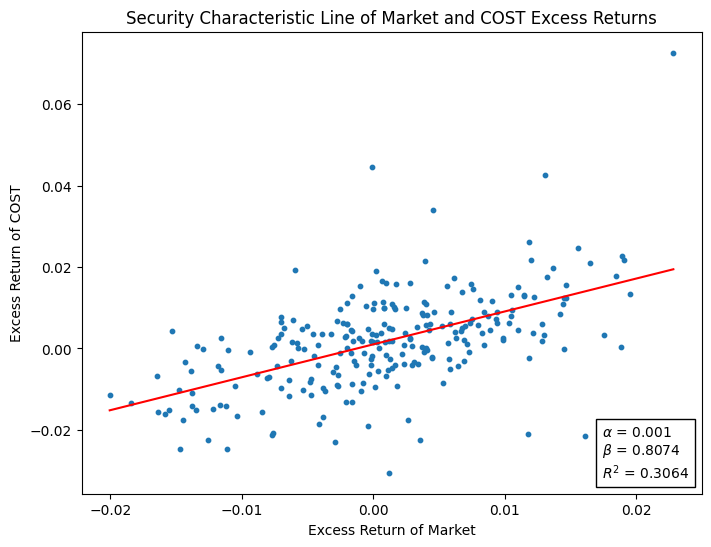

In this post, we will see how CAPM can be implemented on market data and used to select investments. All of our following analysis will assume that the assumptions of CAPM hold.

This post builds upon the theory discussed in the previous post on the [Capital Asset Pricing Model](https://www.funance.lol/blog/4hX4HVhNTKvkluqxK8RsrU/CAPM). Give that a read first if you need a refresher.

## 1 CAPM and Regression

Starting off, we need to first slightly adjust our approach.

As a quick review, CAPM describes a linear relationship between the excess expected returns of the market $(\mu_M - \mu_f)$ and the excess expected returns of an asset $(\mu_i - \mu_f)$. This is represented in the form of the Security Market Line (SML):

$$
(\mu_i - \mu_f) = \beta_i (\mu_M - \mu_f) \quad (1)
$$

Note I moved the intercept $\mu_f$ to the left-hand side to represent the excess returns of the asset $(\mu_i - \mu_f)$. This results in a linear equation with no intercept which is beneficial for finding alpha. More on this later...

While this equation works well in theory, there is one main issue: we are taking the expected values of return, ie $E[R] = \mu$ where $R$ is the actual returns (the expected value of a random variable is the same as taking the mean). As a result, information about the variance ($\sigma^2$) is lost.

When working with real-world stock data, the variance of the distribution is important as it quantifies the _risk_ associated with the asset.

Theres a simple solution to this: we can just fit a regression model of the market returns vs asset returns. Since equation (1) is linear, we will fit a simple linear regression model:

$$
R'_i = \alpha_i + \beta_i R'_M + \epsilon_i \quad (2)
$$

Where $R'_i = (R_i - R_f)$ and $R'_M = (R_M - R_f)$ are the actual excess returns of the market and asset $i$ (the risk-free rate is not constant over time), $\epsilon_i$ is the error term and $\alpha_i, \beta_i$ are the intercept and slope fitted by the regression model.

A few interesting observations can be made here:

1. $\beta_i$ IS the beta of asset $i$
2. $\alpha_i$ IS the alpha of asset $i$
3. Taking the expected values of equation (2) gives us equation (1). Note the expected value of error term is $0$.

### 1.1 Types of Risk

Using equation (2), we can quantify the risk of asset $i$. Taking the variance of both sides:

$$
Var(R'_i) = Var(\alpha_i + \beta_i R'_M + \epsilon_i) \quad (3)
$$

We can simplify the right-hand side using some properties of variance:

$$
Var(X + Y) = Var(X) + Var(Y) + 2Cov(X,Y) \quad (4)
$$

Where $Cov(X,Y)$ is the covariance of $X$ and $Y$. Note the covariance of two _independent_ random variables as well as the covariance of a random variable and a constant are both $0$. Additionally, we also have:

$$
Var(cX) = c^2Var(X) \quad (5)
$$

Where $c$ is a constant.

Using equations (4) and (5), we can simplify equation (3) to get:

$$
\sigma_i = \sqrt{\beta^2_i \sigma^2_M + \sigma^2_{\epsilon, i}} \quad (6)
$$

Where $\sigma_i$ is the standard deviation, or risk of asset $i$, $\sigma^2_M$ is the variance of the market returns, and $\sigma^2_{\epsilon, i}$ is the variance of the regression error term.

Notice how the total risk of asset $i$ can be broken down into two components:

- $\beta^2_i \sigma^2_M$, known as the `Market Risk` or `Systematic Risk`. This is the risk inherent in the market
- $\sigma^2_{\epsilon, i}$, known as the `Unique Risk` or `Unsystematic Risk`. This is the risk _unique_ to each asset, which implies that $\sigma^2_{\epsilon, i}$ and $\sigma^2_{\epsilon, j}$ are **independent** for $i \neq j$

You might spot the issue here. $\sigma^2_{\epsilon, i}$ is not always _unique_. For example, different assets in the same sector usually share some underlying risk beyond market risk. Another shortcoming of CAPM.

### 1.2 Minimizing Risk Through Diversification\*

I will now show how risk can be minimized through diversification (theoretically...).

The proof is not important to understanding this post so you can skip to the next section, but before you go heres a **TL;DR**: Unique Risk can be minimized through diversification while Market Risk cannot.

Suppose we want to construct a portfolio of $N$ assets with returns $R_1, R_2, ... R_N$. The asset weights in the portfolio are $w_1, w_2, ... w_N$. From portfolio theory, we know the total returns of the portfolio, $R_P$ is:

$$
R_P = \sum_{i=1}^{N} w_i R_i \quad (7)
$$

We know that $R_i$ is:

$$
R_i = \mu_f + \beta_i (R_M - \mu_f) + \epsilon_i \quad (8)
$$

This is just equation (2) rearranged (we assume the risk-free rate is constant). Now plug equation (8) into equation (7):

$$
R_P = \sum_{i=1}^{N} \left[ \mu_f + \beta_i ( R_M - \mu_f ) + \epsilon_i \right] w_i \quad (9)
$$

We can expand this into:

$$
R_P = \mu_f + \sum_{i=1}^{N} \beta_i w_i (R_M - \mu_f) + \sum_{i=1}^{N} \epsilon_i w_i \quad (10)
$$

Note $\sum_{i=1}^{N} w_i = 1$. The Beta and Error terms for this portfolio are then:

$$
\beta_P = \sum_{i=1}^{N} \beta_i w_i \quad (11)
$$

$$
\epsilon_P = \sum_{i=1}^{N} \epsilon_i w_i \quad (12)
$$

Lets now look at the two components of risk defined in equation (6):

$$
\text{Market Risk =} \left( \sum_{i=1}^{N} \beta_i w_i \right)^2 \sigma_M^2 \quad (13)
$$

$$
\text{Unique Risk =} \left( \sum_{i=1}^{N} \sigma_i w_i \right)^2 (14)
$$

Assume we put equal weights to each asset in our portfolio. This means: $w_i = \frac{1}{N}$. Looking at each risk component separately, the _market risk_ becomes:

$$
\text{Market Risk} = \left( \frac{\sum_{i=1}^{N} \beta_i}{N} \right)^2 \sigma_M^2 \quad (15)
$$

Taking the _limit_ of this equation for $N \rightarrow \infty$, we see the market risk does not converge (numerator scales at the same rate as the denominator). So the **market risk cannot be reduced through diversification**.

On the other hand, if we assume the variance of the error term is constant: $\sigma_{\epsilon, i}^2 = \sigma_{\epsilon}^2$. The _unique risk_ becomes:

$$
\text{Unique Risk} = \frac{1}{N} \frac{\sum_{i=1}^{N} \sigma_{\epsilon, i}^2}{N} = \frac{\bar{\sigma_{\epsilon}}^2}{N} = \frac{\sigma_{\epsilon}^2}{N} \quad (16)
$$

Where $\bar{\sigma_{\epsilon}}^2$ is the mean of $\sigma_{\epsilon}^2$.

_Finally_, taking the limit of equation (16)...

$$
\lim_{N\to\infty} \frac{\sigma_{\epsilon}^2}{N} = 0 \quad (17)
$$

Bam, unique risk can be eliminated (Theoretically). So... **unique risk can be reduced through diversification**.

## 2 Fitting Regression Models

Thats enough theory, time to fit some models.

Here are the specifications I used:

- Returns of the S&P500 index are used as market returns
- Risk-Free Rate is taken as the history of 10-year US Treasury Bond yield
- Daily data from 2023-01-01 to 2023-12-31 was used to fit the models.

The frequency and period of data used should be adjusted according to investment goals. For example, short-term, high-frequency data (ex, 1 year of daily prices) can maybe capture current trends but is often noisy. Lower frequency data can smooth out the noise but you might lose some information in the process.

Lets start with an example. I will fit a simple linear regression model for `COST - Costco Wholesale Corporation` described in equation (2). Using `statsmodels.api.OLS`, here is the summary:

_Figure 1.CAPM Linear Regression Summary. Obtained using `statsmodels.api.OLS`_

Currently, we are interested in three pieces of information:

1. This shows us the fitted constants as seen in equation (2). _const_ is the intercept (alpha), and _x1_ is the slope (beta)
2. Here we have the p-values of the coefficients. For this example, using a threshold of 0.05, we can reject the Null Hypothesis that $\beta=0$ but we cannot reject $\alpha=0$. This means alpha is not statistically different from 0. Here are some videos on [Hypothesis Testing](https://youtu.be/0oc49DyA3hU?si=MKlJYfgGbNe2vYPR) and [P-Values](https://youtu.be/vemZtEM63GY?si=S8ic0EDq_fukPjpJ) by _StatsQuest_ if you're confused.
3. $R^2$ tells us how 'good' the fit is. Heres an [Investopedia Article](https://www.investopedia.com/terms/r/r-squared.asp) if you want to learn more. In the context of CAPM, $R^2$ tells us what portion of the risk is due to the market. So in _Figure 1_, 30.6% of the total risk associated with `COST` is due to the market risk and 69.4% is due to the unique risk.

Lets plot it:

_Figure 2. Linear Regression of Market and COST Excess Returns_

Thats pretty good. Notice how since we are using daily data, theres some outliers that may impact the final fit.

## 3 Picking Stocks

Ok, so now what?

Recall the definition of alpha and beta:

- $\alpha$ measures whether the stock outperformed ($\alpha > 0$) or underperformed ($\alpha < 0$) relative to the market.
- $\beta$ tells us whether the stocks is risky ($\beta$ > 1) or safe ($\beta$ < 1) relative to the market.

Using this, we can devise a simple investment strategy:

1. Fit regression models on a bunch of stocks
2. Filter out the stocks with $\alpha > 0$ (and are also statistically different from 0). You can also add a restriction for $\beta$ or $R^2$ but I wont for now
3. Construct an optimized portfolio for the selected stocks using Modern Portfolio Theory
4. Profit

Pretty simple strategy... But there is one problem (aside from the issues of CAPM).

### 3.1 Are Alpha and Beta Constant?

One of the observations we made in the CAPM intro blog post is: beta (and alpha) are not always constant. This is an issue since our strategy relies on $\alpha > 0$ to select stocks.

Fortunately, we can test for that. One such way of testing whether alpha and beta are constant is using a sliding window:

- Create subsets of data using the main dataset. For consistency, keep the length of each subset the same
- Fit a regression model on each subset of data
- Record the alphas and betas to see whether they change over time

While this approach would work, its quite computationally intensive since we need to repeatedly fit multiple models for each stock we evaluate. This would not scale well.

#### 3.1.1 Multiple Linear Regression\*

This part is also optional. **TL;DR**: we can fit a Multiple Linear Regression to test whether $\alpha$ and $\beta$ change over time.

Here is another method which requires us to only fit one model for each stock, as outlined in Chapter 7.10 of _Statistics and Finance: An Introduction_ by Ruppert, D (2004).

We will be using `Multiple Linear Regression`. Heres a [StatQuest video](https://youtu.be/EkAQAi3a4js?si=rRPb-To97PoWD-XZ) if you want to learn more.

Assume both $\alpha$ and $\beta$ are not constant, ie, they change over time. For simplicity, we will assume a linear time-varying relationship.

While we can use a simple $y = mx + b$ to represent this relationship, it would result in a very small slope $m$ which may not be statistically different from 0 ($\Delta \alpha$ and $\Delta \beta$ are small). Instead, we can normalize the distribution:

$$
\alpha_t = \alpha + \gamma_{\alpha} \frac{t - (n+1)/2}{n-1} \quad (18)
$$

$$
\beta_t = \beta + \gamma_{\beta} \frac{t - (n+1)/2}{n-1} \quad (19)
$$

Where $n$ is the number of observations in our dataset, $t = 1, 2, ...n$ is the _uniform distribution_ of time, and $\gamma_{\alpha}, \gamma_{\beta}$ are the coefficients for the time dependent components of $\alpha, \beta$.

Plugging equations (18) and (19) into equation (2), we get our multiple linear regression model:

$$
R' = \alpha + \gamma_{\alpha} \frac{t - (n+1)/2}{n-1} + \beta R'_M + \gamma_{\beta} \frac{t - (n+1)/2}{n-1} R'_M + \epsilon_i \quad (20)
$$

After fitting this model, if $\gamma_{\alpha}, \gamma_{\beta} = 0$ (or are not statistically different from 0), we can assume $\alpha, \beta$ are constant (at least for the period we tested). There is still the possibility that the relationship between $t$ and $\alpha, \beta$ is more complex such as quadratic but our simple model will not be accounting for that.

### 3.2 Improved Strategy

Here is the revised strategy:

1. Fit regression models on a bunch of stocks using one year of daily historical returns. Only one year of data is used since I am trying to capture short-term trends
2. Filter out the stocks with $\alpha > 0$ and are statistically different from 0
3. For each filtered stock, fit a multiple linear regression model using five years of daily historical returns
4. Filter out the stocks with non constant $\alpha$
5. Construct a tangent portfolio using selected stocks. Also use CAPM to estimate the expected returns (equation (1)) and risk (equation (6))

## 4 Implementing The Strategy

Lets first backtest the strategy on some historical data. I will use historical returns ending on _12-31-2023_ of all stocks in the S&P500 index. Here are the selected stocks and how they have performed year-to-date:

| Ticker  |      Company Name       | Returns (YTD) | Difference |
| :-----: | :---------------------: | :-----------: | :--------: |
| S&P 500 |      S&P 500 Index      |    16.07%     |     0%     |
|  NVDA   |         NVIDIA          |    144.82%    |  +128.75%  |
|  META   |     Meta Platforms      |    37.69%     |  +21.62%   |
|   GE    |    General Electric     |    58.10%     |  +42.03%   |
|   RCL   | Royal Caribbean Cruises |    40.08%     |  +24.01%   |
|  FICO   |       Fair Isaac        |    40.63%     |  +24.56%   |
|   PHM   |       PulteGroup        |    22.86%     |   +6.79%   |

_Table 1. YTD Performance of Selected S&P500 Stocks. Historical Returns up to 12-31-2023 was used_

Wow thats pretty good. However, I only backtested on 1 subset of data, so take it with a grain of salt. Heres the constructed tangent portfolio:

|  Ticker   |  Weight  | Expected Returns | Standard Deviation |
| :-------: | :------: | :--------------: | :----------------: |
|   NVDA    |  11.65%  |      46.93%      |       49.77%       |
|   META    |  17.77%  |      41.42%      |       39.36%       |
|    GE     |  18.61%  |      23.62%      |       25.54%       |
|    RCL    |  15.73%  |      37.14%      |       37.85%       |
|   FICO    |  20.28%  |      25.37%      |       26.08%       |
|    PHM    |  15.95%  |      29.20%      |       31.64%       |
| **Total** | **100%** |    **32.87%**    |     **21.45%**     |

_Table 2. Tangent Portfolio Constructed using Selected S&P500 Stocks. Historical Returns up to 12-31-2023 was used_

**The actual YTD returns of this portfolio is 52.57%** so we already outperformed our predictions and we're only halfway into the year...

### 4.1 Future Predictions

So would I use this model to invest my own money? No, at least not before extensively backtesting it.

But just for fun, I'll put some money in to test it out. Yolo, do not try this at home.

Lets run this model on up-to-date returns and see what portfolio it recommends. Again to save time, I will only look at stocks in the S&P500 index.

I also added an extra filter for $R^2 > 5%$. Honestly this is pretty arbitrary, I just wanted to filter out the stocks that were very loosely correlated with the market.

This time, only 3 stocks were returned. Here is the tangent portfolio

| Ticker |  Company Name   |  Weight  | Expected Returns | Standard Deviation |
| :----: | :-------------: | :------: | :--------------: | :----------------: |
|  TRGP  | Targa Resources |  26.15%  |      13.73%      |       23.27%       |
|  GDDY  |     Godaddy     |  47.19%  |      21.21%      |       25.03%       |
|  NRG   |   NRG Energy    |  26.66%  |      18.65%      |       29.05%       |
|        |    **Total**    | **100%** |    **18.57%**    |     **16.95%**     |

_Table 3. Tangent Portfolio Constructed using Selected S&P500 Stocks. Historical Returns up to 07-19-2024 was used_

## 5 Conclusion

Well, there you have it.

In this post, we looked at how linear regression could be used to implement CAPM on real world market data. We also used it to create an investment strategy and I put some of my own money on the line for fun. I've accepted the fact that I might never see that money again...

The code used in this post is on [GitHub](https://github.com/yangsu01/funance_blog/blob/main/blogs/08-CAPM-and-regression/capm-regression.ipynb). I also condensed the code implementing the 'improved strategy' [here](https://github.com/yangsu01/funance_blog/blob/main/blogs/08-CAPM-and-regression/portfolio.ipynb) if you're interested.

RIP money
