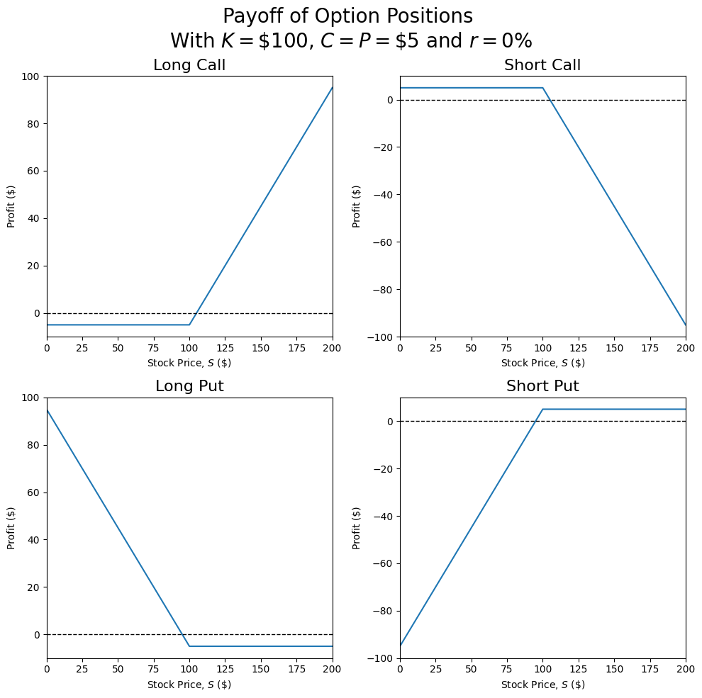
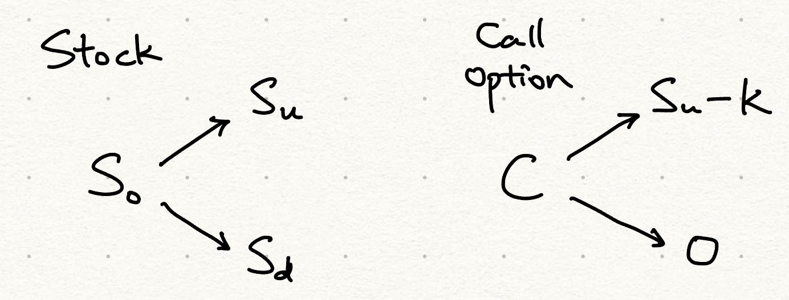
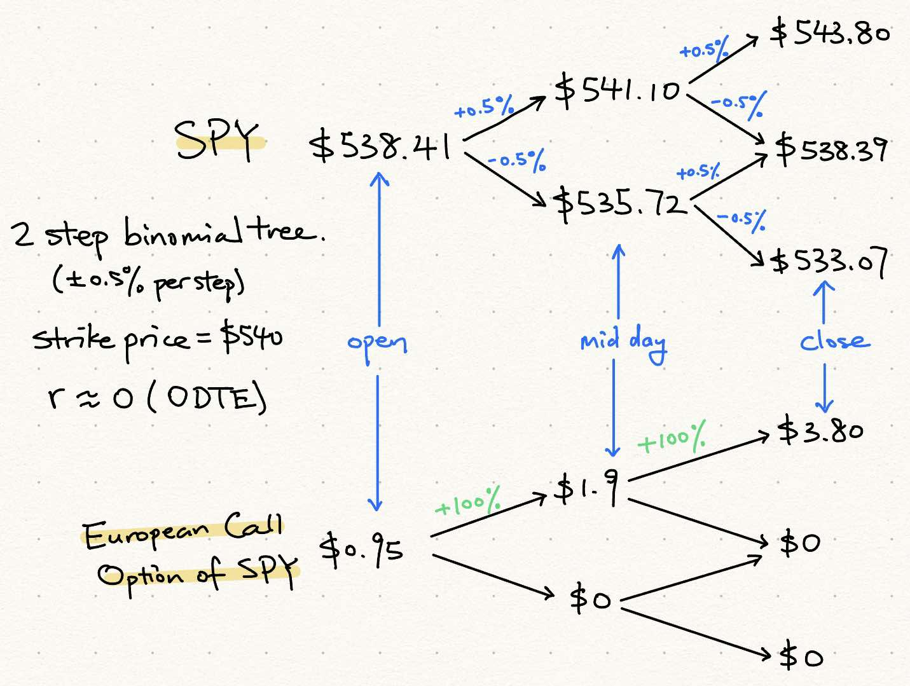
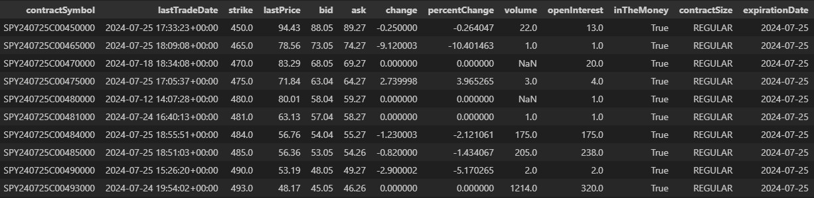

On my to-do backlog for the Funance Portfolio Simulator, I have _'implement options trading'_ as one of the top items.

Initially, I didn't think it would be too much of a challenge: I already understood what options were (I thought...) all I had to do was scrape some prices of option contracts and track it like stock prices.

Yea, I was wrong. After looking at an `Option Chain`: a table of quotes for available option contracts of an asset, I was clueless (more on this later).

So this week, let's start looking at options trading, namely:

1. How are the prices of option contracts determined?
2. Why would someone want to trade options?
3. How can you interpret the information on trading platforms (such as WealthSimple)?

## 1 What are Options?

To make sure everyone is on the same page, we'll start off with some quick definitions. Its pretty standard stuff, feel free to just skim though it (you're probably doing it already).

- `Derivatives`: a type of financial instrument whose value _derives_ from an underlying asset. It can be though of as a contract between two parties and has no intrinsic value in itself
- `Options`: a type of derivative which gives someone the **option** to buy (or sell) a specified number of shares (usually 100) of a stock at a certain price
- `Strike Price`: the price at which the stock can be bought/sold at. The strike price is **fixed** and does not change over time
- `Call Options`: a type of options contract that allows the holder to **buy** a set number of shares at the strike price
- `Put Options`: a type of options contract that allows the holder to **sell** a set number of shares at the strike price

### 1.1 Long and Short Positions

As with any contract, there are two parties involved: someone who purchases the contract and someone who sells it. In the context of options, the party that purchases the option assumes the `Long Position` while the party that issues the options takes on the `Short Position`. The seller of the options contract also charges a premium, this is the options price (more on this later).

If we combine long and short positions with call and put options, we get four different positions. Time to _visualize_...

Assume a strike price (denoted as $K$) of \$100, option price (denoted as $C$ for calls, $P$ for puts) of \$5, and risk-free rate (also referred to as interest rate, $r$) of 0%. We will talk about why interest rate matters in the next section.

Plotting the payoff (or profit) of each position at maturity as a function of the stock price:

_Figure 1. Potential Payoffs of Different Options Positions_

In the figure above, the profit was calculated based on _1 share_. In practice, the size of each options contract is usually **100 shares**.

Time to break it down.

- `Long Call`: if you held this option, you have the _right_ to buy the underlying asset at the strike price $K$
  - Profit: $S - (K + C)$. Where $S$ is the stock price at maturity. This could potentially be infinite since the underlying asset can keep going up
  - Loss: $-C$. You lose the premium paid, this occurs if the stock price is below the strike price. In general, always exercise the call option if the stock price, $S > K$
- `Short Call`: if you assumed this position, you _must_ sell the underlying asset at $K$ if the option is exercised
  - Profit: $C$. This occurs when $S \leq K$ and the option isn't exercised
  - Loss: $(K + C) - S$. Potential infinite loss as the stock price could go up indefinitely
- `Long Put`: the holder has the right to sell the underlying asset at $K$
  - Profit: $K - (S + P)$. This occurs when the stock price falls below the strike price. In general always exercise the put option if $S < K$
  - Loss: $-P$. Similar to a long call, you only lose the premium
- `Short Put`: The holder must buy the underlying asset at the strike price if the option is exercised
  - Profit: $P$. occurs when option isn't exercised at $S \geq K$
  - Loss: $(S + P) - K$. Still a potentially big loss but its bounded by $S = 0$

You probably have a lot of questions right now. I definitely did when researching this topic. So I'll try to go through each question (assuming you have the same questions as me).

## 2 Options Pricing

First of all, where the heck do you get options price ($C, P$)? Well, its complicated.

Options pricing is a very technical topic and is beyond the scope of this post, but learning about the basics can be beneficial to understanding how option prices change. Its like when first learning about integrals, you start off by adding up squares under a curve. Am I right or am I right?

### 2.1 Arbitrage

Let's first look at a simpler example. Instead of pricing an option, we will price a forward contract. `Forwards` are another type of derivative. Different from options, the holder of forward contracts _must_ buy/sell the underlying asset at the agreed upon price at maturity. The pricing of a forward is simpler since the transaction is guaranteed to occur.

Suppose you own a share of stock XYZ with a current price of \$100. You enter a forward contract with a friend, agreeing to sell them the share a year from now at a price $C$. Assuming you did't want to exploit your friend, what would be a fair price?

My first thought was to use the expected returns. If I expected the price of the stock to increase to \$130 in a year, then I would sell it to them for around that price.

This is incorrect. Consider what would happen if the forward contract was priced at \$130. You could just borrow \$100 from the bank, buy a share of XYZ at the current price of \$100, hold it for a year, sell it at \$130 to your friend you just scammed, then pay back the principle + interest to the bank. Assuming an interest rate of 4\% (compounded annually), your profit would be: $130 - 100(1.04) = \$26 $.

This profit is known as `Arbitrage` meaning you made a **risk-free profit** without assuming any market risk or investing any capital (you just borrowed money from the bank). Even if the price of the stock jumped to \$200 and your friend made a profit of $200 - 130 = \$70$, this is still fundamentally different from arbitrage as they took on risk and invested their own capital.

The only fair price is current price + interest occurred (cost of holding the stock for a year). Which is \$104 in our example. If you priced the forward below \$104, it would result in arbitrage for your friend.

Efficient markets should be priced such that there are no opportunities for arbitrage. This can be enforced using the `Law of One Price` which states that if two assets have the same payoffs, they also have the same price. This is how options are priced.

Bit of a tangent, but this is also why stocks that list of multiple exchanges (ex: BB on NYSE and BB.TO on TSX) have the same price adjusted for currencies. If this was not the case, the law of one price would be violated and create opportunities for arbitrageurs. They could purchase the stock on one exchange and immediately sell it on another for guaranteed profits. This would cause the stock's price in both markets to re-balance until the law of one price is met.

### 2.2 1-Step Binomial Pricing

So how does options pricing work? Let's look at a simplified example. Suppose we have a `European Call Option` which only allows you to exercise the option at maturity. On the contrast, `American Options` allows you to exercise the option at anytime before maturity.

Suppose we have a stock with current price $S_0$. After one arbitrary time period, the price will either go up to $S_u$ or down to $S_d$ (the probability of these events occurring doesn't actually matter). The strike price of the european call option $K$ ($S_d < K < S_u$ for no arbitrage) and the risk-free market rate is $r$. We can visualize the potential payouts as follows:

_Figure 2. 1-Step Binomial Tree of Potential Payouts of a Stock and European Call Option_

It is implied that the payouts of the call option are: $S_u - K$ if the option is exercised and $0$ if its not. Now we need to find the price of the call option $C$. By the law of one price, if there exists some portfolio with the same payoffs as the option, then the current value of the portfolio _is_ the price of the option. This means that we need to satisfy:

$$
\text{Volatility of Portfolio} = \text{Volatility of Option} \quad (1)
$$

Note the volatility here is referring to the **difference in potential payouts**. If we construct our portfolio using the same stock and the risk-free asset, we can conveniently find how many shares we need purchase in the portfolio as follows:

$$
\Delta = \frac{S_u - K}{S_u - S_d} \quad (2)
$$

Where $\Delta$ is the `Hedge Ratio (Delta)` of the option which tells us how sensitive the option's price is to changes in the stock's price. Delta is part of a larger family of metrics known as `The Greeks` that measure different properties of option contracts. Heres the [Investopedia page](https://www.investopedia.com/trading/getting-to-know-the-greeks/#:~:text=Option%20Greeks%20are%20financial%20metrics,price%20of%20the%20underlying%20asset.) if you want to learn more. ($S_u - K$) is the _volatility_ of the option and ($S_u - S_d$) is the _volatility_ of the underlying asset. Interestingly, delta also tells us how much of the underlying asset we should hold to hedge the options position.

Next let's find how much we should invest in the risk-free asset. To satisfy the law of one price, we need to match the payouts. If the payout of the option is zero, then the payout of our portfolio should also be zero:

$$
\Delta S_d + x = 0 \quad (3)
$$

Where $\Delta S_d$ is the value of the stock in our portfolio if the stock price goes down. Solving for $x$, the amount we should invest in the risk-free asset is $-\Delta S_d$ which can be interpreted as taking on a _negative position_ in the risk-free asset (borrowing money). Note that $-\Delta S_d$ is the _future_ value of the risk-free asset, so we need to discount it by the interest rate $r$ to the present value: $- \frac{\Delta S_d}{1 + r}$. Heres an article on [present value of money](<https://www.investopedia.com/terms/p/presentvalue.asp#:~:text=Present%20value%20(PV)%20is%20the,in%20strategic%20planning%20for%20businesses.>)

Now that we know how many shares of the stock to buy ($\Delta$) and how much of the risk-free asset to invest in ($-\Delta S_d$), we can find the present value of the portfolio:

$$
PV = \Delta S_0 - \frac{\Delta S_d}{1 + r} \quad (4)
$$

Where $\Delta S_0$ is the amount invested in the underlying stock, and $\frac{\Delta S_d}{1 + r}$ is the amount invested in the risk-free asset.

Since we matched the payouts of this portfolio to the payouts of the call option, by the law of one price, the price of the European Call option is:

$$
C_0 = \frac{S_u - K}{S_u - S_d} \left( S_0 - \frac{S_d}{1+r} \right) \quad (5)
$$

This is the underlying intuition of options pricing using the law of one price. In particular, we showed how it could be done using a **1-Step Binomial**.

Pricing European Options using the 1-step binomial method is oversimplified as we assume the stock price only changes once in a **discrete** interval. In practice, we need to use PDEs (options price is a function of time and stock price). Here is the [wiki page](https://en.wikipedia.org/wiki/Black%E2%80%93Scholes_equation) if you want to learn more.

## 3 Why Trade Options?

While researching for this post, I ended up going down the rabbit hole of retail day traders. Would not recommend... If you know, you know. You see people claim to 'consistently' make thousands in profit per day. How is that possible? They probably don't have large portfolios that can generate those returns so do they just buy penny stocks and wait for it to flip? I don't know cause I didn't buy their courses 💅.

But more likely than not, they are trading options.

### 3.1 Leverage

As we just discussed, option prices are primarily influenced by two things: the underlying stock's price and the time until maturity. The more volatile the stock price and the shorter the time till maturity, the more volatile the options price will be.

So for maximum volatility or should I say _maximum profit_, `0DTE` (0 days until expiration) options are very popular. As for the stocks, you might be surprised to find that its usually not penny stocks, but rather large corporations listed on the S&P500 or NASDAQ. This is due to the `Leverage` options provide where option prices are very sensitive to changes in the stock price.

Let's look at a quick example. The current price of `SPY - SPDR S&P 500 ETF Trust` is \$538.41. Assume the price of `SPY` can fluctuate $\pm 1\%$, and the strike price of a European Call Option to be $K = \$540$ (since the expiration is literally the end of the trading day, we can assume $r=0$).

Using a 2-step binomial tree, we can price the call option as follows:

_Figure 3. Sketch of 2-Step Binomial Tree Approximation of 0DTE SPY Call Option Pricing_

I used a slightly different method to find the option price at each node, read more [here](https://en.wikipedia.org/wiki/Binomial_options_pricing_model).

Notice how even though the price of `SPY` only changed by **1\%**, the price of the call option could increase by **400%**. This is leverage.

So if you invested in this particular 0DTE call option, you could either 4X your investment, or lose it all by the end of the day. 😤😤 Its not gambling, I swear 😤😤.

### 3.2 Hedging

While retail day traders like to use leverage to generate massive returns (potentially), institutions often use options for the exact opposite: to hedge. `Hedging` is the process of investing in the opposite position in order to reduce risk.

For example, If you held shares of a stock, you could reduce the risk of the investment by purchasing a _put_ to hedge against it. In this case, its kinda like buying insurance for your investments.

Risk management is a big part of quantitative finance and we will definitely explore hedging more in the future.

## 4 Interpreting Option Chains

Last but not least, let's take a quick look at what information may be included on an exchange. In case you wanted to start trading options (would not recommend).

_Figure 4. Options Chain of SPY. Scraped using `yfinance`_

- `Contract Symbol`: ticker symbol of the option. It includes basic information about the contract, including stock ticker (SPY), expiration date (240725), whether its a call or put (C) and the strike price (450)
- `Last Trade Date`: the datetime of the last trade that occurred for this contract
- `Strike`: strike price of option
- `Last Price`: the last price this contract was bought/sold at
- `bid`: current highest price that a buyer is willing to pay for the contract
- `ask`: current lowest price that a seller is willing to accept
- `Change / Percent Change `: change of option price since last trading day close
- `Volume`: number of contracts that have been traded this session
- `Open Interest`: number of outstanding contracts that have not been settled. Tells you about the liquidity of the option
- `In the Money`: whether the option is still valuable (for calls, its whether the strike price is below the stock price)
- `Contract Size`: well, size of the contract. Regular is 100 shares.
- `Expiration Date`: pretty self explanatory. For European Options, also means exercise date. Most options traded are American Options

Many exchanges will list more advanced statistics such as bid-ask spread and the Greeks. But we out of time for today. Look it up yourself if interested.

## 5 Conclusions

In this post, we gained a basic understanding of what options are, how they're priced, why investors trade options, and how to interpret option chains. Hopefully your learned something. We only scratches the surface of options trading and will require followup posts to dive deeper.

Thanks for reading this post. This will probably the last post of its kind as I burnt out writing all these blocks of text. In the future, I will focus more on the analytical part and not go into detail on too much theory (I'll still leave links for further readings). Let me know if you have any suggestions funance.blog@gmail.com
