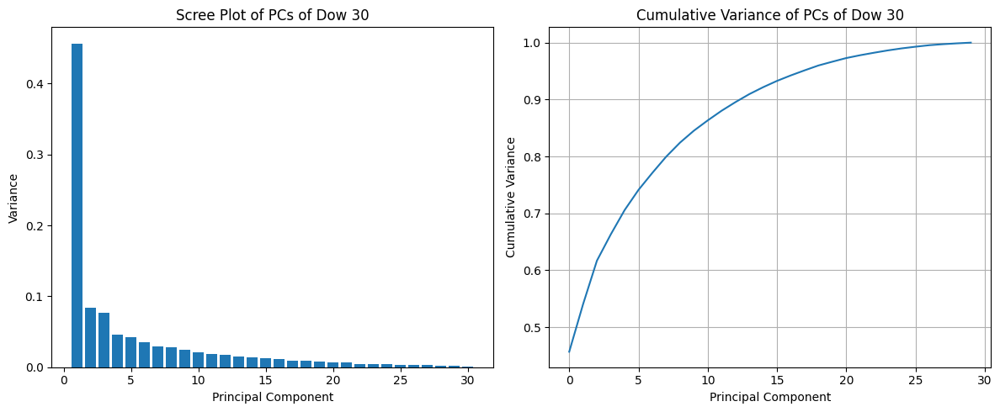
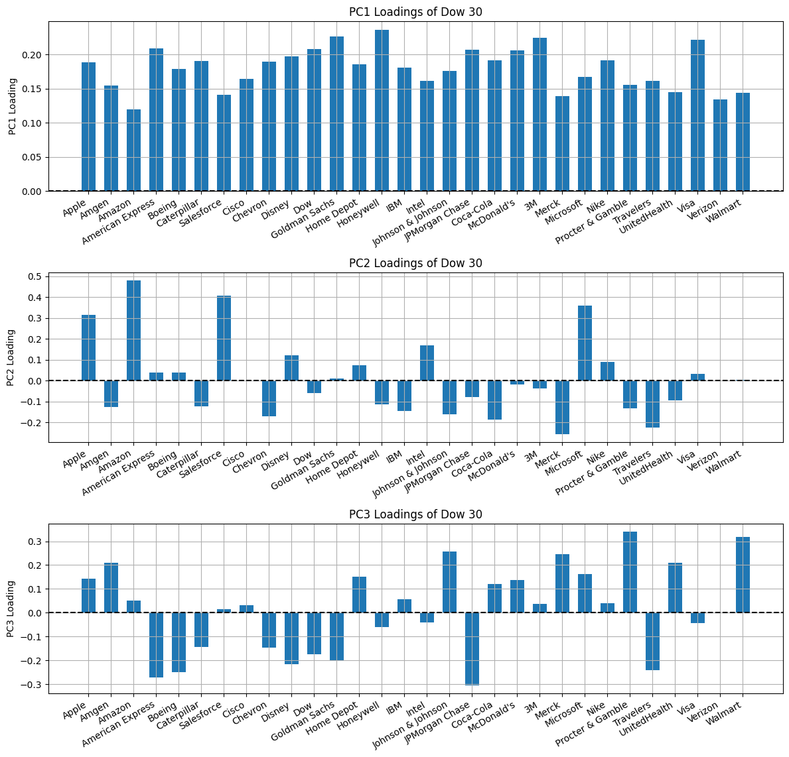
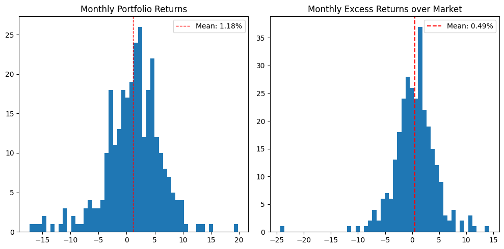
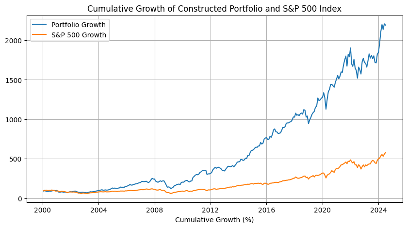

Hey.

As mentioned previously, I will be changing up the structure of future posts, starting with this one.

I started writing this blog to document my process as I learn about quantitative finance and share any interesting insights. In the past, I tried to provide justification/proof for every theory and equation but that just ended up burning me out. Besides, you can just read a textbook or google the terminology to get all the explanation you need. The focus now will be on implementation. I will still provide links to further information if needed.

So today, lets develop an investment strategy. Before going into any detail, I'll first clarify the objectives I'm trying to achieve:

1. Prioritize growth and potential returns
2. Diversify and capture overall market trends
3. Construct an optimized portfolio

## 1 Prioritizing Growth

This basically just means we want to select stocks with high potential returns. There are many ways to do this, but I ended up going with factor models. The overall approach will be similar to the one outlined in my [Investing Using CAPM](https://www.funance.lol/blog/77URiX6i0DSoEfOOtDUjv9/capm-regression) post and a lot of the intuition is explained there.

### 1.1 Factor Models

Factor models are used to estimate the returns of an asset using different factors of risk. The general equation is a _multiple linear regression_:

$$
R'_{j, t} = \beta_{0, j} + \beta_{1, j} F_{1,t} + ... + \beta_{p, j} F_{p,t} + \epsilon_{j, t} \quad (1)
$$

Where $R'_{j, t}$ is the _excess returns_ of asset $j$ at time $t$, $F_{1,t} ... F_{p,t}$ are the factors that represent different risks, $\beta_{0, j}...\beta_{p, j}$ are the loadings of asset $j$ that quantify the _sensitivity_ of the asset to the risk factors, and $\epsilon_{j, t}$ is the error term which is interpreted as the _unique risk_ of the asset. $\beta_{0, j}$ is also denoted as $\alpha$ (alpha) which quantifies whether the asset beat the market.

[CAPM](https://www.funance.lol/blog/4hX4HVhNTKvkluqxK8RsrU/CAPM) is a factor model with $p=1$.

While you can estimate the values of each factor statistically, its generally hard to interpret results. Luckily, there are models with pre-defined factors which is what I will be using. In particular, the `Carhart four-factor model`:

$$
R'_{j,t} = \alpha_j + \beta_{1,j} R'_{M,t} + \beta_{2,j} \text{SMB}_t + \beta_{3,j} \text{HML}_t + \beta_{2,j} \text{MOM}_t + \epsilon_{j, t} \quad (2)
$$

This is a model that extends the famous `Fama-French three factor model`. There are four risk factors we are considering:

1. `Market Excess Returns` ($R'_{M,t}$): this is the same factor that CAPM uses and it quantifies the _systematic risk_ of the market.
2. `Small Minus Big` (SMB): the difference in returns between portfolios of small market value companies and big market value companies. This factor quantifies the `size risk` which is the risk associated with small companies
3. `High Minus Low` (HML): the difference in returns between portfolios of high book-to-price (value) stocks and low book-to-price (growth) stocks. HML quantifies the `value risk` associated with underpriced and overpriced stocks.
4. `Momentum` (MOM): the difference in returns between portfolios of stocks with high historical returns and low historical returns. MOM quantifies the `momentum risk` associated with price trends (stocks with good recent performance tend to continue doing well...)

**Side note**: the risk of an asset associated with the market is called `beta` while the risk associated with other factors such as SMB, HML, MOM... are `alternative betas`. `Indexing` (buying index funds or market etfs) is a beta investing strategy. Theres also many strategies that utilize alternative betas such as `value investing` or `momentum investing`.

Ok, back to factor models. Now we need to find the values for each factor and fit a multiple linear regression to find the loadings $\beta_{0, j}...\beta_{p, j}$. For simplicity, I will use the data uploaded on _Dr. Kenneth R. French_ [Data Library](https://mba.tuck.dartmouth.edu/pages/faculty/ken.french/data_library.html) instead of calculating it myself.

Sorry, can't really _visualize_ anything right now cause we're fitting in ${\rm I\!R}^5$ space.

### 1.2 Forecasting Expected Returns

Before calculating the expected returns using _equation 2_, we also need to find the expected values of each factor (we assume the loadings are constant in the short term). While you can just use the historical averages, we can go one step further by forecasting the values. Conveniently, one of my previous posts is on [ARIMA Models](https://www.funance.lol/blog/2oH7rZlN6SorUF88mjEX9H/time-series-arima) so lets use that.

Since ARIMA models are only only good at forecasting 1 step into the future, the frequency of our data is important. Daily and weekly are too frequent (I don't wanna day-trade and theres a lot more noise), and if we use yearly data, there won't be enough data points to train on. So the frequency I will be using for forecasting along with fitting every other model in this strategy is **Monthly data**. This also means the holding period of the portfolio produced with the strategy is **1 month**.

## 2 Capturing Market Trends

This is where the investment strategies I tested in previous posts ended. I found the expected returns of stocks and just chose the ones with the highest values.

While this could work, its way too risky. If the forecasted returns were wrong, then you're cooked. To combat this, we can just diversify.

The overall market is very diverse, so lets try to mimic that. The easiest way to do this is to buy every stock in the market, at which point, you might as well buy an index fund. You can't just randomly select stocks with high expected returns either, cause theres no way of ensuring they're diversified. If only there was a way to reduce the number of stocks while capturing the diversity of the market. hmmm...

### 2.1 Dimensionality Reduction

We are working with a dataset of hundreds of samples (returns) and features (stocks). `Dimensionality reduction` is the process of reducing high dimensional data to lower dimensions while retaining the overall properties of the original dataset.

Specifically, I will use `Principal Component Analysis (PCA)` to reduce the matrix of stock returns to a lower dimension where each new axis (principal component) corresponds to a component of market variance. Heres a [video](https://youtu.be/FgakZw6K1QQ?si=kJjQb9gC4oRvcP6K) on PCA if you're interested.

To visualize this, we will use the 30 stocks in the `Dow Jones Industrial Average`. First, let's look at how much _variance_ of the overall dataset each new principal component captures:

_Figure 1. Scree Plot of Principal Components (PCs) Obtained from Stocks in Dow Jones (left) and Cumulative Variance of PCs (right)_

As you can see, the first few principal components accounts for majority of the variation of the dataset. So we don't actually need all 30 stocks in order to create a portfolio that mimics the overall trends of the Dow Jones Industrial Average.

We can further visualize how much each stock contributes to the principal components by looking at the loadings:

_Figure 2. Loadings of First 3 Principal Components Obtained from Stocks in Dow Jones_

Let's try to interpret this plot.

- **PC1** can be thought of as the **overall market trend** since all stocks have similar loadings
- **PC2** shows the highest loadings on _Apple_, _Amazon_, _Salesforce_, _Microsoft_... So maybe this is captures the **tech/software trends**
- **PC3** is a bit harder to interpret, but the highest loadings are either pharmaceuticals or consumer products which are all consumer facing companies. So maybe it captures the **consumer trends**

### 2.2 Clustering

Now we need to define the selection criteria using the PCs. The simplest way is to look at each principal component and choose stocks with the highest loadings. However, this does not take into account correlation and expected returns (we don't want to select stocks that are expected to lose money...)

The solution is to use clustering to group stocks into clusters, then select stocks with the highest expected returns from each cluster.

I decided to use `K-Mean Clustering` which is a method that clusters data by minimizing the variance of each cluster.

## 3 Constructing an Optimized Portfolio

Finally, with the selected stocks and forecasted expected values, we can use Modern Portfolio Theory to calculate the optimal weights (read more about MPT [here](https://www.funance.lol/blog/35i6akI5V1EbX3F8V58WJq/portfolio-construction)).

The inputs of MPT is the expected returns and volatility (in the form of the covariance matrix) of each stock. In the past, I used the sample covariance matrix of the returns while here I'll use a slightly different approach...

We can first represent _equation 1_ in matrix form as:

$$
\bm{R}_t = \bm{\beta}_0 + \bm{\beta}^T \bm{F}_t + \bm{\epsilon_t} \quad (3)
$$

Where $\bm{R}_t$ is the _nx1_ vector of stock returns ($R_{1,t}, ... , R_{n,t}$), $\bm{\beta}_0$ is the _nx1_ vector of intercepts (alphas), $\bm{F}_t$ is the _px1_ vector of factors, $\bm{\beta}^T$ is the _pxn_ matrix of loadings, and $\bm{\epsilon_t}$ is the _nx1_ vector of errors (assume error terms are uncorrelated).

The _covariance matrix of returns_ can then be defined as:

$$
\bm{\Sigma}_R = \bm{\beta}^T \bm{\Sigma}_F \bm{\beta} + \bm{\Sigma_{\epsilon}} \quad (3)
$$

Where $\bm{\Sigma}_R$ is the covariance matrix of returns (one of the inputs for MPT), $\bm{\beta}$ is the matrix of regression coefficients (without the intercept), $\bm{\Sigma}_F$ is the sample covariance matrix of the factors, and $\bm{\Sigma_{\epsilon}}$ is the diagonal matrix of mean squared errors. I omitted the derivation of this equation but trust me bro, the math works out.

The advantage of using this approach over directly using the sample covariance matrix is accuracy (supposedly). We usually have $n >> p$ (number of stocks >> number of factors). So when calculating the sample covariance matrix, there could be more error due to the size of the dataset. Using _equation 3_ on the other hand only requires a covariance matrix of pxp factors, which is a 4x4 matrix in our case. The main issue here is the assumption that $\bm{\Sigma_{\epsilon}}$ is diagonal. This requires the mean squared error (MSE) of each stock to be uncorrelated.

## 4 Backtesting

Heres the detailed steps of the investment strategy:

1. Fit a regression model to find loadings of the Carhart four factor model for each stock in a market index.
2. Forecast factors for the next month using an ARIMA model
3. Calculate the expected returns for all stocks using forecasted factors and fitted loadings
4. Use PCA to identify main principal components driving the market
5. Use K-means clustering to group stocks based on significant PCs
6. Select stocks with highest positive expected returns in each cluster
   1. I also added an extra filter for positive alpha
7. Construct a portfolio using Modern Portfolio Theory
   1. Add a constraint to not allow short selling

Time to backtest. Using data from 2000 to June 2024, I backtested the model on S&P500 stocks (we will also benchmark the model against the index). This was done by running the model on the previous 5 years of historical returns then constructing a portfolio based on the forecasts for the next month. I then recorded the actual returns of the selected portfolio and repeated the process with updated data.

Here are the results:

_Figure 3. Histogram of Monthly Portfolio Returns Constructed Using the Trading Strategy (left) and Monthly Excess Returns Over the Market (Portfolio Returns - Market Returns, right)_

Thats pretty good. Not only did we average positive returns, we also generated an extra _0.49%_ returns per month over the market returns.

Taking a closer look, the results match pretty well with our initial objectives of prioritizing growth while maintaining diversification. This means we take on more risk which you can see from the volatility in the distribution. I mean, theres one month where we underperformed the market by around 24%... And we're talking a flat percentage, so if the market broke even that month, our portfolio lost 24% of its total value. Yikes.

But overall, the hope is that over the long term, we average returns above market returns. _0.49%_ might not seem like a lot, but since we are re-balancing our portfolio every month, this _0.49%_ is compounded monthly. And over the last 24 year, I'll look something like this:

_Figure 4. Cumulative Growth of a Portfolio Constructed Using the Trading Strategy Benchmarked Against the Market (S&P500) Growth_

Thats the power of compounding. From this plot you can also see our strategy successfully captures the overall market trends as the points of major growth/dip line up pretty well.

Assuming you invested **\$100,000** on January 1, 2000, as of July 2024, your portfolio would be worth...

| Investment Strategy            | Portfolio Value |  Growth  | Annualized Returns |
| :----------------------------- | :-------------: | :------: | :----------------: |
| Buying and Holding Market Fund |  \$577,652.81   | 577.65%  |       7.42%        |
| Using the Trading Strategy     | \$2,192,893.94  | 2192.89% |       13.43%       |

_Table 1. Portfolio Performances of Indexing (Buying and Holding S&P500 Index Fund) and Using the Investment Strategy From Jan 1, 2000 to July 30, 2024_

## 5 Conclusion

So would I use this strategy to invest all my money? No. This is just a basic proof-of-concept, theres still a lot more testing to be done before I am comfortable integrating this into my own investing strategies.

How consistent are the backtest results? What if I started/ended at a different time? How sensitive is this model if we tweak some parameters? Can we make it more consistent by adding thresholds? How do different factor models or clustering methods affect the returns? ... Theres still so much work to be done.

The code and some additional visualizations can be found on [GitHub](https://github.com/yangsu01/funance_blog/tree/main/blogs/10-factor-models). Since theres a lot of code in the implementation of the model, I wrote it in a separate script [here](https://github.com/yangsu01/funance_blog/blob/main/src/investing_strategies/pca_fa.py).

:)
