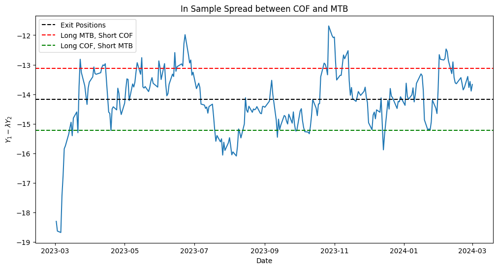
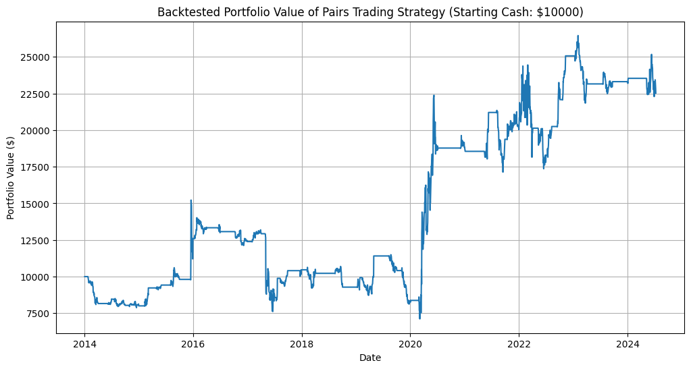
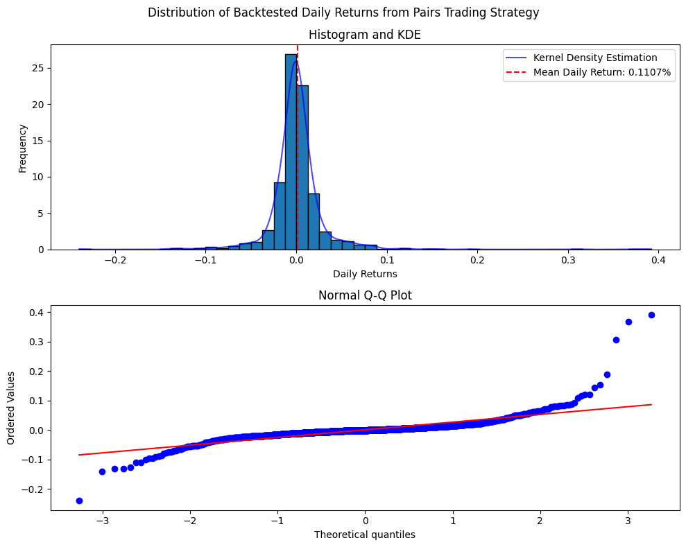

Here's a great and simple investment strategy:

1. Find a stock with a price distribution that is `stationary` (constant mean, standard deviation, and covariance)
2. Implement a `mean-reverting` trading rule
   1. Buy (long) when the price is below the mean
   2. Sell (short) when the price is above the mean
   3. Wait until the price reverts to the mean to exit positions

This strategy has (almost) guaranteed profits with minimal risk. End of post.

If only it were that easy... Unfortunately, it's really hard to find stocks with a stationary price series. Sure, it may have stationary behavior in the short term, but in the long term, this often doesn't hold. As discussed in the post on [ARIMA models](https://www.funance.lol/blog/2oH7rZlN6SorUF88mjEX9H/time-series-arima), the time series of prices is usually $I(1)$, where $I(d)$ denotes the `order of integration` of the time series (the number of differences needed to obtain a stationary series, $I(0)$).

But as I'll discuss in this post, there are ways to get around this issue.

## 1 Cointegration

The solution is to find 2 (or more) stocks that share some long-term trend such that a linear combination of their prices will be stationary. This relationship is known as `Cointegration`. Here's an example, suppose we have 2 time series $Y_{1,t}, Y_{2,t}$:

$$
Y_{1,t} = \beta_1 W_t + \epsilon_{1,t} \quad (1)
$$

$$
Y_{2,t} = \beta_2 W_t + \epsilon_{2,t} \quad (2)
$$

Where $\beta_1, \beta_2$ are non-zero coefficients, $W_t$ is a $I(1)$ trend that both time series share, and $\epsilon_{1,t}, \epsilon_{2,t}$ are $I(0)$ noise. If we let $\lambda = \beta_1 / \beta_2$, the linear combination of $Y_{1,t}, Y_{2,t}$ would be:

$$
Y_{1,t} - \lambda Y_{2,t} = \epsilon_{1,t} - \lambda \epsilon_{2,t} \quad (3)
$$

The non-stationary trend is cancelled out and the result is a stationary $I(0)$ series. $[1, -\lambda]$ is known as the `cointegration vector` which we'll discuss later.

It's important to note the difference between cointegration and correlation. `Correlation` measures the **short-term** relationship between time series whereas `cointegration` measures the **long-term** relationship between non-stationary time series. stocks with a high correlation may diverge in the long term and cointegrated stocks may have a low correlation in the short term.

## 2 Pairs Trading

`Pairs Trading` is a trading strategy based on mean-reversion where you simultaneously take a **long position** in one asset and a **short position** in another. The returns are then generated from the **relative price movements** of the stocks. This is where we can utilize cointegration. We know the linear combination of a cointegrated pair (referred to as the `spread`) $Y_{1,t} - \lambda Y_{2,t}$ is **stationary**. So, we can buy (long) one and sell (short) the other when the spread deviates from the mean and wait until it reverts before exiting the positions to generate a profit.

### 2.1 Testing for Cointegration

To identify the cointegration pairs, I first generated a list of candidates from stocks in the **S&P500 index**. The stocks were also grouped by sector (the assumption is that companies in the same sector are more likely to be cointegrated), reducing the list of candidates from ~120,000 to ~10,000. Running the `Johansen test` on each of the pairs would then tell us which pairs are cointegrated.

The question now is how much data to use for the tests. Using all the available data risks **overfitting** and if a shorter period was used, results may not be representative of the overall relationship. I ended up implementing a `walk-forward` test where cointegration is tested in multiple periods using a **sliding window** and stock pairs were sorted by the number of cointegrated periods.

Using historical prices of S&P500 stocks from Jan 1 2002 to Dec 31 2012, the fitting data was set to 1 year (252 trading days) and step size to 1 quarter (63 trading days).

### 2.2 Defining Trading Rules

The next step is to specify trading thresholds. The signal to exit positions is the easiest: exit when the **spread** ($Y_{1,t} - \lambda Y_{2,t}$) reverts to the mean.

As for the signals to enter the long/short positions, there will be 2: one somewhere above the mean, and the other somewhere below it. This threshold should be set depending on the desired trading frequency, trading cost, and risk tolerance. But as a starting point, I will be using $\mu \pm 2*\sigma$. Where $\mu$ is the mean of the spread, and $\sigma$ is the standard deviation of the spread. Here is a visualization:

_Figure 1. Pairs Trading Thresholds of In Sample Spread between COF and MTB_

We long _MTB_ and short _COF_ when the spread crosses the upper threshold, and hold until the spread reverts to the mean (do the opposite for the lower threshold).

It's important to note that the spread and thresholds shown in _Figure 1_ were produced with `in sample data` meaning we used the same dataset to fit and test the trading rules. A more realistic test would use `out of sample data` which is what I'll be using in the backtests.

To figure out what ratio to long/short, we can use the equation for the spread. For example, when the upper threshold is reached (spread is above mean), we know $Y_{1,t}$ is overvalued relative to $Y_{2,t}$ so we short $Y_{1,t}$ and long $Y_{2,t}$. To have a `market neutral` position, where the returns are independent of the overall market, we need to hedge the position. This is determined by the **hedge ratio** given by the **cointegration vector** $[1, -\lambda]$.

I'll further assume that **no leverage** is used, ie, the cash generated from shorting one stock will not be used to buy more of the other.

### 2.3 Backtesting

To backtest this strategy, I used another **walk-forward test**. Defining an **in sample** period of 1 year and an **out of sample** period of 1 quarter, the procedure is as follows:

1. Use a **Johansen test** to check whether the **in sample** data is cointegrated
2. Repeat _step 1_ using the list of ranked cointegration pairs until a cointegration relationship is found.
3. Apply the trading thresholds calculated using the **in sample** data to the **out of sample** data
4. At the end of the period, close all positions

It's also important to run the backtest on a different dataset to the one used to rank cointegration pairs to avoid **look-ahead bias**.

I also considered a transaction cost of \$10 per trade and a borrowing rate for shorting of 2% annually. Here are the backtest results:

_Figure 2. Backtested Portfolio Value of Pairs Trading Strategy with \$10,000 starting cash_

That does not look pretty... Let's break it down:

- Notice how there are frequent plateaus where the portfolio value stays constant. This happens when all positions are closed and the spread has not deviated from the mean. This is inefficient as we are just sitting there doing nothing with the money.
- The plateaus are often followed by periods of **high volatility**. This could be due to the cointegration relationship no longer holding for the out of sample period or from the volatility of the underlying assets.
- The overall trend does not follow the market, especially during the COVID period. This is likely due to the **market neutral** behavior of pairs trading.

Looking at the distribution of the returns:

_Figure 3. Histogram and QQ Plot of Backtested Pairs Trading Strategy Returns. Periods of 0 Returns (no positions are held) have been removed_

The heavy tails are a bit concerning, but we can probably reduce them by tweaking the trading rules. Here are the specific statistics:

- **Annualized Returns**: 8.04%
- **Annualized Volatility**: 34.82%
- **Sharpe Ratio**: 0.23

Seems reasonable.

## 3 Potential Improvements

So far we have a very rough trading strategy. There are a lot of refinements that need to be made and tested before it's suitable for implementation. Here are some potential points of improvement I could think of:

- **Adjusting the Thresholds**: the exit, upper, and lower thresholds can all be modified. However, be careful of overfitting when comparing backtested returns of different trading rule variations.
- **Cointegration Pair Selection**: currently, we're mostly brute forcing this process - looping through candidate pairs until cointegration is identified (we did rank the pairs beforehand but the effectiveness is debatable). Taking into account how 'good' the fit is or the speed of mean-reversion using the `loading matrix` would be more robust.
- **Minimize Downtime**: it's inefficient whenever no positions are held. Trading other cointegrated pairs during this downtime may improve overall returns.
- **Exit Strategy**: the backtest exits all positions at the end of each step regardless of gain/loss. Implementing a **limit sell** or **stop-loss** threshold could reduce the downsides.
- **Forecasting**: the spread could continue to diverge from the mean after crossing the entry threshold. Forecasting the spread using a model such as `VECM (Vector Error Correction Model)` could ensure a better entry point.
- **Trading Multiple Stocks**: since pairs trading utilizes `statistical arbitrage`, the return may be unpredictable if other traders or firms have the same positions. Opportunities derived from complex cointegration relationships between more than 2 assets may be undiscovered by others.

Maybe I'll investigate this in more detail in a future post...

## 4 Conclusions

In this post, we looked at how mean-inversion strategies could work. Specifically, pairs trading using 2 cointegrated stocks. We also did some backtesting to see what returns we could expect from the strategy.

The code can be found [here](https://github.com/yangsu01/funance_blog/blob/main/blogs/11-cointegration/cointegration.ipynb).
