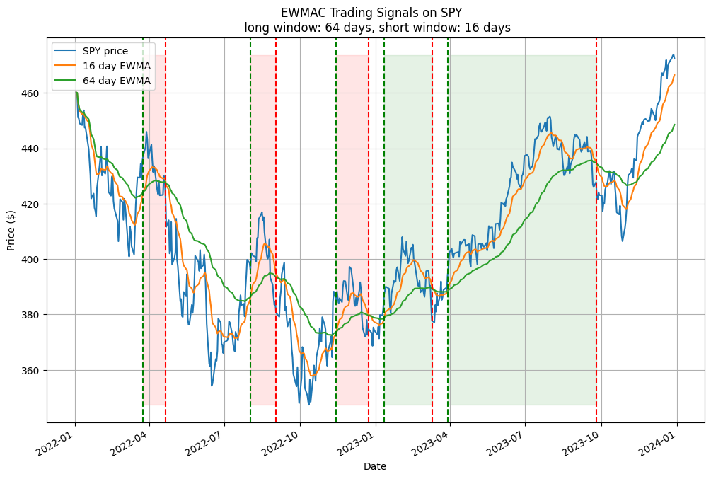
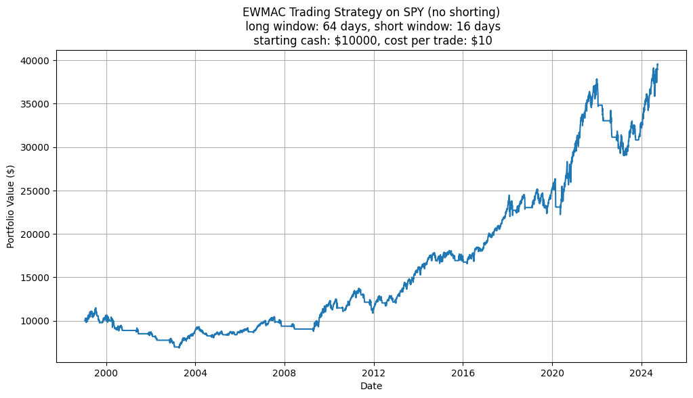
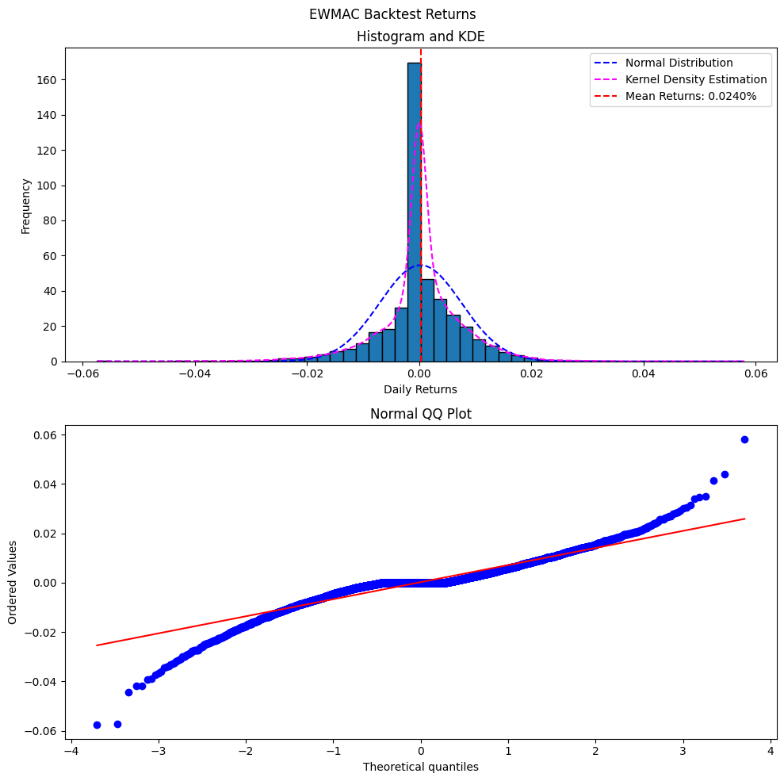
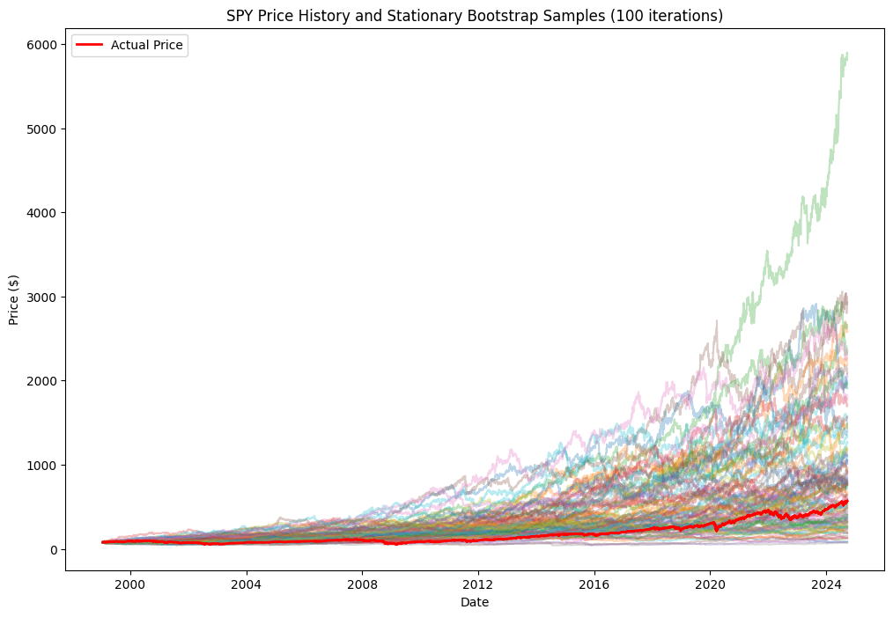

In past posts, we have looked at two types of investment strategies: active trading (pairs trading, ARIMA forecasting) and portfolio allocation (PCA+FA, CAPM). While some of the strategies seemed promising, the posts primarily focused on the theory. There was no standardized way of evaluating the effectiveness or robustness of the strategies.

So thats what we're focusing on today: how you can evaluate different investment strategies.

## 1 Example - EWMAC

I will be using `exponentially weighted moving average crossovers (EWMAC)` as an example. **EWMAC** is a popular trend-following trading strategy that uses two exponentially weighted moving averages (one long and one short) to generate trading signals based on **momentum**. Each EWMA is calculated using:

$$
\text{EWMA}_t = \alpha P_t + (1 - \alpha) \text{EWMA}_{t-1} \enspace (1)
$$

$$
\alpha = \frac{2}{N+1} \enspace (2)
$$

Where $P_t$ is the price at time $t$ and $N$ is the number of periods in the lookback window. The difference between EWMA and **simple moving average (SMA)** is that more weight is is put on recent prices ($\alpha P_t + \alpha (1-\alpha) P_{t-1} + \alpha (1-\alpha)^2 P_{t-2} ...$).

The signals are as follows:

- Buy (long) when **short EWMA** crosses above **long EWMA**. This indicates an uptrend in the price
- Sell (short) when **long EWMA** crosses above **short EWMA**. This indicates a downtrend in the price

Heres an example of trading **SPY** using a short window of 16 days and long window of 64 days.

_Figure 1. EWMAC Signals on SPY using Long Window of 16 Days and Short Window of 64 Days. No Shorting_

Since this post is focused on trading rule evaluation, I will just use the same windows moving forward and not worry about optimizing the strategy.

## 2 Comparing Strategies

Alright, now that we have the trading rules, how would you evaluate how profitable it is?

The first step I would take is to do a simple backtest. Since EWMAC is a trend-following rule, it would likely perform differently under different market conditions (bull, bear, sideways...). Using a large range of data would produce more realistic results so I used the daily prices from 1999-2024. Here is the portfolio value over time:

_Figure 2. Backtested Portfolio Value of EWMAC on SPY_

Cool, but this doesn't tell us much. To quantify the performance, we need to compare it to some alternatives...

### 2.1 Quantifying Performance

Interestingly, you can analyze trading rules the same way you analyze stocks: by looking at its returns. This allows us to directly compare different rules and strategies. You can even take this one step further by creating a trading strategy using a portfolio of trading rules constructed with portfolio theory. But thats another post for another day...

Comparing EWMAC to holding the stock:

|                   | Mean Returns | Annual Returns | Annual Volatility |
| :---------------- | :----------- | :------------- | :---------------- |
| **EWMAC (16/64)** | 0.02124%     | 5.497%         | 11.59%            |
| **Buy and Hold**  | 0.03084%     | 8.081%         | 19.39%            |

_Table 1. Returns and Volatility (standard deviation) of EWMAC and Holding SPY_

Holding SPY would have more returns but also involves more risk. To take that into account, we can use the risk adjusted returns, or **Sharpe Ratio**. EWMAC has a Sharpe Ratio of **0.1852** and holding SPY has a Sharpe Ratio of **0.1939**.

### 2.2 Distribution of Returns

If the data is normally distributed, we could just stop here. Unfortunately, this is often not the case as financial time series tend to have **heavy tails**, meaning outliers occur more frequently. Only looking at the mean and standard deviation of returns can lead to overconfidence and unexpected losses.

Studying the distribution of returns can help you understand the **risk profile** of the investment strategy. Heres a plot of the backtested EWMAC returns:

_Figure 3. Distribution of Backtested Returns of EWMAC_

The histogram and kernel density estimation (KDE) gives us an approximation of the sample distribution while the normal QQ (quantile-quantile) plot compares the sample distribution to a normal distribution. Heres a few metrics you can use to quantify this:

`Skew` is a measure of symmetry around the mean. A trading strategy with **positive skew** has frequent small losses with occasional large gains (ex. trend following) while a strategy with **negative skew** has frequent small gains with rate large losses (ex. pairs trading). Understanding the skew of your investment strategy can help you estimate the expected risks.

Additionally, when you have highly skewed data, using the **mean** as a performance metric may lead to unrealistic expectations. In such cases, the **median** could be a better estimator. From the histogram and KDE, it seems that the backtested returns have no obvious skew.

`Kurtosis` measures the frequency of outliers in the data. As mentioned above, financial time series often have **heavy tails**. From the normal QQ plot, we can see this is indeed the case as there are more extreme values when compared to a normal distribution.

We can confirm these graphical observations by calculating the values numerically:

|                         | Skew     | Kurtosis |
| :---------------------- | :------- | :------- |
| **EWMAC (16/64)**       | -0.4922  | 5.596    |
| **Buy and Hold**        | -0.01314 | 11.27    |
| **Normal Distribution** | 0        | 3        |

_Table 2. Skew and Kurtosis of EWMAC and Holding SPY_

So from the backtest results, EWMAC using a short window of 16 days and a long window of 64 days on SPY has a slightly negative skew. When compared to just holding SPY, EWMAC has less extreme returns.

We can dive deeper and look into **risk management** but that will be a topic for a future post.

## 3 Robustness of Backtests

Again, you could stop here; we calculated the performance metrics (mean, volatility, Sharpe Ratio) and risk profile (skew, kurtosis) by backtesting the trading rule. Now you can use these values to compare different variations and strategies.

How much can we trust the results from the backtest? Since the data we used was a random sample of the overall population, the metrics we calculated from it are also random samples. Sure, using a large amount of data could minimize some of the error due to the **law of large numbers** but there still may be some underlying bias. Different samples would likely produce different backtested results. How do we know the ones we got are 'realistic'?

While in past posts, I have **walk-forward tests** to achieve this, today, we will look at a more statistical approach: **bootstrapping**.

Specifically, I am using a `non-parametric stationary bootstrap` to generate different price series while maintaining the underlying trends by sampling the original time series **with replacement** (meaning each data point can be sampled multiple times). Since each new series is generated from the original data, it maintains the same distribution. By then applying the backtest to each sample and re-calculating the metrics, we can test the robustness of the trading rule by looking at the confidence interval and other statistics.

Still with me? Alright, let me break down the specific steps:

1. Resample the returns data directly with replacement. _An alternative would be to first fit the data to a distribution (likely some **t-distribution**) then sample according to the **PDF (probability density function)**. This is known as **parametric bootstrapping**._
2. To preserve the trends in the data, sample blocks of adjacent datapoints at a time. Randomize the length of each block to avoid creating any artificial trends. This is called a **stationary bootstrap**.
3. Using the randomly sampled returns, reconstruct a price series using the **cumulative product**.
4. Run the backtest on each reconstructed price series and record the calculated metrics.
5. Analyze the distribution of each metric to evaluate the robustness of the trading rule.

Heres an example of the resampled price series after _step 3_:

_Figure 4. SPY Prices Resampled using Stationary Bootstrap_

The original price series might seem a bit low but considering the compounding of returns, any small difference in average daily returns would result in a large difference over 20+ years. We can check if theres is any bias by looking at the statistics:

|                       | Population Mean | Bootstrap Mean | Bias    | Standard Error | 95 CI                |
| :-------------------- | :-------------- | :------------- | :------ | :------------- | :------------------- |
| **Mean Returns**      | 0.0308%         | 0.0317%        | 0.0009% | 0.0138%        | [0.0554%, 0.0044%]   |
| **Annual Returns**    | 8.082%          | 8.3892%        | 0.3072% | 3.7675%        | [14.9864%, 1.0195%]  |
| **Annual Volatility** | 19.39%          | 12.97%         | 6.42%   | 0.9067%        | [21.0068%, 17.5161%] |
| **Sharpe Ratio**      | 0.2439          | 0.2663         | 0.0263  | 0.2036         | [0.6164, -0.1129]    |
| **Skew**              | -0.0131         | 0.0123         | 0.0254  | 0.2629         | [0.5568, -0.4420]    |
| **Kurtosis**          | 11.27           | 11.0203        | -0.2497 | 3.5761         | [18.8275, 4.5209]    |

_Table 3 Original Estimates and Bootstrap Results of SPY. Produced using 100 samples_

Actually, the bootstrap does have a slight positive bias. This is probably due large losses in the market being clustered in short time periods such as the 08/09 financial crisis and COVID. As a result, the probability of sampling these losses are lower. The **standard error** and by extension, the **confidence interval** is also quite large... Idk, just something to keep in mind.

The above result was produced using 100 bootstrap samples. Increasing the number the of samples will hopefully increase the accuracy.

Moving on, now I'll go through the whole process but increase the bootstrap samples to 1000. Here's the results of the backtests on the EWMAC rule:

|                       | Population Mean | Bootstrap Mean | Bias     | Standard Error | 95 CI              |
| :-------------------- | :-------------- | :------------- | :------- | :------------- | :----------------- |
| **Mean Returns**      | 0.0213%         | 0.0158%        | -0.0055% | 0.0069%        | [0.0293%, 0.0023%] |
| **Annual Returns**    | 5.514%          | 4.078%         | -1.436%  | 1.814%         | [7.650%, 0.5892%]  |
| **Annual Volatility** | 11.60%          | 14.83%         | 3.23%    | 1.042%         | [16.61%, 12.52%]   |
| **Sharpe Ratio**      | 0.1864          | 0.0519         | -0.1345  | 0.1256         | [0.3080, -0.1854]  |
| **Skew**              | -0.4923         | 0.0023         | 0.4946   | 0.2660         | [0.4661, -0.5554]  |
| **Kurtosis**          | 5.599           | 20.681         | 15.082   | 6.158          | [31.219, 7.711]    |

_Table 4 Original Estimations and Bootstrap Results of EWMAC Backtest. Produced using 1000 samples_

It looks like our backtest results are too optimistic. The metrics aside from kurtosis all fall within the confidence interval thought so we're not completely off.

While this could be partly due to the high variability in the bootstrap samples, more investigation is required. But I think its safe to conclude that using **EWMAC** with a short window of 16 days and a long window of 64 days to trade **SPY** is not a great strategy.

## 4 Conclusion

In this post, we outlined a framework to test and evaluate trading rules and investing strategies. This includes using metrics such as the **sharpe ratio** to quantify the expected performance and **skew / kurtosis** to understand the risks. We also used **bootstrapping** to evaluate the robustness of the estimations.

The analysis can be found [here](https://github.com/yangsu01/funance_blog/blob/main/blogs/12-evaluating-strategies/evaluating_strategies.ipynb) and the backtest/bootstrap code [here](https://github.com/yangsu01/funance_blog/blob/main/src/backtest/backtest_trader.py).

I'm tired
