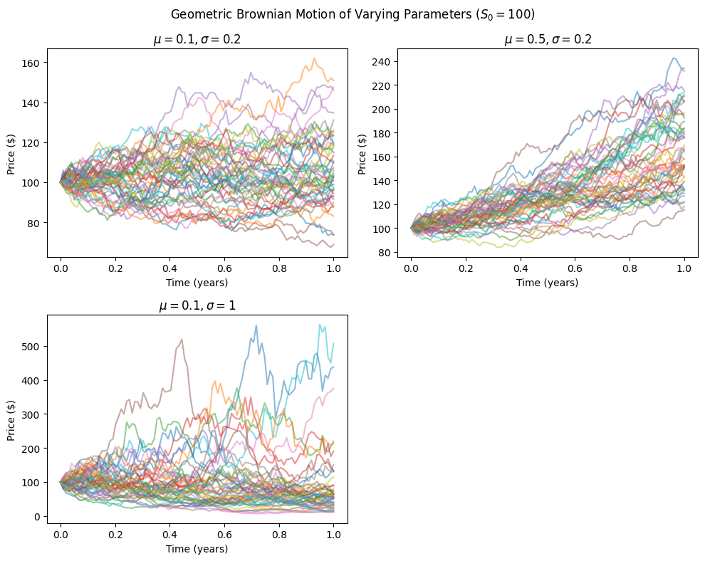
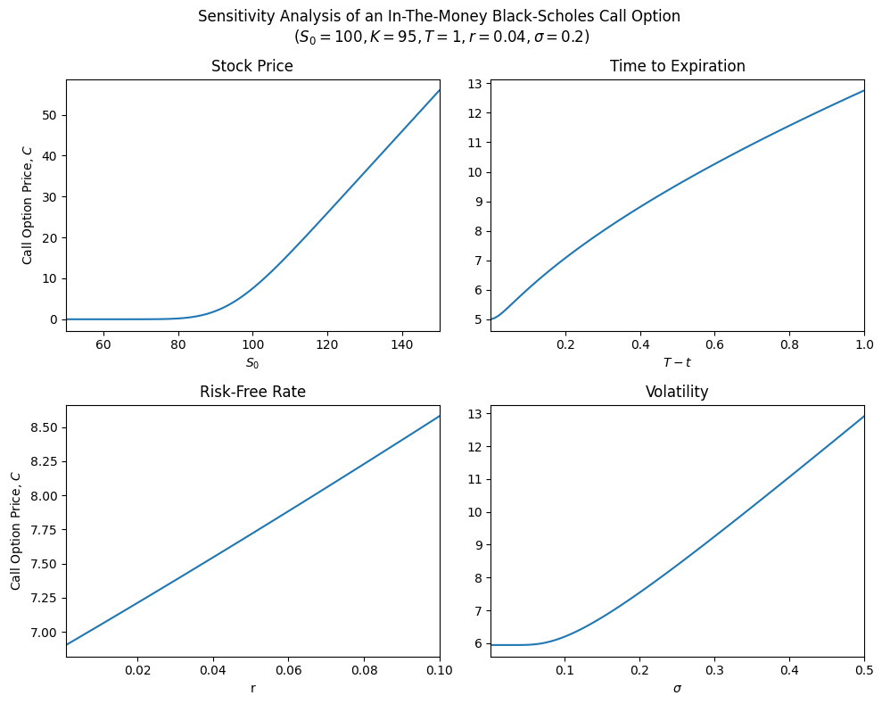
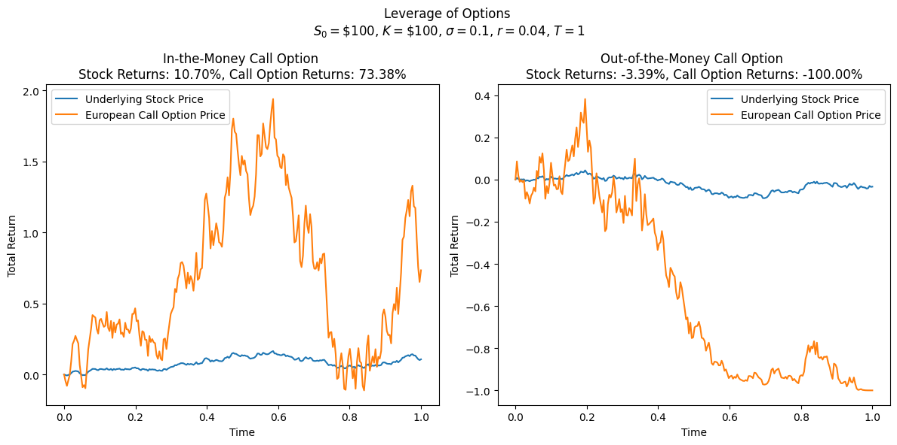
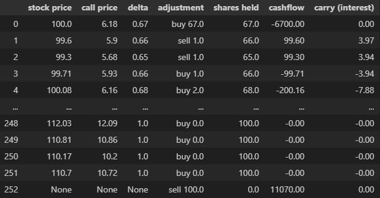
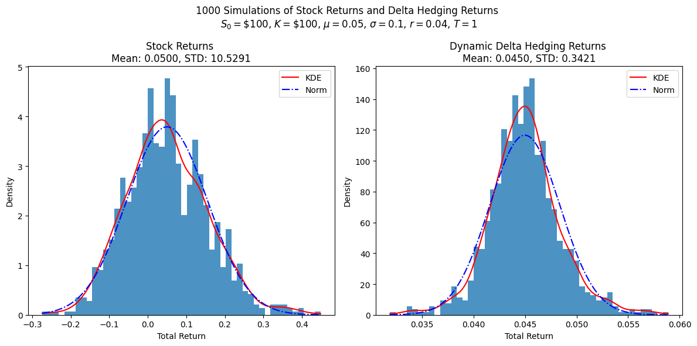

A few posts ago, we discussed what options are and why someone would want to trade options. I also briefly went over the intuition behind options pricing and gave an example of pricing in discrete time using binomial trees.

Today, we'll go one step further and looking at a more realistic option pricing model in continuous time using the famous **Black-Scholes model**. You can read my previous post on options [here](https://www.funance.lol/blog/51epGWiq1HHy0BLIxpXWQN/options-trading) if you need a refresher.

There will be a healthy amount of math involved so feel free to skip it and focus on the _visualizations_ and insights.

## 1 Discrete to Continuous Time

The price of an options contract is directly based on the underlying stock price. So before we can model the price of options, we need a way of modelling the stock price.

In discrete time, stock prices are modelled using binomial trees (a type of random walk) where at each node, the price could either increase by a factor of $u$ or decrease by a factor of $d$. Taking the limit as the number of time steps approaches infinity, we get the continuous time equivalent: `Geometric Brownian Motion`, defined as the following `stochastic differential equation (SDE)`:

$$
dS_t = \mu S_t dt + \sigma S_t dW_t \enspace (1)
$$

Where $S_t$ is a time dependent stochastic process (stock price), $\mu$ is the drift term (expected returns), $\sigma$ is the dispersion (volatility), and $dW_t$ is the time derivative of a standard brownian motion:

$$
dW_t = Z \sqrt{dt} \enspace (2)
$$

Where $Z ∼ N(0, 1)$ is a `random variable` with a standard normal distribution.

Solving this SDE, we get the explicit form:

$$
S_t = S_0 e^{(\mu - \sigma^2 / 2)t + \sigma W_t} \enspace (3)
$$

Where:

$$
W_t = \int_{0}^{t} dW \approx \sum_{i=1}^{t} Z_i \sqrt{dt} \enspace(4)
$$

The second part of the equation is the numerical approximation which I will be implementing in _Python_.

Alright, let's run some simulations to visualize everything so far.

_Figure 1. Sensitivity Analysis Geometric Brownian Motion Parameters_

From the sensitivity analysis, we can observe:

- $\mu, \sigma$ are analogous to the `expected returns` and `volatility` of the stock.
- The stock price cannot be negative.

## 2 The Black-Scholes Equation

I wont be showing the derivation of the Black-Scholes equation, but heres a [video](https://youtu.be/-qa2B_sCpZQ?si=oKMJhJcFiLNvgYYQ) if your're curious. Or better yet, read the [original paper](https://www.cs.princeton.edu/courses/archive/fall09/cos323/papers/black_scholes73.pdf). I would also highly recommend watching this [video](https://youtu.be/A5w-dEgIU1M?si=YqR8NPnIXxwxhP6M) on why the equation is so groundbreaking.

The `Black-Scholes equation` is a parabolic PDE (similar to the heat equation) that models the price $V(S,t)$ of a European option. It's given by:

$$
\frac{\partial V}{\partial t} + \frac{\sigma^2}{2} S^2 \frac{\partial^2 V}{\partial S^2} + rS \frac{\partial V}{\partial S} - rV = 0 \enspace (5)
$$

Where $S = S_t$ is the price of the underlying stock, $r$ is the risk free (interest) rate, and $\sigma$ is the volatility of stock.

The main assumptions include:

- The risk free rate and volatility, $r, \sigma$ are constant.
- The underlying stock follows a 1D Geometric Brownian Motion. This means that the stock returns follows a log-normal distribution.
- There are no transaction fees and the stock does not pay dividends.
- The option can only be exercised at expiration (European option).

The Black-Scholes PDE is pretty hard to interpret by itself so we first need to solve it. For a European Call, $V(S, T) = C(S, t)$ with maturity $T$, we can apply the **boundary conditions**:

$$
C(0, t) = 0 \enspace (6)
$$

$$
C(S, t) \rightarrow S - K \text{ for } S \rightarrow \infty \enspace (7)
$$

Where $K$ is the strike price of the call. And **initial condition**:

$$
C(S, T) = \text{max}(S-K, 0) \enspace (8)
$$

**tl;dr**: The boundary conditions basically says: the call option is worthless if the stock is worthless, and that as the stock price grows, call is likely to be exercised where its value will be $S-K$ (remember the **payoff diagram** of a long call). The initial condition says: at maturity $t=T$, the option will be worth $S-K$ if the stock price exceeds the exercise price, or 0 if the stock price is below the exercise price. Since its easier to calculate the options price at maturity, we are actually working backwards in time. This is why $(T- t)$, or 'time until maturity' is used.

Solving the Black-Scholes PDE for a European Call, we get:

$$
C(S, t) = \Phi(d_+)S - \Phi(d_-)Ke^{-r(T-t)} \enspace (9)
$$

$$
d_+ = \frac{\text{ln}(S/K) + (r + \sigma^2/2)(T-t)}{\sigma \sqrt{T-t}} \enspace (10)
$$

$$
d_- = d_+ - \sigma \sqrt{T-t} \enspace (11)
$$

Where $\Phi$ is the **cumulative distribution function (CDF)** of the standard normal distribution. It is also convention to use 'years' as the units for time.

Notice how $C$ does not depend on the expected returns $\mu$ of the underlying stock, and only depends on variables that can be directly calculated (maybe not volatility), making it fairly straightforward to implement numerically.

### 2.1 Sensitivity Analysis

Using _equation 9_, we can visualize how different parameters impact the call price. Note that $r, \sigma$ are usually not constant in the real world so I've also included them in the sensitivity analysis.

_Figure 2. Sensitivity Analysis of Parameters for an ITM Black-Scholes Call Option_

Let's break it down:

- Stock price has a positive and relatively linear relationship with call price, given that the option is in-the-money ($S > K$). If it is out-of-the-money ($S < K$), then the call option is basically worthless. The plot is very similar to the payoff diagram of a long call.
- More time until expiration means the stock price has more time to change, so the call price is higher. At maturity ($t=T$), the price converges to ($S-K$), as described by _equation 8_.
- The risk free (interest) rate also has a positive relationship due to the **present value of money**.
- Volatile stocks have higher growth potential so the option price will be higher.

### 2.2 Implied Volatility

Another interesting thing we can do is to calculate the price of a call option and compare it to the price listed on an options chain. I will use **NVDA - NVIDIA Corp**.

The current price of **NVDA** is \$139.56, looking at the options chain, I selected the call option with a strike price of $K=\$130$ and expire date of Dec. 20, 2024. This means that $(T-t) = 44/252$ (There are 44 trading days left till expiration and 252 trading days in a year). Lastly, we need to find $\sigma$ which I calculated using the standard deviation of returns over the last year. Plugging everything into _equation 9_, we get:

- Price of call option based on Black-Scholes: **\$17.47**
- Price of call option listed on options chain: **\$18.18**

Close, but we're a bit off. The main difference here likely lies in the calculation of volatility.

Since we have the actual price of the call option, we can go backwards and find the 'actual' volatility of NVDA. This is know as the `implied volatility (IV)` and its reflects the market's expectation of the volatility of the underlying stock from now until the expiration of the option. Basically, IV can help us understand the **market sentiment** around the underlying stock. A high IV suggests the market expects large price movements (this could be up or down), while a low IV suggests more stable prices. Note that implied volatility is not constant across all option contracts for a given stock.

To calculate IV, we just need to invert _equation 9_. While there is no explicit form for $\sigma$, we can use a root finding optimization method to approximate the numerical solution. I used the Brent's method (`brentq`) in the `scipy` library.

- Initial calculation of volatility: **0.5194**
- Calculated implied volatility: **0.5538**
- Implied volatility listed on options chain: **0.6016**

Damn, we're still a bit off. In practice, the Black-Scholes model is often used as a benchmark for option prices, and the actual price is determined by **supply and demand**.

## 3 Leverage and Hedging

As we discussed in the _Binomial Options Pricing_ post, the main reasons investors trade options are for **leverage** and **hedging**. Now that we have a robust way of option pricing, its time to _visualize_.

### 3.1 Leverage

Using geometric brownian motion, I simulated one stock that had a positive return and one with a negative return. I then used _equation 9_ to calculate the option prices at each time step. Here are the results:

_Figure 3. Returns of ITM and OTM Call Options VS Underlying Stock Returns_

Any small changes in the underlying stock price gets amplified. This could make you a lot of money but if the stock price falls below the strike price even by a small amount, the price of the call option plummets.

Totally not gambling.

### 3.2 Hedging

Now suppose you want to buy some stocks and decide to minimize risk by hedging your position. To hedge a long position in the underlying stock, you can short (sell) call options. Buying (long) puts also works but we've only discussed calls so far so let's stick with it. If each options contract covers 100 shares, how many shares in the underlying stock should you buy to hedge that?

Taking the partial derivative of $C$ with respect to $S$:

$$
\Delta = \frac{\partial C}{\partial S} \enspace (12)
$$

`Delta` $\Delta$ tells us how much the call price changes with a \$1 change in the underlying stock price. So if $\Delta = 0.5$, then a \$1 increase in the stock price causes the price of the call to increase by \$0.5. Puts have negative deltas since they move in the opposite direction of the stock price.

So if you short a call option that covers 100 shares, you hedge this position by buying $\Delta*100$ shares of the underlying stock. This way, you completely offset any changes in the underlying stock price with changes in the option price. This strategy is known as `Delta hedging`.

You can also take the partial derivatives of $C$ with respect to the other parameters $\sigma, (T-t), r$ which will give you the other `Greeks`. [Heres](https://youtu.be/l9ta2nLXoao?si=_6oUvMl9xbFImjGz) a video if you're interested.

Taking the partial derivative of _equation 9_:

$$
\frac{\partial C}{\partial S} = \Phi(d_+) + \phi(d_+) \frac{\partial d_+}{\partial S}S - \phi(d_-) \frac{\partial d_-}{\partial S} Ke^{-r(T-t)} \enspace (13)
$$

Where $\phi$ is the **probability density function (PDF)** of the **standard normal distribution** ($d\Phi = \phi$).

We can simplify _equation 13_ further by plugging in:

$$
\phi = \frac{1}{2\pi} e^{x^2/2} \enspace (14)
$$

In the end, we get:

$$
\Delta_{call} = \Phi(d_+) \enspace (15)
$$

Beautiful.

Delta is not constant through time, so we would need to periodically adjust the number of shares of the underlying stock we hold to maintain a `delta neutral` position. This is known as `dynamic delta hedging`. For simplicity, I will assume we adjust every day and there are no transaction fees.

I will now explain how I calculated everything. Skip to the plot if you'd like.

Here is an example of how I calculated the returns of the delta hedged portfolio:

_Figure 4. Cashflow of Delta Hedged Portfolio_

On the first day, I sell a call option for 100 shares of the underlying stock at 100\*6.18 = \$61.8. I calculate the delta (0.67) and buy 67 shares of the underlying stock. I assume these initial transactions are done using my own money so I don't pay any interest.

Every following day, I recalculate delta and adjust the number of shares I hold. If I need to buy more shares, I borrow money from the bank and pay interest depending on how many days until maturity. If I sell shares, I subtract the amount of interest I would have paid from the total (if that makes any sense...).

On the last day, I exit all my positions. Since I sold calls, I also sell 100 shares to whoever bought my call at the strike price if $S>K$.

In the end, my total profit would be:

$$
\text{net cashflow from trading stocks} + \text{premium for selling calls} + \text{interest from premium} - \text{cost if call is exercised} - \text{interest from borrowing to buy stocks} \enspace (16)
$$

Using geometric brownian motion to simulate a stock with 5\% expected return and 10\% volatility, here is the distribution of returns after 1000 simulations.

_Figure 4 Simulated Distribution of Returns of a Dynamic Delta Hedging Strategy_

Delta hedging allows us to minimize the exposure to market risk but doing so also means we will generate returns close to the risk free rate. We basically created a portfolio that behaves like a bond.

Be careful though, this strategy wouldn't work well if the underlying stock was very volatile since there would be a higher change that the call option would be exercised (higher costs for you).

## 4 Conclusions

In this post, we took a closer look at options pricing in continuous time and stock prices could be modelled using geometric brownian motion.

Using the black-scholes formula, we looked at how different parameters affected the price of a call option and how implied volatility can be used to understand market sentiment around a stock.

Lastly, we visualized the leverage and hedging properties of options, and simulated the returns of a simple delta hedging strategy.

If you want to play around with the parameters of any plots, the code can be found on [GitHub](https://github.com/yangsu01/funance_blog/blob/main/blogs/13-black-scholes/black-scholes.ipynb).
