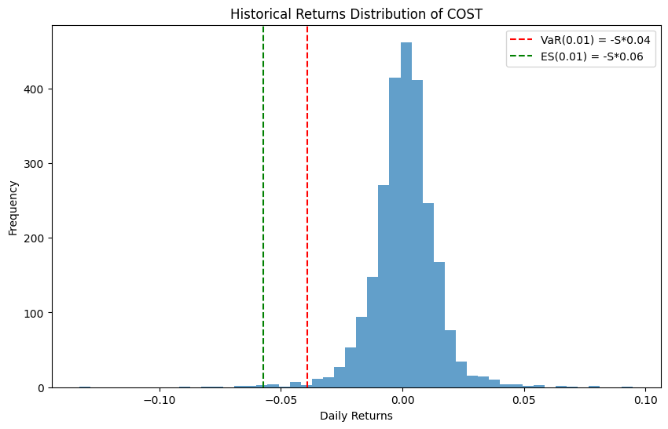
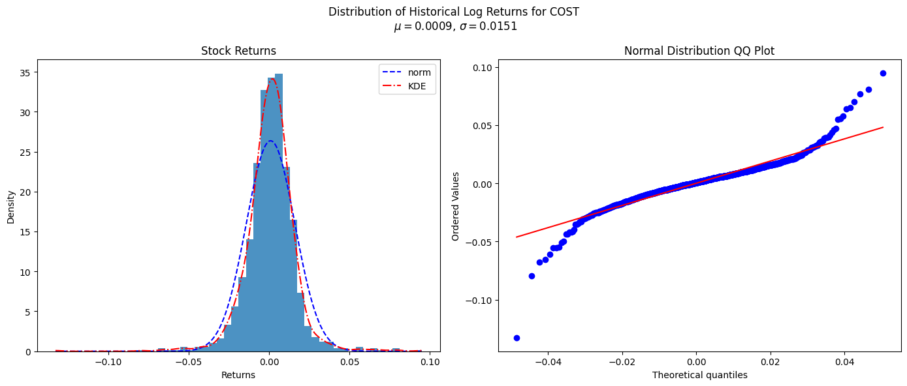
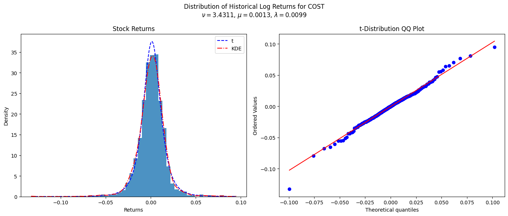

As retail investors, we tend to focus on the potential upside or profitability (think expected returns, volatility, Sharpe Ratio...) when evaluating assets, portfolios, or trading rules. However, as discussed in my post on [_evaluating investment strategies_](https://www.funance.lol/blog/4ejCfGO8EcB1OF3SUrtFbn/evaluating-strategies), decisions purely based on these metrics can lead to large unexpected losses as financial returns tend to be skewed or have fat tails. Minimizing the impact of these risks can add robustness to our investments and is a core objective of `risk management`.

So today, lets start off by looking at some of the metrics used to quantify risk and how they can be used in our own investment portfolios.

## 1 VaR and ES

The two most widely used metrics in risk management are `Value at Risk (VaR)` and `Expected Shortfall (ES)` (also referred to as `Conditional Value at Risk (CVaR)`).

**VaR** is defined by two parameters, the time horizon $T$ and confidence level $\alpha$. It basically answers the question: _"Over a period of $T$, how much money would I lose in the worst $\alpha$ percent of cases?"_ So if a portfolio has $\text{VaR}(0.01, 1\text{ day}) = \$1000$, then there is a $1\%$ chance of a loss exceeding \$1000 over the next day. Putting this into an equation:

$$
P\left[ L \geq \text{VaR}(\alpha) \right] = \alpha \enspace (1)
$$

Where $L$ is the loss over period $T$. Note we often don't explicitly state the time horizon $T$ in the notation.

**ES** goes one step further and answers the question: _"What is the average amount of money I would lose if the loss exceeds the VaR threshold?"_ So $\text{ES}(0.01) = \$1500$ means in the worst 1% of cases, I would lose on average \$1500. This can be described as:

$$
\text{ES}(\alpha) = E \left[ L \mid L \geq \text{VaR}(\alpha) \right] \enspace (2)
$$

### 1.1 Non-Parametric Estimations

If you have a large amount of data, VaR and ES can be found using a non-parametric estimation where we directly calculate the metrics using historical data.

Using this method, we can modify _equations 1, 2_ as:

$$
\widehat{\text{VaR}}_{np}(\alpha) = -S \widehat{q}(\alpha) \enspace(3)
$$

Where $S$ is the value of the position you hold and $\widehat{q}(\alpha)$ is the lower $\alpha$ _sample quantile_ of the sample historical returns. Note "$\widehat{x}$" just means $x$ is an estimation from a sample.

And:

$$
\widehat{\text{ES}}_{np} = -S \frac{\sum_{i=1}^{n} I[R_i < \widehat{q}(\alpha)] R_i}{\sum_{i=1}^{n} I[R_i < \widehat{q}(\alpha)]} \enspace (4)
$$

Where $R_i$ is the $i$th return and $I[R_i < \widehat{q}(\alpha)] = 1$ when $R_i < \widehat{q}(\alpha)$ and 0 otherwise. Basically, we are taking the average of all the returns less than $\widehat{q}(\alpha)$.

Using `COST - Costco Wholesale Corporation` as an example, here is the distribution of returns over the last 5 years:

_Figure 1. Distribution of Returns and Non-Parametric Estimations of VaR and ES. Where S is the position size_

Assuming you held a \$10,000 long position, the VaR and ES for a 1 day period (we are using daily returns) can be found using _equations 3, 4_:

- VaR(0.01) = \$391.80
- ES(0.01) = \$573.26

So, you would expect a loss greater than \$418.45 1% of days (every 100 trading days). Furthermore, in the worst 1% of days, I expect an average loss of \$617.33.

VaR and ES allows us to quantify the down side risks associated with investments. Using it, we can compare different alternatives and adjust positions according to our personal `risk tolerance`.

Ask yourself: "Would a loss of \$617 in one day impact my day-to-day life? Can I sleep at night if I had a loss greater that \$418 every 5 months?" If the answer is no, then you better reconsider your investments.

## 2 Parametric Estimations

Another approach to calculating VaR and ES is using a parametric estimation where we first fit the sample data to a known distribution, then calculate the metrics using the fitted parameters. This method works well when theres less data available or in more complex applications (more on this later).

### 2.1 The t-distribution

Starting off, lets fit the data to a `normal distribution`:

_Figure 2. Distribution of Historical Returns Compared to a Normal Distribution_

As expected, we observe heavy tails. Looking at the lower quantiles of the normal QQ plot, the theoretical quantiles of the normal distribution severely underestimate the observed values. So estimating VaR and ES using a normal distribution would lead to overconfidence.

A better alternative would be the `t-distribution` which generalizes the normal distribution by adding an additional parameter that describes the tails known as the `degrees of freedom` $\nu$. To fit the parameters $\mu, \lambda, \nu$, we can use a `maximum likelihood estimation (MLE)` (watch this [video](https://youtu.be/XepXtl9YKwc?si=hUGVuNaQiSW42kkW) to learn more about MLE). Here are the results:

_Figure 3. Distribution of Historical Returns Compared to a t-distribution_

There are still some underestimation in the most extreme values, but a lot better than before. Note the `scale parameter` $\lambda$ is not necessarily equal to the standard deviation $\sigma$. To convert $\lambda$ to $\sigma$, we can use:

$$
\widehat{\sigma} = \widehat{\lambda} \sqrt{\widehat{\nu} / (\widehat{\nu} - 2)} \enspace (5)
$$

For $\nu \rightarrow \infty$, $\sigma = \lambda$ and the t-distribution becomes the normal distribution.

Assuming the returns are independent and identically distributed (i.i.d.), VaR and ES can be calculated using the fitted parameters with the following equations:

$$
\widehat{\text{VaR}}_t (\alpha) = -S (\widehat{\mu} + q_{\alpha}(\widehat{\nu}) \widehat{\lambda}) \enspace (6)
$$

Where $q_{\alpha}(\widehat{\nu})$ is the $\alpha$-quantile of the standard t-distribution with $\nu$ degrees of freedom.

And:

$$
\widehat{ES}_t (\alpha) = S \left( -\widehat{\mu} + \widehat{\lambda} \frac{f_{\widehat{\nu}} [q_{\alpha}(\widehat{\nu})] [\widehat{\nu} + q_{\alpha}(\widehat{\nu})^2]}{\alpha (\widehat{\nu} - 1)} \right) \enspace (7)
$$

where $f_{\widehat{\nu}}$ is the probability density function (PDF) of the standard t-distribution.

_Equations 6, 7_ gives:

- VaR(0.01) = \$356.56
- ES(0.01) = \$530.47

A slight underestimate compared to the non-parametric values previously found.

### 2.2 Confidence Intervals

Fitting the distribution first also allows us to calculate the confidence intervals with parametric bootstrapping (read this post on [bootstrapping](https://www.funance.lol/blog/4ejCfGO8EcB1OF3SUrtFbn/evaluating-strategies) if you want more details). Here are the results after 1000 samples:

|                           | VaR(0.01)           | ES(0.01)             |
| :------------------------ | :------------------ | :------------------- |
| Non-Parametric Estimation | \$391.80            | \$573.26             |
| Parametric Estimation     | \$356.56            | \$530.47             |
| 95% Confidence Interval   | [\$328.77, \$388.7] | [\$466.04, \$606.23] |

_Table 1. Estimations of VaR and ES of a \$10000 Long Position in COST (1 Day Horizon)_

From the table above, both the parametric and non-parametric ES falls within the 95% confidence interval but the non-parametric estimation for VaR does not. This suggests we may be underestimating the tails of the distribution. Further adjustment is required...

## 3 VaR and ES of Portfolios

As mentioned previously, parametric estimations allow us to calculate VaR and ES for complex applications - such as a portfolio. I will demonstrate this using a portfolio of 5 stocks but it can be extended to large portfolios containing different asset classes.

- **GOOGL** - Alphabet Inc Class A
- **JPM** - JPMorgan Chase & Co
- **KO** - Coca-Cola Co
- **NRG** - NRG Energy Inc
- **PG** - Procter & Gamble Co

Lets assume equal weights.

The method I used estimate VaR and ES is to first approximate the distribution of the overall portfolio returns (assuming its some multivariate t-distribution), then calculate VaR and ES with _equations 6, 7_.

So we need to estimate $\mu_p, \lambda_p, \nu_p$ of the portfolio. From portfolio theory (read about it [here](https://www.funance.lol/blog/35i6akI5V1EbX3F8V58WJq/portfolio-construction)), we know:

$$
\mu_p = \sum^{N}_{i=1} \omega_i \mu_i = \bm{\omega}^T \bm{\mu} \quad (8)
$$

Where $\mu_p$ is the mean returns of the portfolio, and $\omega_i, \mu_i$ are the weight and mean returns of asset $i$.

And:

$$
\sigma_p^2 = \sum^{N}_{i=1} \sum^{N}_{j=1} \omega_i \omega_j \Omega_{i,j} = \bm{\omega}^T \bm{\Omega} \bm{\omega} \quad (9)
$$

Where $\sigma_p^2$ is the variance of the portfolio, and $\bm{\Omega}$ is the covariance matrix of the assets.

$\nu_p$ can be approximated by taking the `harmonic mean` of the $\nu$ of individual assets;

$$
\nu_p \approx \frac{N}{\sum^{N}_{i=1} \frac{1}{\nu_i}} \enspace (10)
$$

Where $N$ is the total number of assets in the portfolio, and $\nu_i$ is the degrees of freedom of asset $i$.

The reason I used a harmonic mean here is because assets with lower $\nu$ (fatter tails) have a larger influence on the tail of the overall portfolio.

$\lambda_p$ can then be calculated with _equation 5_.

Plugging everything into _equations 6, 7_ (assume total portfolio value of \$10000):

- VaR(0.01) = \$297.49
- ES(0.01) = \$451.53

As a comparison, here are the VaR and ES if you bought any of the individual stocks:

|                           | VaR(0.01) | ES(0.01) |
| :------------------------ | :-------- | :------- |
| GOOGL                     | \$490.71  | \$745.67 |
| JPM                       | \$466.33  | \$726.59 |
| KO                        | \$302.10  | \$467.03 |
| NRG                       | \$642.42  | \$938.85 |
| PG                        | \$307.61  | \$465.68 |
| Portfolio (equal weights) | \$297.49  | \$451.53 |

_Table 2. VaR and ES of different $10000 long positions (1 day horizon)_

Notice how both the VaR and ES of the portfolio is lower than investing in any of the individual stocks. Another illustration of how diversification reduces risk.

### 3.1 Constructing Portfolios with VaR and ES

One last thing, you can also use VaR and ES to construct portfolios. Here are two approaches.

The first is an updated version of the `mean-variance` method of portfolio theory (again, you can read about it [here](https://www.funance.lol/blog/35i6akI5V1EbX3F8V58WJq/portfolio-construction)). Instead of finding the asset weights by minimizing the portfolio variance, you find the weights by minimizing the portfolio VaR or ES for a given confidence level $\alpha$. This approach is more computationally intensive but it provides a heavier focus on minimizing downside risk.

The second is a modified version of a `risk parity` portfolio where instead of using the volatility, you use the VaR or ES of assets. Risk parity is a strategy that allocates assets based on risk contribution. Instead of minimizing the overall portfolio risk, you allocate weights such that each asset contributes equally to the portfolio risk. I might write a future post on this topic...

## 4 Conclusions

In this post, we looked at how to estimate the value at risk (VaR) and expected shortfall (ES) of assets using non-parametric and parametric methods. I also showed how the VaR and ES of a portfolio can be found and briefly mentioned two portfolio construction methods utilizing VaR and ES.

The code used in this post can be found on [GitHub](https://github.com/yangsu01/funance_blog/blob/main/blogs/14-risk-management/risk-management.ipynb)
