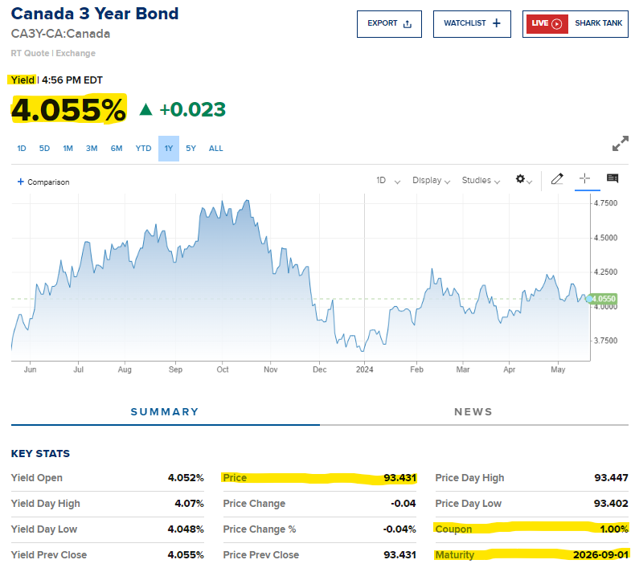
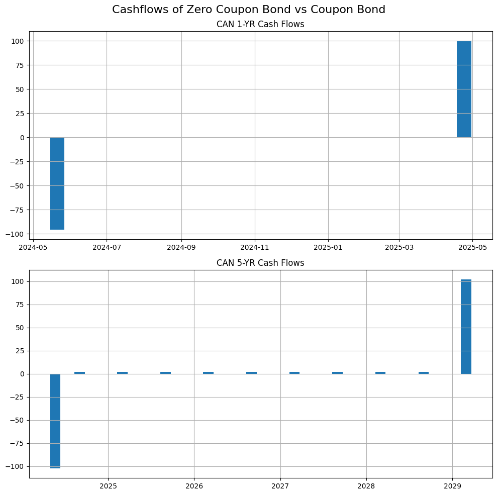
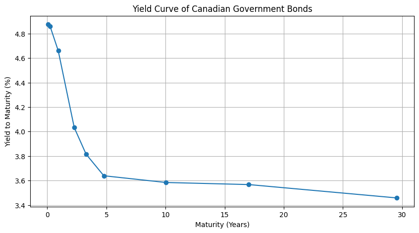
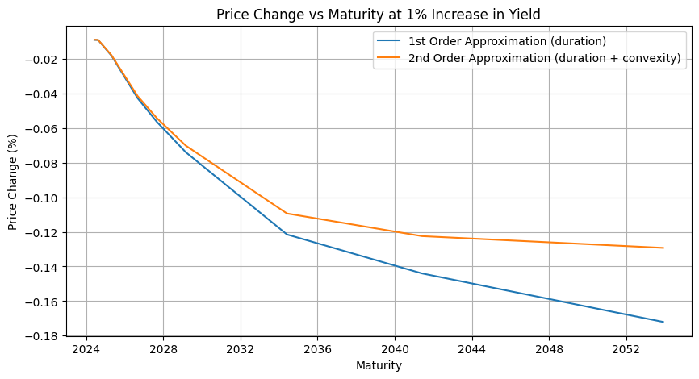

When I just got started with investing, one of the things I learned about is the allocation of assets. For most retail investors, there are 2 asset classes that we invest in:

- Equity, primarily in the form of stocks
- Fixed income, primarily in the form of bonds

I learned about the need to choose a proper asset allocation depending on your age and the level of risk you are willing to take. Whether that's an 80-20 for younger people, or a less risky 40-60 split if you are nearing your retirement.

Nowadays for passive investors, it's even more carefree as you can just invest in a single basket ETF with your desired allocation, whether that's VGRO or VCNS (I'm Canadian so these are traded on TSE...). You don't even need to rebalance your portfolio anymore. Despite this, I still think it's important to have a basic understanding of these assets.

To me, while stocks have always been relatively straightforward to understand, bonds were a bit more illusive. Why are they considered 'safer'? What drives their prices to change? What can we learn from bond prices?

Let's try to answer these questions in this week's edition of **Funance Blog**

## 1 What are Bonds

There are many websites and blogs that explain this already, so to paraphrase, bonds are basically loans issued by governments or companies. But unlike your car insurance or mortgage, you can trade it in the market. They are not directly traded on the stock market (you can find bond ETFs tho) but can be bought directly through a bank or broker.

Bonds are considered safer than stocks because...

- Longer-term bonds often have consistent payouts throughout their lifetime (coupons)
- The principle, ie, the initial amount you buy is guaranteed to be paid back when the bond matures (unless the company or country goes bankrupt at which, theres probably more things to worry about...)
- Companies will pay out bondholders before stockholders (so even if they go under, at least theres still people doing worse than you)
- Bonds are less volatile than stocks. While stock prices can change drastically, bond yields are fixed (although the bond price might change, but if you hold the bond till maturity, it's all good).

Generally, government bonds are considered the safest which is also what we will be looking at today.

### 1.1 Bonds vs Interest Rates

Even though the payments and the face value of a bond do not change, expected returns (yield) do. This is represented in the bond price changing, think about the _present value of money_ for y'all econ nerds. But unlike stocks, the fluctuation can be more easily understood, as it is often the result of... Interest rate changes.

A general rule of thumb is that **bond prices move in the opposite direction of interest rates**.

There are plenty of readings online if you want a detailed explanation from more qualified people so I'm just gonna stop yapping...

## 2 Analyzing Bonds

Lets get into the actual interesting stuff.

Opening up a quote for a bond traded on the bond market, you might see something like this

_Figure 1. Example Bond Quote (source [CNBC](https://www.cnbc.com/quotes/CA3Y-CA))_

This is one way it can be shown, in a similar layout to stock quotes. I've also seen it presented in a bond table (I found it kinda hard to find real-time bond prices when researching for this post...). Regardless of how it is presented, the core information stays the same:

- `Yield to Maturity (YtM)` - the total expected return of a bond if it is held to maturity. It is often just noted as `yield`, not to be confused with the `current yield` (The annualized rate of return on a bond). For the rest of the blog, when I mention _yield_, I will be referring to the _yield to maturity_
- `Maturity` - the time period (or date) when the bond issuer must pay back the bond value to the bondholder. Can range from a few months to decades
- `Coupon` - the annual or semi-annual amount of money that the issuer will pay to the holder up until maturity. Kinda like periodic interest payments (Canadian government bonds have semi-annual payouts). The coupon rate is predetermined and will not change. Often represented as a percentage of the PAR
- `PAR` - aka the face value of the bond. It is the amount of money the bond issuer will repay the bondholder. It is standard practice to have the PAR value set to \$100 (like in this case)
- `Price` - the present value of the bond. However, this is usually not the price you will be paying if you buy the bond, as it is the `Clean Price` (does not include any accrued interest). The `Dirty Price` is the actual price you will pay. More on this later.

OK, if you know what these terms mean, you're golden. But let's dig a bit deeper...

### 2.1 Zero Coupon Bonds vs Coupon Bonds

As the names suggest, a zero coupon bond has no interest payments and the investor just gets back to PAR value at maturity. While for coupon bonds, regular interest payments are paid up til maturity, where the PAR value plus the last coupon payment is paid out to the bondholder.

Lets **_visualize_**. By Choosing the _Canada 1 Year Bond_ and _Canada 5 Year Bond_, we can calculate the cash flows of each bond assuming we bought it today. Note, as previously mentioned, we need to convert the clean price to the dirty price to account for any accrued interest.

This requires an equation. Trigger warning for people who told me I put too many equations in the last blog. _You know who you are_. Look away...

$$
P_{dirty} = P_{clean} + \frac{\text{days since last coupon}}{\text{days between coupons}} * \text{coupon} \quad (1)
$$

Pretty self explanatory equation. If you buy the bond when it was issued or after an interest payment has been made, $P_{dirty} = P_{clean}$. But if you buy it any other time, you would need to pay the bondholder the current price plus any interest that has been generated since the last period. Heres the cash flows:

_Figure 2. Cash Flow of Zero Coupon Bond and Coupon Bond_

Yup, that matches up exactly with the definitions we gave before. Do note that the zero coupon bond is bought at a higher discount to par, which is what generates the yield. On the other hand, the coupon bond is bought at a price close to par, as its yield is primarily generated through the coupon payouts.

Generally speaking, for bonds with the same maturity, zero coupon bonds offer higher returns at the expense of volatility when compared to coupon bonds.

### 2.2 Yield to Maturity

While yield is already provided to you when looking at a bond quote, we can also calculate it, using the following equation.

$$
P_t(T) = \sum_{i=t_1}^{T} \frac{C_i}{(1+y)^{i-t}} \quad (2)
$$

Where $P_t(T)$ is the dirty price of the bond at time $t$ (now), $T$ is the maturity time of the bond, $C_i$ is the cashflow at time $i$, starting at time $t_1$ (when the next cash flow will occur). Finally, $y$ is the yield to maturity of the bond. This equation basically just calculates the present value of the bond...

We can then find the yield to maturity by solving for $y$. Using the Canadian Government Bond Quotes, we can calculate the yields and compare it to the listed ones.

| Bond Name | Yield  | Calculated Yield | Difference |
| :-------: | :----: | :--------------: | :--------: |
| CAN 1-MO  | 4.875% |      4.927%      | 1.066667%  |
| CAN 3-MO  | 4.860% |      4.885%      | 0.514403%  |
| CAN 1-YR  | 4.660% |      4.618%      | 0.901288%  |
| CAN 3-YR  | 4.032% |      4.025%      | 0.173611%  |
| CAN 4-YR  | 3.815% |      3.815%      | 0.000000%  |
| CAN 5-YR  | 3.639% |      3.643%      | 0.109920%  |
| CAN 10-YR | 3.584% |      3.584%      | 0.000000%  |
| CAN 20-YR | 3.567% |      3.567%      | 0.000000%  |
| CAN 30-YR | 3.458% |      3.480%      | 0.636206%  |

_Table 1. Difference Between Calculated Yield and Quoted Yield_

As you can see, the values are very similar. There are differences though, likely due to a difference in dirty price or coupon periods used in the calculation. For some reason, the [government of Canada](https://www.canada.ca/en/department-finance/programs/financial-sector-policy/securities/securities-technical-guide/determining-bond-treasury-bill-prices-yields.html) recommends using 200 days as their semi-annual coupon date.

### 2.3 The Yield Curve

Now that we have the yields, we can plot it as a function of bond maturity to obtain the... `Yield Curve`. For Canadian government bonds, it currently looks something like this:

_Figure 3. Yield Curve of Canadian Government Bonds_

**_Uh Oh_**. Normally, we would expect shorter-term bonds to have lower yields than longer-term bonds. Since the shorter the maturity, the lower the risk. But in our case, we see the opposite, an _inverted yield curve_. This usually means... **recession**.

During a recession, investors tend to seek safe long-term investments by purchasing long-maturity bonds over short ones. Supply and demand increases the price of long-term bonds and causes their yield to dip below shorter-term bonds. Here's a great video by [_The Plain Bagel_](https://www.youtube.com/watch?v=5L_zQGPNXOk&t=445s&ab_channel=ThePlainBagel) that explains this.

But apparently, this time, its not that bad as the inversion is primarily caused by the Post-COVID interest rate hikes. Idk, I'm just an unemployed engineering grad. [Heres an article that explains it better than I can](https://economics.td.com/us-time-different-yield-curve).

One thing though, for us normal retail investors, its best to be consistent. Don't try to predict the market and sell your shares anticipating a recession. Just keep consistently investing and in the long term, it'll all work out. That or WWIII starts and the global economy collapses. But thats beyond the scope of this blog...

### 2.4 Duration and Convexity

The price of a bond isn't constant, it fluctuates as interest rates change. But how much it changes depends on the bond. We can quantify this using `Duration` and `Convexity`.

The relationship between interest rate and price can be thought of as an arbitrary function. How can we approximate it? Well, **Taylor expansions** of course!

If we find the coefficient of the first order approximation, we get, `Duration`, defined as:

$$
D^{mac} = \frac{1}{P} \sum_{t_i=t_1}^{t_N} \frac{t_i C_{t_i}}{(1+y)^{t_i}} \quad (3)
$$

Where $D^{mac}$ is the `Macaulay duration`, $P$ is the price you buy the bond at, $C_{t_i}$ is the cash flow at time $t_i$, and $y$ is the yield to maturity of the bond.

Basically, the Macaulay duration just tells us the time period which the bondholder can expect to earn back the bond price initially spent, given the time value of money.

We can even modify the Macaulay duration by dividing it by the yield to get,

$$
D^{mod} = \frac{D^{mac}}{1 + y} \quad (4)
$$

Where $D^{mod}$ is the `Modified duration` of the bond, it tells us how sensitive a bond is to interest rate changes. So if a bond has $D^{mod} = 15$. That means a 1% change in the interest rate would cause a 15% change in the bond price.

Moving on, the second order Taylor coefficient gives us the `Convexity`

$$
\text{Convexity} = \frac{1}{P} \sum_{t_i=t_1}^{t_N} \frac{t_i (1+t_i) C_{t_i}}{(1+y)^{t_i + 2}} \quad (5)
$$

Convexity approximates the curvature in the relationship and is a more accurate estimate of price vs interest rate.

Lets apply this to the Canadian government bonds we've been looking at.

_Figure 3. Price Change at Different Maturities for a 1% Increase in Yield_

From the plot we observe an increase in price change as the maturity of the bond increases. This matches our intuition as longer maturity bonds are more sensitive to interest rates.

Comparing the 1st and 2nd order approximations, we see that the duration estimation overestimates the price changes. This only gets magnified as the maturity increases.

Note all these calculations assume a constant yield (interest rate) at each point in time. There are more complex methods such as using the interest rates in _Nelson-Siegel models_ to find _Fisher-Weill Duration and Convexity_. But thats another topic to be explored on another day.

## 3 Conclusion

This was a difficult blog to write. Hopefully I got everything correct, if not, please [let me know](mailto:ssgc1101@gmail.com). Fixed income and bonds are a very deep rabbit hole and I barely scratched the surface... There is still so much to learn!

In this post, we discussed what bonds are and what drives their prices. We then looked at how to interpret the information presented in a bond quote and use it to calculate the yield of the bond (even though its already given to us) as well as what the yield curve may reveal about the overall economy. Lastly, we showed how risk can be quantified using the duration and convexity.

As always, the code used in this blog can be found on the [Funance Blog Github Repo](https://github.com/yangsu01/funance_blog).

Thanks for reading!
