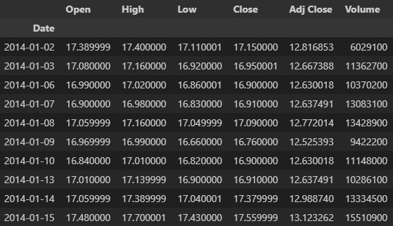
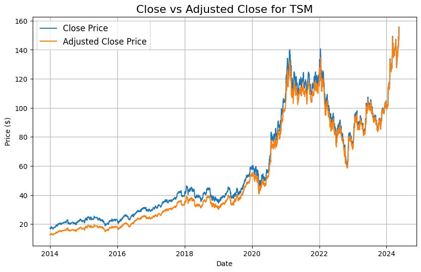
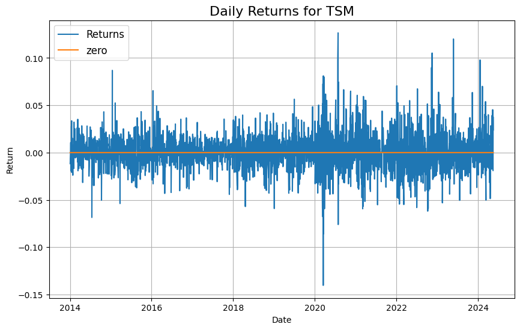
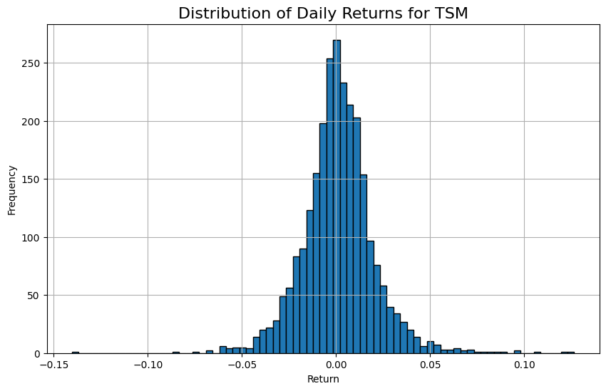
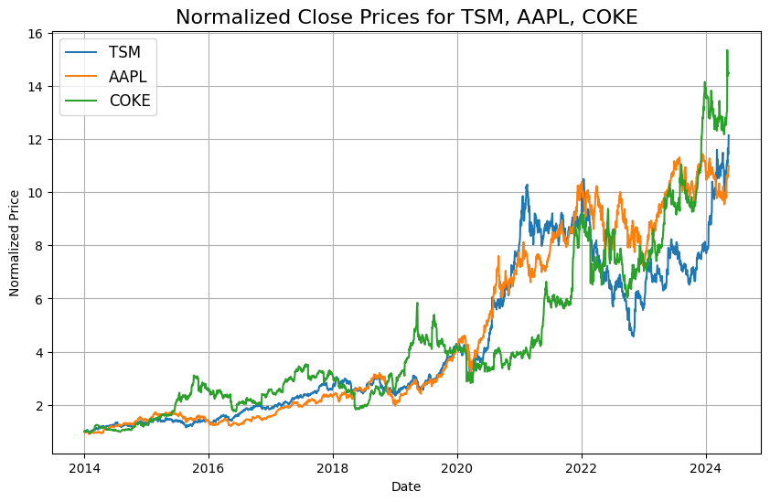
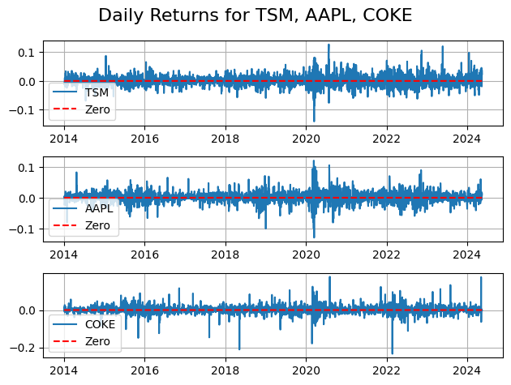
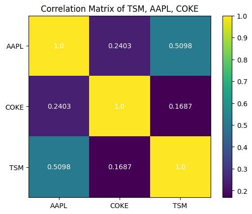

Its finally here, Funance Blog Vol.1!!! Before we start looking at anything fancy, we should start with the basics and build out way up (its totally not because I haven't done any analytics stuff in a few years and need a refresher...).

Thus for the inaugural blog of Funance Blog, we will be looking at... Returns! and how we can use it to evaluate investments.

## 1 What are Returns

Returns are an easy way of looking at how much profit (or loss) a stock has generated over a certain period of time. The returns over certain period, $t$ can be calculated as:

$$
    R_t = \frac{P_t}{P_{t-1}} - 1  =  \frac{P_t - P_{t-1}}{P_{t-1}} \quad (1)
$$

where $R_t$ is the net returns, $P_t$ is the price of a stock at time $t$, and $P_{t-1}$ is the price at the beginning of the period.

Cool... but what does that really mean? Lets **_visualize_**.

### 1.1 Close vs Adjusted Close

First we choose a stock, lets do `TSM (Taiwan Semiconductor Manufacturing Company)`. Using _yfinance_ we can download the historical data over the last 10 years, which looks something like this

 <br>
Figure 1: Historical Prices of TSM

Now we can calculate the daily returns using the closing price. But notice there are 2 columns related to the closing price: `Close` and `Adj Close`. If we plot these 2 columns, we get the following:

 <br>
Figure 2: Close vs Adjusted Close Prices of TSM

While the closing price is the share price of the last transaction before market close, the adjusted closing price is, well, adjusted 🤯. It factors in any corporate actions and adjusts the price accordingly. This includes dividend payouts, stock splits, and more (probably).

Suppose at the end of a trading day, the company announces a dividend payout of 1%. If the stock is priced at $100 per share at market close, the closing price would be recorded as such, $100. The adjusted closing price on the other hand, would be $99 since that $1 (1%) has been paid out.

So as we can see, adjusted close is a better indicator the actual value of the stock and we will be using it moving forward.

### 1.2 Returns

Now we can finally look at the returns. Applying equation (1) to the Adjusted Close values of TSM, we get the following plot...

 <br>
Figure 3. Daily Returns of TSM

Alright, we're getting somewhere. Doing a quick visual analysis, we can infer some results;

- The returns seem to be balanced around 0%, meaning on average, we can expect a daily return close to that.
- Comparing the time periods before and after 2020, we can see more extremes in the latter. This suggests that the period after 2020 has higher volatility, what a surprise...
- Looking at the largest peaks, we can identify periods of unusual market behavior. Look at the lowest peaks in early 2020 as well as the the high peaks right after, its almost like the market crashed due to some real world event but quickly bounced back after some kind of stimulus. wow.

Lets go one step further by organizing the data a bit more:

 <br>
Figure 4. Histogram of TSM Returns

🤔🤔 Looks like a normal distribution centered around 0%, which confirms our earlier estimation that we can expect an average daily return close to 0%. Not really that surprising...

By examining the width of the curve, we can find the `daily standard deviation of TSM = 1.919%`. Specifically in finance, this is also known as the _Volatility_ of a stock which can tell us how safe or risky a particular investment is. Although one value by itself isn't really useful...

We can go even further, and look at the QQ plot as well as the skewness and kurtosis of the distribution but I think I'll save that for a future post.

### 1.3 Average Returns

What about the average return we expect to get an a given day? Well, the average turns out to be... `mean = 0.001141`. So this means (heh) the average daily returns of _TSM_ is 0.1141%. Right? Well actually 🤓, this is the arithmetic average, and for returns, we need to use the geometric average.

Consider 2 stocks with the following annual returns over 3 years,

|         | Year 1 | Year 2 | Year 3 |
| :------ | :----- | :----- | :----- |
| Stock 1 | 10%    | 10%    | 10%    |
| Stock 2 | 70%    | -50%   | 10%    |

Table 1: Yearly returns of 2 stocks

Assuming the 2 stocks are the same otherwise and that the future behaves like the past, which stock would you choose to invest in? Well, we can calculate the average using $\sum R/n$, which gives us `Stock 1 Returns = 10% (annually)` and `Stock 2 Returns = 10% (annually)`. So we can invest in either?

But remember, the returns compound and are calculated using the price of the previous period, if we start with $100, the %10 increase in year 2 is on top of the $110 from the end of year 1. Putting it in a formula, we have

$$
    \bar{R} = \left( \prod_{i=1}^{N} (1 + R_i) \right)^{1/N} - 1 \quad (2)
$$

Where $\bar{R}$ is the average returns over $N$ periods.

Using this formula on the 2 stocks, if I did my math correctly, we get `Stock 1 Returns = 10% (annually)` and `Stock 2 Returns = -2.2% (annually)`. _W O W_

Another reason why investing early in diversified index funds almost always out performs investing in highly volatile stocks in the _long term_.

Ok, going back to _TSM_, we find the the actual `average daily return of TSM = 0.0957%` which we can annualize by just multiplying the daily returns by itself _252_ times (we assume the market is open 252 days a year)

$$
    \bar{R}^A = (1 + \bar{R}^D)^{252} - 1 \quad (3)
$$

Where $\bar{R}^A$ is the average annual returns and $\bar{R}^D$ is the average daily return.

This is why it is common to use _log returns_ instead of just returns in a lot of analysis, we can utilize the additive property of logarithms to further simplify the calculations. But that is another tangent for another day (foreshadowing...)

Plugging everything in, we find `average annual return of TSM = 27.2679%`. Thats pretty good. Wouldn't expect anything less from a tech (related) stock.

## 2 Using Returns to Evaluate Stocks

Using everything we just learned, we can do some simple analysis by comparing different stocks.

Ima just choose...

```
TSM (Taiwan Semiconductor Manufacturing Company)
AAPL (Apple Inc.)
COKE (Coca-Cola Consolidated, Inc.)
```

Plotting the close prices of these stocks, we get the following:

 <br>
Figure 5: Normalized Price History of TSM, AAPL, and COKE

Since the 3 stocks are priced at different values, we normalized the prices before plotting. As you can see, they're actually quite similar! And surprisingly, _COKE_ can keep up and even surpass the tech stocks 😮... with an over 15x increase over the last 10 years.

Looking at the daily returns of each stock...

 <br>
Figure 6: Daily Returns of TSM, AAPL, COKE

We can see similar behaviors of all 3 stocks. Its hard to judge which one has better performance and/or volatility. I probably should have chosen other stocks,
but its 11pm rn...

Lets look at the metrics of average returns and volatility... Using the equations defined above, we get:

| Stock | Annual Returns | Annualized Volatility |
| :---: | :------------: | :-------------------: |
|  TSM  |    27.2679%    |       30.4628%        |
| AAPL  |    26.0445%    |       28.2095%        |
| COKE  |    29.4419%    |       36.8384%        |

Table 2: Average annual returns and volatility of TSM, AAPL, COKE

Yea I definitely should have chosen different stocks.

Investing is a game of balancing potential returns and volatility. The higher the risk, the higher the potential rewards (I know, mindblowing). Depending on the risk the investor wants to take, an optimized portfolio can be constructed by maximizing the potential returns at that risk (insert blog on Markowitz's Portfolio Theory here...)

Looking at returns is a simple way of optimizing a portfolio. Suppose you want to construct a portfolio with a maximum of 30% volatility. ie, you are willing to accept a decrease of 30% of your total portfolio value in a year. If you had to choose between the 3 stocks above for the investment, which would you choose? _COKE_ offers the highest potential returns but is too risky for you. There is no clear winner among _TSM_ and _AAPL_, so you choice depends on whether you want to maximize returns or minimize risk... But if we also had another choice of a stock with say, `15% returns and 29% volatility`. you could automatically rule it out as there are options that offer better returns for similar risk.

All of this is assuming that the past behaves like the future. And while this is not always true, history often repeats itself in the long term.

### 2.1 Correlation between stocks

Another way of lowering risk is through diversification. A stock I own might tank cause their CEO got cancelled (unlucky), but if I invested in 20 different stocks, ain't no way all of them end up tanking right? Its just as simple as that, more diversification, less impact of tanking stocks on you overall portfolio.

Well if you want to decrease your overall risk even more, we can look at... Correlation of returns! Now look at this plot

 <br>
Figure 6: Correlation Matrix of TSM, AAPL, COKE

Out of the 3 stocks, which 2 would you select to construct the most 'diversified' portfolio?

Well, if `Correlation > 0` means the two stocks have a positive relationship (if one goes up, the other will likely go up too) with the higher the number, the stronger the correlation (1 means they're literally the same stock). And `Correlation < 0` means the two stocks have a negative relationship, then we probably want to select stocks with a correlation value close to 0. That would be _COKE_ and _TSM_ in our example.

Note the correlation between _TSM_ and _AAPL_ is quite high, suggesting that the 2 stocks have similar price changes. That makes a lot of sense considering Apple is one of the biggest costumers of TSMC, and TSMC makes almost all of Apple chips.

## 3 Conclusion

Thats all folks, hopefully you have learned something reading this Vol.1 of Funance Blog. I'm surprise you finished it (or maybe skipped to the end...)

In this blog, we looked at how we can calculate the returns of a stock and use it to find the average returns and volatility of a given time period. Using this, we can then compare different stocks and construct simple portfolios depending on the level of risk one want to take on. Lastly, we showed how you could use the correlation between different stocks to construct diversified portfolios 🥰.

If you want to play around with any of the code used in this blog, please see the [Funance Blog](https://github.com/yangsu01/funance_blog) Github repo.

I am just getting started learning about a lot of this stuff, so if you find any errors in the blog or have any suggestions, please feel free to reach out at [ssgc1101@gmail.com](mailto:ssgc1101@gmail.com)

And that concludes this edition of Funance Blog!!
